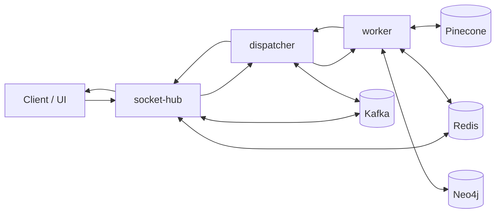

# Luxia: 0-to-Hero System Guide

This file is the fastest and most complete way to understand Luxia from zero background to deep technical confidence.

If you read only one file, read this one first.

## 1) What Luxia Is

Luxia is a claim-verification platform that takes a natural-language claim and returns:

- a verdict (`TRUE`, `FALSE`, `PARTIALLY_TRUE`, `UNVERIFIABLE`)
- truthfulness and confidence signals
- evidence sources and evidence statements
- rationale explaining why the verdict was produced

The platform is designed around a Retrieval-Augmented Generation (RAG) approach, where model output is grounded in retrieved evidence instead of pure parametric memory.

## 2) Why This System Exists

LLM-only answers can be fluent but unreliable. Luxia addresses that by:

- retrieving evidence first
- ranking evidence with trust and relevance signals
- generating verdicts from evidence, not from model guesswork
- exposing pipeline metrics for transparency and debugging

## 3) Big-Picture Architecture

Luxia is split into specialized services:

- `socket-hub`: realtime client gateway (Socket.IO), room auth, event fanout
- `dispatcher`: orchestration layer between ingress and worker
- `worker`: RAG pipeline and verdict engine
- `shared`: cross-service shared code (`shared/metrics.py`)
- `infra`: deployment and observability assets
- `frontend`: user interface layer

### Topology at a Glance

## 4) End-to-End Flow (Claim to Verdict)

### Step A: Client Interaction

1. Client connects to `socket-hub`.
2. Client joins a room (`join_room`) with credentials.
3. Client sends a claim (`post_message`).

### Step B: Dispatch

4. `socket-hub` forwards request to `dispatcher` (`POST /dispatch/submit`) or uses Kafka path when enabled.
5. `dispatcher` sends request to worker (`POST /worker/verify`).

### Step C: Verification (Worker)

6. Worker runs retrieval + ranking + trust + verdict generation.
7. Worker returns structured result payload.

### Step D: Result Delivery

8. `dispatcher` returns/publishes result.
9. `socket-hub` emits `worker_update` to the room.
10. Client displays verdict, scores, and evidence.

## 5) Core RAG Logic in Worker (Technical View)

The worker is the core of the system.

### 5.1 Input Contract

The verify endpoint accepts:

- `job_id`
- `claim`
- optional `room_id`, `source`
- optional controls (`domain`, `top_k`)

### 5.2 Pipeline Strategy

The pipeline is corrective and trust-gated:

- retrieve available evidence first
- evaluate evidence quality/coverage
- expand search when evidence is insufficient
- stop early when threshold is satisfied

This controls cost and latency while keeping evidence grounding.

### 5.3 Retrieval Channels

- semantic retrieval from VDB (Pinecone)
- structural/graph retrieval from KG (Neo4j)

### 5.4 Ranking and Trust

The worker surfaces ranking and trust signals, including:

- `top_ranking_score`, `avg_ranking_score`
- `vdb_signal_count`, `kg_signal_count`
- `vdb_signal_sum_top5`, `kg_signal_sum_top5`
- `trust_policy_mode`, `trust_metric_name`, `trust_metric_value`
- `trust_threshold_met`, `coverage`, `diversity`, `num_subclaims`

### 5.5 Verdict Synthesis

Verdict generation produces:

- final verdict class
- confidence and truthfulness percent
- rationale
- claim breakdown
- evidence map with support/contradict/neutral behavior

## 6) Reliability and Safety Model

Luxia includes resilience mechanisms:

- worker fallback response mode if pipeline fails
- timeout controls across services
- Kafka-based decoupled path for async flow
- callback fallback from dispatcher to socket-hub when needed
- explicit metrics for HTTP/service performance

## 7) Operating the System

### Local Runtime

- Main topology: `docker-compose.yml`
- Services: `socket-hub`, `dispatcher`, `worker`, Kafka, Redis, observability stack

### Azure Runtime

- Single-container backend profile under `infra/azure`
- Nginx routes to internal uvicorn services
- Supervisord manages backend service processes

### Observability

- Prometheus metrics from each backend service
- Grafana/Loki/Tempo/OTel in observability stack

## 8) Mental Model for New Engineers

Use this model:

- `socket-hub` = network edge + session/room guard
- `dispatcher` = workflow traffic controller
- `worker` = evidence reasoning engine
- `shared` = common instrumentation layer
- `infra` = runtime scaffolding

If verdict quality looks wrong, start from worker evidence and trust metrics before touching UI or transport.

## 9) Fast Learning Path (Recommended)

For a complete learning path:

1. Read this file end-to-end.
2. Read `docs/system-overview.md`.
3. Read `docs/request-lifecycle.md`.
4. Read `docs/worker-pipeline.md`.
5. Read `docs/interfaces-and-contracts.md`.
6. Read `docs/deployment-and-operations.md`.
7. Read `docs/testing-and-validation.md`.

## 10) Where to Debug by Symptom

- Client does not receive result:
  - check `socket-hub` room/auth + `worker_update` emission path
- Claim accepted but processing fails:
  - check `dispatcher` timeout and worker call errors
- Result is returned but quality is poor:
  - inspect worker evidence set, ranking signals, trust metrics
- Latency spikes:
  - inspect external retrieval behavior and timeout configuration

## 11) Source of Truth Files

Primary implementation references:

- `socket-hub/app/main.py`
- `dispatcher/app/main.py`
- `worker/app/main.py`
- `worker/app/services/corrective/pipeline/__init__.py`
- `worker/app/services/verdict/verdict_generator.py`
- `worker/app/services/ranking/hybrid_ranker.py`
- `shared/metrics.py`
- `docker-compose.yml`

## 12) Full Documentation Map

- `docs/system-overview.md`
- `docs/request-lifecycle.md`
- `docs/worker-pipeline.md`
- `docs/interfaces-and-contracts.md`
- `docs/deployment-and-operations.md`
- `docs/testing-and-validation.md`
- `docs/known-issues-and-next-steps.md`

Last verified against code: February 13, 2026
