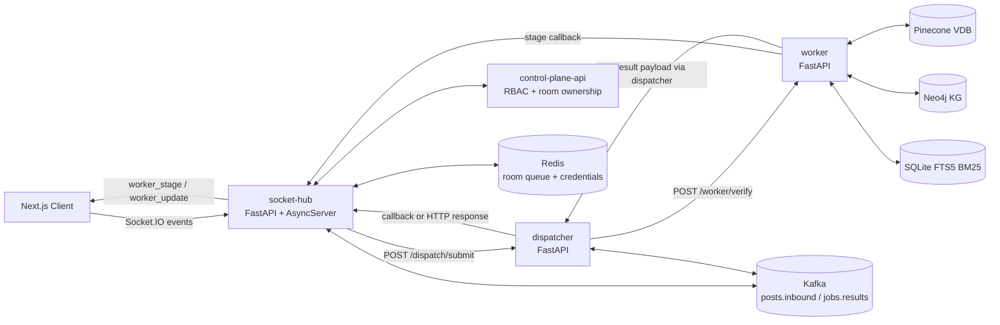

# 01. System Architecture

## Architectural Objective

Luxia is designed to verify claims under two competing constraints: evidence-grounding quality and bounded latency/cost. The architecture enforces a staged control flow where expensive actions (web search, scraping, extraction) are activated only after retrieval and trust sufficiency checks fail.

## Service Topology

### Prose Equivalent

1. Client connects to `socket-hub` and authenticates room access through control-plane checks.
2. Claim posts are accepted by `socket-hub`, mirrored to Kafka when enabled, or dispatched directly to `dispatcher`.
3. `dispatcher` calls `worker /worker/verify` and returns the worker payload.
4. `worker` emits stage callbacks to `socket-hub` while the pipeline runs.
5. Final result reaches clients through `worker_update`; stage progression reaches clients through `worker_stage`.

## Component: Socket-Hub (Realtime Edge)

1. Functional role
- Entry point for client sessions, room membership, realtime status, and result fanout.

2. Technical mechanism
- FastAPI app plus `socketio.AsyncServer` ASGI wrapper.
- `join_room` validates room secret and authorization via control-plane endpoints.
- `post_message` emits `processing` immediately, then uses Kafka publish or local async dispatch fallback.
- Internal callback endpoints accept dispatcher/worker callbacks: `/internal/dispatch-result`, `/internal/dispatch-stage`.

3. Inputs and outputs
- Inputs: Socket.IO events (`join_room`, `post_message`), callback HTTP payloads, Kafka messages.
- Outputs: `worker_update`, `worker_stage`, Kafka `posts.inbound` and optional `jobs.results` mirror.

4. Interaction with other components
- Calls control-plane for `join` and `post` authorization decisions.
- Calls dispatcher or publishes to Kafka.
- Emits worker stage/result callbacks to frontend.
- Uses Redis-backed `RoomManager` for queueing and credential storage.

5. Why necessary in hybrid pipeline
- Decouples user-facing realtime UX from long-running corrective verification loops.
- Enables progressive observability (stage streaming) instead of opaque request blocking.

6. Failure points and trade-offs
- Control-plane latency/outage can block join/post authorization.
- Dual transport (Kafka + direct dispatch) improves resilience but increases operational complexity.
- Redis queue is best-effort; verification can still proceed without Redis.

## Component: Control-Plane Authorization Layer

1. Functional role
- Enforces room ownership, role-based posting rights, and room-secret validation.

2. Technical mechanism
- FastAPI router with token principal checks (`platform_admin`, `client_admin`, `client_operator`, `client_viewer`).
- `POST /v1/socket/authorize` validates action scope (`join` or `post`).
- `POST /v1/socket/verify-room-secret` validates active room credential hash.

3. Inputs and outputs
- Inputs: bearer token, `client_id`, `room_id`, action, room secret.
- Outputs: authorization boolean or HTTP error with reason.

4. Interaction with other components
- Consumed by `socket-hub` during join and post flows.
- Backed by control-plane database state for rooms/credentials.

5. Why necessary in hybrid pipeline
- Prevents untrusted claim injection into expensive downstream verification infrastructure.

6. Failure points and trade-offs
- Tight coupling to token scope correctness; mis-scoped tokens block valid users.
- More security checks increase ingress latency but reduce abuse blast radius.

## Component: Dispatcher (Workflow Traffic Controller)

1. Functional role
- Isolation boundary between ingress and worker compute; manages worker call timeouts and delivery fallback.

2. Technical mechanism
- FastAPI endpoint `POST /dispatch/submit` forwards standardized payload to `worker /worker/verify`.
- Optional Kafka consume loop processes `posts.inbound`, publishes results to `jobs.results`.
- If result publish fails, can call socket-hub callback URL with signed token header.

3. Inputs and outputs
- Inputs: dispatch request (`job_id`, `claim`, room/client metadata) or Kafka post event.
- Outputs: normalized dispatch response and/or Kafka result payload/callback payload.

4. Interaction with other components
- Consumes ingress payloads from socket-hub or Kafka.
- Calls worker synchronously over HTTP.
- Returns outputs to socket-hub directly, via Kafka, or callback fallback.

5. Why necessary in hybrid pipeline
- Protects edge service from worker timeout behavior and transport retries.

6. Failure points and trade-offs
- Timeout tuning is critical; too low yields false failures, too high ties resources.
- Multiple result paths improve reliability but complicate consistency debugging.

## Component: Worker API Surface

1. Functional role
- Stable verification contract and lifecycle wrapper around corrective pipeline orchestration.

2. Technical mechanism
- FastAPI endpoint `POST /worker/verify` accepts claim payload and optional domain/top_k controls.
- Lazy singleton initialization of `CorrectivePipeline` with startup preload option.
- Captures stage events and forwards to socket-hub callback endpoint.
- Converts internal pipeline output into normalized external result schema.

3. Inputs and outputs
- Inputs: `VerifyRequest` (`job_id`, `claim`, room/client identifiers, `domain`, `top_k`).
- Outputs: completed payload with verdict, trust/ranking signals, evidence lists, stage_events.

4. Interaction with other components
- Called by dispatcher.
- Emits stage callbacks to socket-hub.
- Calls retrieval/ranking/verdict subsystems through `CorrectivePipeline`.

5. Why necessary in hybrid pipeline
- Separates transport and orchestration concerns from retrieval and reasoning internals.

6. Failure points and trade-offs
- Runtime exceptions trigger fallback-completed behavior to preserve availability.
- Fallback preserves uptime but can reduce epistemic quality under subsystem failures.

## Component: Frontend Contract Consumer

1. Functional role
- Converts backend event stream into user-visible state transitions and final evidence rendering.

2. Technical mechanism
- Socket listeners for `join_room_success`, `auth_error`, `worker_stage`, `worker_update`.
- Correlates updates via `client_claim_id` and `job_id`.
- Maps backend stage keys (`started`, `retrieval_done`, `search_done`, `completed`) into UI labels.

3. Inputs and outputs
- Inputs: socket events with stage/result payloads.
- Outputs: UI timeline states, verdict cards, evidence logs.

4. Interaction with other components
- Depends on socket-hub event contract fidelity.
- Uses control-plane APIs for registration and room approval state.

5. Why necessary in hybrid pipeline
- Hybrid corrective loops are multi-step; realtime event consumption is required for transparency and operator trust.

6. Failure points and trade-offs
- Missing claim/job correlation can misattach updates to wrong post card.
- Rich stage logging improves debuggability but increases frontend state complexity.

## Architecture Decisions and Rationale

1. Edge/orchestrator/worker decomposition
- Decision: isolate ingress, dispatch, and verification into separate services.
- Rationale: protects interactive sockets from long worker latencies and enables independent scaling.
- Trade-off: more network hops and contract coordination.

2. Optional Kafka path plus direct HTTP fallback
- Decision: keep both async and direct delivery modes.
- Rationale: supports resilient operation across local, cloud, and degraded broker conditions.
- Trade-off: duplicate transport logic and harder delivery tracing.

3. Stage callback channel as first-class API
- Decision: worker emits incremental stage events.
- Rationale: corrective loops are non-trivial; stage visibility is necessary for operations and UX.
- Trade-off: event schema stability becomes part of backward compatibility surface.

Last verified against code: February 28, 2026
