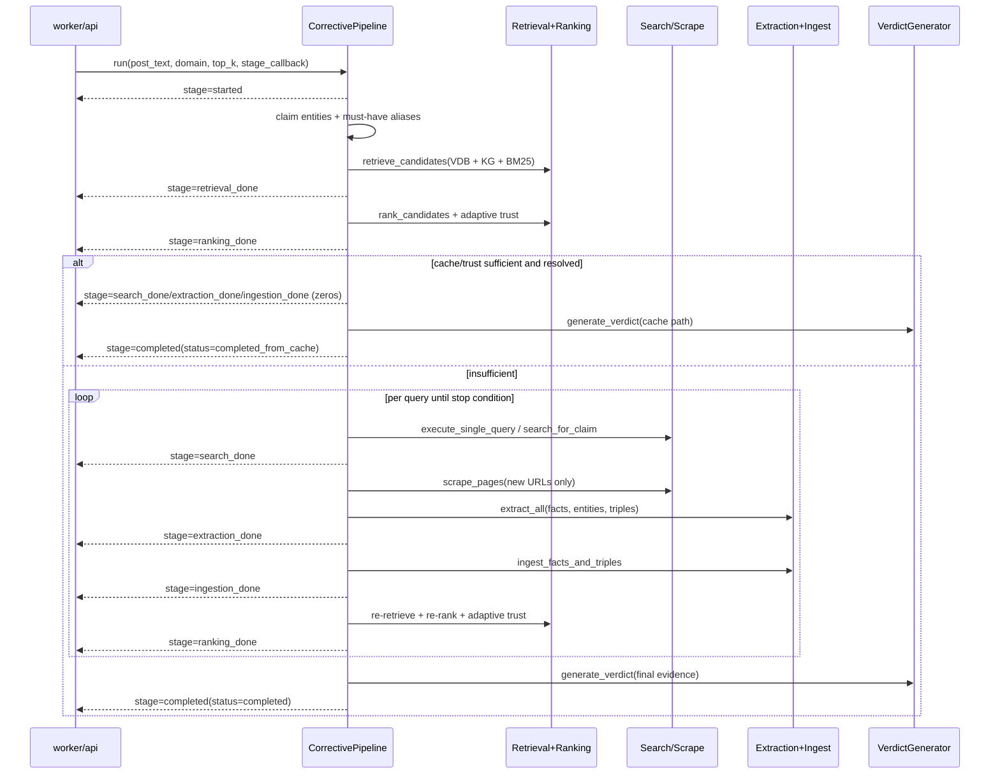

# 02. Pipeline Stage Decomposition

## Stage-Oriented Execution Model

`CorrectivePipeline.run()` is retrieval-first and trust-gated. It emits stage callbacks that mirror pipeline milestones and are consumed by `socket-hub` and frontend.

### Stage Sequence

### Prose Equivalent

1. Pipeline starts and emits `started` with claim preview.
2. It extracts claim anchors/entities, infers topics, and retrieves cached evidence from VDB/KG/lexical index.
3. It ranks evidence and computes adaptive trust.
4. If trust is sufficient and cache precheck confirms resolved required segments, it completes without web expansion.
5. Otherwise it enters incremental one-query loop: search, scrape, extract, ingest, re-retrieve, re-rank, trust re-check.
6. Loop exits on sufficiency, confidence-mode stop rules, comparative-claim saturation, or query budget limits.
7. Final verdict generation runs once on final ranked evidence; pipeline emits `completed`.

## Component: Stage Callback Emitter

1. Functional role
- Publishes deterministic stage checkpoints for external observability.

2. Technical mechanism
- Internal `_emit_stage(stage, payload)` wraps pipeline state into callback payload and invokes `stage_callback` asynchronously.

3. Inputs and outputs
- Inputs: internal phase milestones and counters.
- Outputs: standardized stage events (`started`, `retrieval_done`, `ranking_done`, `search_done`, `extraction_done`, `ingestion_done`, `completed`).

4. Interaction with other components
- Worker captures callback and forwards to socket-hub `/internal/dispatch-stage`.
- Frontend consumes mapped stage labels.

5. Why necessary in this hybrid pipeline
- Corrective loop is multi-iteration; stage transparency is needed for both debugging and UX.

6. Failure points and trade-offs
- Callback failures are logged but do not stop verification, so observability can degrade while core logic still runs.

## Component: Claim Entity and Anchor Initialization

1. Functional role
- Establishes retrieval anchors that constrain downstream candidate relevance.

2. Technical mechanism
- Claim entity extraction uses LLM-assisted path plus deterministic phrase fallback.
- Must-have entity selection prioritizes high-salience entities and builds alias list for strict matching.

3. Inputs and outputs
- Inputs: raw claim text.
- Outputs: `claim_entities`, `must_have_entities`, `must_have_aliases`.

4. Interaction with other components
- Feeds retrieval anchor filters, ranking must-have gates, and extraction admissibility checks.

5. Why necessary in this hybrid pipeline
- Prevents topic drift during retrieval and search expansion.

6. Failure points and trade-offs
- Aggressive anchor filtering improves precision but risks recall collapse on sparse claims.

## Component: Initial Retrieval and Ranking Gate

1. Functional role
- Determines whether existing indexed knowledge is enough before paying web-search cost.

2. Technical mechanism
- `retrieve_candidates()` pulls from Pinecone, Neo4j, and lexical shortlist.
- `rank_candidates()` performs hybrid scoring, admissibility gating, contradiction penalties, and top-k selection.
- Trust layer computes adaptive sufficiency (`coverage`, `diversity`, `agreement`, `trust_post`).

3. Inputs and outputs
- Inputs: claim, anchors, inferred topics, top_k.
- Outputs: ranked evidence list, trust metrics, debug counts.

4. Interaction with other components
- Calls retrieval and ranking modules.
- Passes ranked evidence into cache-precheck verdict path.

5. Why necessary in this hybrid pipeline
- Retrieval-first gate is the central cost-control mechanism.

6. Failure points and trade-offs
- Conservative thresholds reduce false positives but can trigger unnecessary corrective rounds.

## Component: Cache Verdict Precheck

1. Functional role
- Decides whether adaptive sufficiency can terminate early without web expansion.

2. Technical mechanism
- Runs `verdict_generator.generate_verdict(... cache_sufficient=True ...)`.
- Applies deterministic `_cache_fast_path_allowed` checks: segment resolution, admissible evidence ratio, stance distribution, coverage constraints.

3. Inputs and outputs
- Inputs: current ranked evidence + adaptive trust metrics.
- Outputs: either `completed_from_cache` return or forced continuation to web loop.

4. Interaction with other components
- Couples trust policy with verdict reconciliation before expensive search.

5. Why necessary in this hybrid pipeline
- Avoids both false early exits and unnecessary external retrieval.

6. Failure points and trade-offs
- Strong cache gate can delay completion in borderline cases.

## Component: Incremental Query Execution Loop

1. Functional role
- Expands evidence only until sufficiency criteria are met.

2. Technical mechanism
- Generates query set once, then processes one query at a time.
- Filters already-processed URLs using VDB URL set and per-job processed URL memory.
- Caps per-query URLs and total search calls.

3. Inputs and outputs
- Inputs: generated queries, processed URL sets, trust state.
- Outputs: executed query list, search API call count, new URLs.

4. Interaction with other components
- Invokes trusted search and scraper.
- Feeds extraction and ingestion stages.

5. Why necessary in this hybrid pipeline
- Implements quota efficiency by avoiding bulk search fanout.

6. Failure points and trade-offs
- One-query pacing minimizes waste but can increase wall-clock latency for hard claims.

## Component: Extraction and Ingestion Subloop

1. Functional role
- Converts web pages into structured evidence and makes them retrievable immediately.

2. Technical mechanism
- Extracts facts/entities/triples from scraped pages.
- Ingests trusted facts to Pinecone + lexical index, triples to Neo4j.
- Re-runs retrieval/ranking/trust after each ingestion batch.

3. Inputs and outputs
- Inputs: scraped page content for current query.
- Outputs: new facts/triples, updated ranked evidence, updated trust metrics.

4. Interaction with other components
- Tight loop between scraper, extractors, ingesters, and retrieval/ranking modules.

5. Why necessary in this hybrid pipeline
- Enables immediate feedback from newly discovered evidence rather than end-batch processing.

6. Failure points and trade-offs
- Partial ingestion failures can create temporary VDB/KG asymmetry.

## Component: Adaptive Stop Controller

1. Functional role
- Terminates loop on sufficiency or saturation signals.

2. Technical mechanism
- Stops on `adaptive_trust.is_sufficient`.
- In confidence mode, applies additional target coverage and trusted URL caps.
- Comparative claims have custom early-stop rules when diversity stagnates.

3. Inputs and outputs
- Inputs: adaptive trust metrics, claim frame, loop counters.
- Outputs: stop/continue decision and reason.

4. Interaction with other components
- Reads trust outputs each iteration.
- Controls entry to final verdict stage.

5. Why necessary in this hybrid pipeline
- Prevents runaway search behavior on irreducible or low-signal claims.

6. Failure points and trade-offs
- Early stopping can miss long-tail evidence; late stopping increases cost/latency.

## Component: Final Verdict Assembly Stage

1. Functional role
- Produces final claim decision payload and telemetry signals.

2. Technical mechanism
- Recomputes/adopts final adaptive trust snapshot.
- Calls `generate_verdict` with final ranked evidence.
- Emits final stage and returns normalized output fields consumed by worker API formatter.

3. Inputs and outputs
- Inputs: final ranked evidence, loop metadata, adaptive trust metrics.
- Outputs: verdict object, evidence map, trust/ranking summaries, llm metadata.

4. Interaction with other components
- Bridges corrective pipeline into verdict subsystem and worker response model.

5. Why necessary in this hybrid pipeline
- Centralizes final reconciliation after dynamic evidence accumulation.

6. Failure points and trade-offs
- Verdict quality is bounded by final evidence set and admissibility filtering quality.

Last verified against code: February 28, 2026
