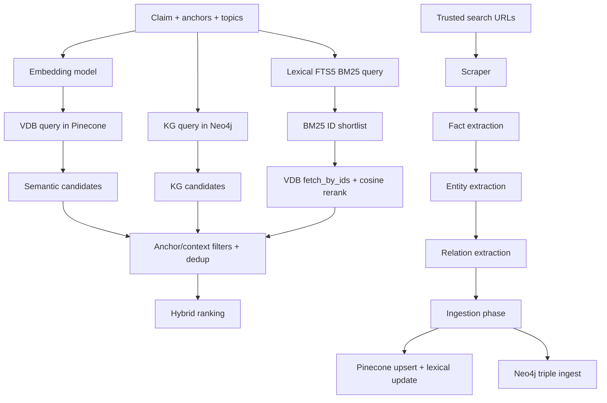

# 03. Retrieval and Ingestion

## Retrieval-Ingestion Data Plane

### Prose Equivalent

1. Claim-conditioned queries are embedded and sent to Pinecone, while entity paths are sent to Neo4j and lexical FTS.
2. Retrieval outputs are normalized, filtered by anchor/context overlap, and deduplicated.
3. Corrective search produces new pages which are scraped and converted to facts/entities/triples.
4. Trusted facts are ingested into Pinecone and lexical index; triples are ingested into Neo4j.
5. Retrieval reruns over updated stores to refresh ranking and trust decisions.

## Component: Embedding and Vector Query Path

1. Functional role
- Generates semantic representations for retrieval and BM25 rerank alignment.

2. Technical mechanism
- `embed_async()` produces vectors for normalized query text.
- `pinecone_client` enforces index dimension match with embedding model and recreates index on mismatch.

3. Inputs and outputs
- Inputs: normalized claim/query text.
- Outputs: embedding vectors; Pinecone similarity matches with metadata.

4. Interaction with other components
- Used by VDB retrieval and BM25 shortlist reranking.

5. Why necessary in this hybrid pipeline
- High-recall semantic retrieval is the primary cache-first evidence source.

6. Failure points and trade-offs
- Dimension mismatch handling preserves correctness but index recreation is operationally disruptive.

## Component: Pinecone Retrieval (`VDBRetrieval`)

1. Functional role
- Retrieves semantically similar evidence with claim-context alignment constraints.

2. Technical mechanism
- Applies topic/language filters, fallback filter relaxation, and score thresholding.
- Adds claim alignment boosts (`claim_context_hash`, anchor overlap, claim token overlap).
- Rejects low-signal/claim-mismatch items and backfills from near-threshold pool to avoid starvation.

3. Inputs and outputs
- Inputs: query string, top_k, topics, claim text, claim anchors, context hash.
- Outputs: scored semantic candidate list with metadata (`statement`, `score`, `source_url`, `topic`, `claim_context_match`, etc.).

4. Interaction with other components
- Called by retrieval phase; outputs merged with KG and lexical branches.

5. Why necessary in this hybrid pipeline
- Enables direct reuse of previously ingested evidence and staged relevance boosts tied to current claim context.

6. Failure points and trade-offs
- Strict claim-alignment filtering improves precision but can suppress novel yet relevant evidence.

## Component: Neo4j Retrieval (`KGRetrieval`)

1. Functional role
- Retrieves structured relational evidence (1-hop and 2-hop) not captured by pure semantic similarity.

2. Technical mechanism
- Executes unioned Cypher for direct and intermediate paths.
- Computes path score from relation confidence, hop penalty, anchor/query overlap, role alignment, and context hash match boosts.
- Applies timeout wrappers and returns empty set on connection/timeouts.

3. Inputs and outputs
- Inputs: entity list, top_k, claim text, claim anchors, context hash.
- Outputs: structured KG candidates (`subject`, `relation`, `object`, `hop_distance`, `path_quality_score`, `source_url`).

4. Interaction with other components
- Retrieval phase merges KG candidates into hybrid ranking.

5. Why necessary in this hybrid pipeline
- Supplies structural causality/association signals that complement textual semantic retrieval.

6. Failure points and trade-offs
- 2-hop paths increase recall but introduce transitive noise risk.

## Component: Lexical Side-Channel (`LexicalIndex`)

1. Functional role
- Recovers keyword-heavy matches that embedding similarity can miss.

2. Technical mechanism
- SQLite FTS5 table stores fact statements and metadata.
- BM25 search returns fact IDs; retrieval phase fetches vectors by IDs and reranks via cosine similarity.

3. Inputs and outputs
- Inputs: sanitized query string, optional topics.
- Outputs: BM25 hits (`fact_id`, `bm25`) and vector-enriched candidates after fetch/rerank.

4. Interaction with other components
- Augments VDB candidate pool before dedup and ranking.

5. Why necessary in this hybrid pipeline
- Improves robustness for numerics/entity names where lexical precision matters.

6. Failure points and trade-offs
- SQLite local index is lightweight but adds consistency considerations with vector store state.

## Component: Web Scraper

1. Functional role
- Converts URL lists into parseable text for extraction.

2. Technical mechanism
- Async HTTP fetch with browser-like headers, domain-specific timeouts, and domain cooldown policies.
- Uses Trafilatura extraction first; Playwright fallback for blocked/JS-heavy pages.
- Handles PDFs with `pdfplumber` and supports persistent 403 domain blocking.

3. Inputs and outputs
- Inputs: URL batch.
- Outputs: page objects with `url`, `content`, `source(domain)`, `published_at`.

4. Interaction with other components
- Feeds extraction phase.
- Receives URL candidates from trusted search component.

5. Why necessary in this hybrid pipeline
- Corrective loop depends on reliable conversion of web results into model-consumable evidence text.

6. Failure points and trade-offs
- Browser fallback increases retrieval success but adds latency and runtime dependency complexity.

## Component: Fact Extraction

1. Functional role
- Produces atomic, claim-admissible factual statements from scraped content.

2. Technical mechanism
- Batched LLM extraction with strict JSON schema and retry prompt on malformed output.
- Cleans/normalizes statements, splits conjunction-heavy facts, filters hedged or low-signal statements.
- Applies claim-context admissibility gates using must-have and predicate-family overlap.

3. Inputs and outputs
- Inputs: scraped pages, claim text, claim entities, must-have entities.
- Outputs: normalized facts with `statement`, `confidence`, `fact_id`, source metadata, claim context fields.

4. Interaction with other components
- Sends fact list to entity and relation extractors, then ingestion.

5. Why necessary in this hybrid pipeline
- Enforces atomic evidence representation required for stable ranking and verdict attribution.

6. Failure points and trade-offs
- Aggressive admissibility filtering can drop true-but-broad contextual evidence.

## Component: Entity Extraction

1. Functional role
- Annotates extracted facts with biomedical entities used by retrieval/ranking.

2. Technical mechanism
- Single batched LLM call across fact list.
- JSON parsing with retries and truth-entity filtering to remove meta entities.

3. Inputs and outputs
- Inputs: fact statements.
- Outputs: per-fact `entities` arrays.

4. Interaction with other components
- Feeds relation extraction and ranking entity overlap features.

5. Why necessary in this hybrid pipeline
- Entity-level alignment is required for anchor-aware relevance controls.

6. Failure points and trade-offs
- NER errors propagate into relation quality and anchor matching precision.

## Component: Relation Extraction

1. Functional role
- Converts fact statements into KG-ready triples for structural retrieval.

2. Technical mechanism
- Batched LLM triple extraction with index integrity checks and JSON repair path.
- Remaps triples to best aligned source fact when index drift occurs.
- Applies claim-alignment filters and negation guard to avoid positive causal triples from negated statements.

3. Inputs and outputs
- Inputs: facts, entity vocabulary, claim context.
- Outputs: triples with `subject`, `relation`, `object`, `confidence`, context metadata.

4. Interaction with other components
- Feeds KG ingestion module.

5. Why necessary in this hybrid pipeline
- Enables retrieval of structured causal/associative evidence in later rounds and future claims.

6. Failure points and trade-offs
- Triple extraction improves structural reasoning but introduces additional LLM parse/error surface.

## Component: Ingestion Coordinator (`ingest_facts_and_triples`)

1. Functional role
- Persists newly extracted evidence while enforcing domain-trust safety.

2. Technical mechanism
- Enriches facts with `validation_state` and skips non-trusted domains for VDB ingestion.
- Calls VDB ingest (with lexical upsert) and KG ingest in best-effort mode.

3. Inputs and outputs
- Inputs: extracted facts and triples.
- Outputs: persisted vectors/triples; ingestion logs and counters.

4. Interaction with other components
- Connects extraction stage with subsequent retrieval rounds.

5. Why necessary in this hybrid pipeline
- Corrective loop requires immediate persistence so newly found evidence can influence same-request ranking.

6. Failure points and trade-offs
- Best-effort ingest avoids hard failures but can create temporary partial persistence states.

## Component: VDB Ingestion (`VDBIngest`)

1. Functional role
- Stores trusted fact vectors and metadata for future semantic retrieval.

2. Technical mechanism
- Domain trust gating; metadata enrichment; embedding generation; Pinecone upsert.
- Updates lexical FTS index best-effort.
- Exposes `get_processed_urls` for URL dedupe and skip logic.

3. Inputs and outputs
- Inputs: fact records.
- Outputs: ingested fact IDs and refreshed processed URL set.

4. Interaction with other components
- Used both by ingestion phase and corrective loop URL filtering.

5. Why necessary in this hybrid pipeline
- Maintains persistent evidence memory and prevents repeated scraping cost.

6. Failure points and trade-offs
- Strict domain trust policy improves reliability but may delay ingestion of potentially useful new domains.

## Component: KG Ingestion (`KGIngest`)

1. Functional role
- Persists deterministic entity-relation graph state for structural retrieval.

2. Technical mechanism
- Deterministic `Entity.id` and `Relation.rid` generation.
- Neo4j MERGE-based upsert with confidence max-update semantics.
- Negation-aware unsafe triple suppression and per-query timeout enforcement.

3. Inputs and outputs
- Inputs: triple list and optional source URLs/context fields.
- Outputs: ingest summary (`attempted`, `succeeded`, `failed`).

4. Interaction with other components
- Consumed by ingestion phase; read later by KG retrieval.

5. Why necessary in this hybrid pipeline
- Preserves high-value relational signals for multi-hop evidence discovery.

6. Failure points and trade-offs
- Deterministic IDs improve dedupe but can collapse nuanced relation variants if predicate normalization is too coarse.

Last verified against code: February 28, 2026
