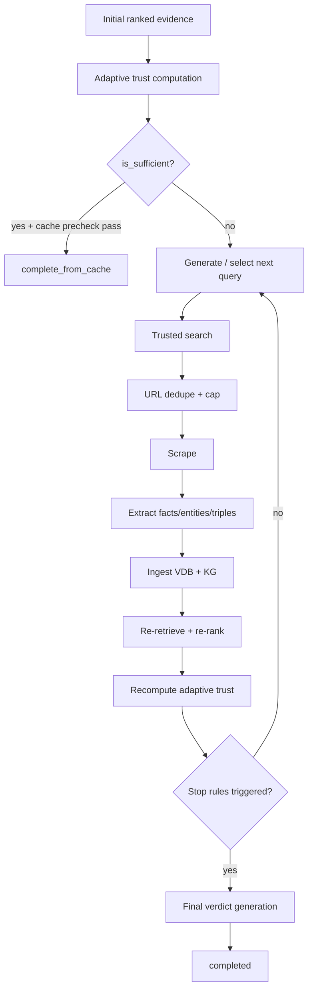

# 04. Ranking, Trust, and Corrective Loop

## Corrective Control Loop

### Prose Equivalent

1. Ranking and trust evaluation starts immediately after retrieval.
2. If adaptive sufficiency and cache guard pass, pipeline exits with `completed_from_cache`.
3. Otherwise, each loop iteration executes one query and updates evidence stores before reranking.
4. Loop stops when adaptive trust is sufficient or special stop policies fire.
5. Final verdict uses latest ranked evidence snapshot.

## Component: Hybrid Ranker

1. Functional role
- Produces unified final relevance score across semantic and graph evidence streams.

2. Technical mechanism
- Combines weighted signals: semantic score, KG score, entity overlap, claim overlap, recency decay, credibility, source quality.
- Applies claim-type-dependent weight overrides (therapeutic, causal, mechanistic, general).
- Injects penalties for low-signal phrases, uncertainty language, relation-direction mismatch, and unsupported object focus.

3. Inputs and outputs
- Inputs: semantic candidates, KG candidates, query text, query entities.
- Outputs: scored candidate list with `final_score`, component-level diagnostics, stance hints.

4. Interaction with other components
- Called by ranking phase before trust grading.
- Supplies evidence used by trust and verdict layers.

5. Why necessary in this hybrid pipeline
- Hybrid retrieval requires explicit arbitration between textual similarity and relational evidence quality.

6. Failure points and trade-offs
- Heuristic weights improve controllability but require ongoing calibration per claim domain.

## Component: Ranking Phase Gatekeeper

1. Functional role
- Enforces admissibility and relevance constraints before trust aggregation.

2. Technical mechanism
- Count-claim evidence gate removes non-numeric/no-overlap candidates.
- Topic alignment filter marks `admissible_for_trust`.
- Optional cross-encoder rerank can refine top-N ordering.
- Contradicting evidence receives score penalty and can be excluded from supporting top-k unless degraded mode.
- Must-have alias enforcement keeps core-entity relevance.

3. Inputs and outputs
- Inputs: raw semantic/KG candidates and claim entities.
- Outputs: top-k graded evidence with trust grades and ranking diagnostics.

4. Interaction with other components
- Uses `hybrid_ranker`, `ContradictionScorer`, and trust grading helper.

5. Why necessary in this hybrid pipeline
- Prevents high-similarity but off-target evidence from dominating trust decisions.

6. Failure points and trade-offs
- Strict must-have gating protects relevance but can hide partial yet useful evidence.

## Component: TrustRankingModule

1. Functional role
- Converts ranked evidence into per-item trust and aggregate post trust.

2. Technical mechanism
- Computes evidence trust from semantic/source/recency/stance components.
- Deduplicates by normalized URL or statement hash.
- Computes post trust with self-weighted mean and agreement ratio; provides bootstrap confidence interval.
- Exposes adaptive trust wrapper through `AdaptiveTrustPolicy` integration.

3. Inputs and outputs
- Inputs: EvidenceItem list with stance signals.
- Outputs: trusted evidence ordering, trust summary (`trust_post`, `agreement_ratio`, grade, CI bounds).

4. Interaction with other components
- Receives ranked evidence from ranking phase.
- Supplies adaptive metrics used by pipeline stop logic and verdict calibration.

5. Why necessary in this hybrid pipeline
- Converts heterogeneous relevance evidence into decision-oriented sufficiency metrics.

6. Failure points and trade-offs
- URL-based dedupe can hide legitimately distinct evidence hosted on same page.

## Component: Adaptive Trust Policy

1. Functional role
- Determines if evidence is sufficient for claim-level decision without further search.

2. Technical mechanism
- Decomposes claim into subclaims.
- Computes weighted coverage using strong/partial thresholds, anchor matching, and stance-aware scoring.
- Computes diversity from domain spread and agreement from stance balance.
- Applies gated sufficiency rules conditioned on coverage/diversity/agreement/evidence count.
- Has confidence-mode parameter set with lower thresholds and modified partial weighting.

3. Inputs and outputs
- Inputs: claim text, top-k evidence set.
- Outputs: adaptive metrics (`coverage`, `diversity`, `agreement`, `num_subclaims`, `trust_post`, `is_sufficient`, strong/contradicted counts).

4. Interaction with other components
- Uses `AnchorExtractor` and `subclaim_coverage` internals.
- Drives corrective loop continuation decisions.

5. Why necessary in this hybrid pipeline
- Single scalar trust is insufficient for multi-part claims; adaptive coverage/diversity is required.

6. Failure points and trade-offs
- Segment decomposition errors can distort sufficiency status and loop behavior.

## Component: Anchor Extraction and Subclaim Coverage

1. Functional role
- Provides subclaim-level relevance grounding for trust and verdict reconciliation.

2. Technical mechanism
- Extracts 2-5 anchor terms per subclaim (LLM with rule-based fallback and cache).
- Scores each evidence item against anchors, lexical overlap, semantic signal, stance, and optional KG down-weighting.
- Emits per-subclaim status (`STRONGLY_VALID`, `PARTIALLY_VALID`, `UNKNOWN`, etc.) with weighted coverage.

3. Inputs and outputs
- Inputs: claim/subclaims and evidence list.
- Outputs: anchors map, per-subclaim details, weighted coverage metrics.

4. Interaction with other components
- Consumed by adaptive trust policy and verdict diagnostics.

5. Why necessary in this hybrid pipeline
- Corrective stopping and final verdict require segment-level grounding, not just top-document similarity.

6. Failure points and trade-offs
- Anchor overfitting can punish semantically valid paraphrases.

## Component: Corrective Loop Budget Controller

1. Functional role
- Limits external search/scrape cost while preserving decision quality.

2. Technical mechanism
- One-query-at-a-time execution.
- Max query budget and per-query URL cap.
- Processed URL suppression via VDB URL history plus in-job URL memory.
- Confidence mode stop and comparative-claim monopoly stop heuristics.

3. Inputs and outputs
- Inputs: query list, loop counters, adaptive trust updates, processed URL sets.
- Outputs: stop reason, executed query set, skipped URL metrics.

4. Interaction with other components
- Coordinates trusted search, scraper, extractors, and ingesters per iteration.

5. Why necessary in this hybrid pipeline
- Prevents quota exhaustion and redundant scraping while still allowing evidence accrual.

6. Failure points and trade-offs
- Aggressive early-stop may miss late-emerging high-quality contradictory evidence.

## Component: LLM Quota Hardening Layer

1. Functional role
- Protects critical LLM calls from starvation and uncontrolled per-job token/call growth.

2. Technical mechanism
- Per-job Groq call state via context variables (`max_calls`, reserved critical slots, degraded mode).
- Call-tag-aware token caps and quota reservations for fact extraction/verdict generation.
- Non-critical low-priority calls can be skipped with explicit degraded markers.

3. Inputs and outputs
- Inputs: prompt + call metadata (`priority`, `call_tag`, quota override flags).
- Outputs: LLM JSON/text response or explicit degraded-skip payload/error.

4. Interaction with other components
- Used by query generation, extraction modules, and verdict generation.

5. Why necessary in this hybrid pipeline
- Corrective loops can trigger many model calls; quota hardening keeps endpoint availability stable.

6. Failure points and trade-offs
- Degraded skipping preserves service continuity but can lower reasoning completeness.

## Design Decisions Captured in This Layer

1. Adaptive sufficiency over fixed threshold only
- Rationale: multi-segment claims require coverage/diversity-aware stopping.

2. Immediate ingest + rerank per query
- Rationale: early-exit opportunities are realized only if new evidence is visible immediately.

3. URL memory against both global (VDB) and local (job) state
- Rationale: avoids duplicate scrape cost in long loops and across prior runs.

Last verified against code: February 28, 2026
