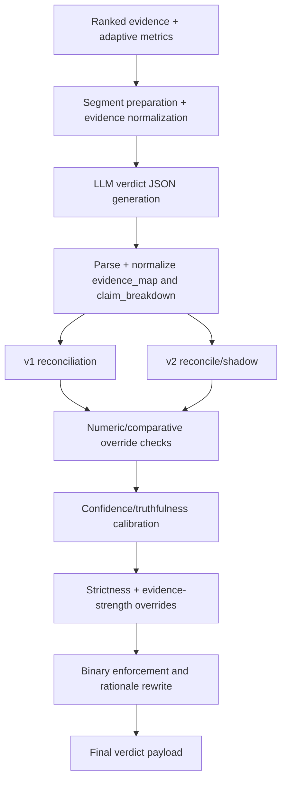

# 05. Verdict Synthesis

## Verdict Engine Composition

### Prose Equivalent

1. Verdict stage ingests ranked evidence, optionally recovers missing segment evidence, and formats LLM prompt inputs.
2. LLM response is parsed and normalized into `claim_breakdown` and `evidence_map`.
3. Deterministic reconciliation computes verdict consistency from segment statuses.
4. Numeric/comparative and policy overrides can force deterministic status corrections.
5. Confidence and truthfulness are calibrated using trust and evidence quality signals.
6. Strictness logic can cap confidence or override verdict for contradiction dominance and related patterns.
7. Final payload is normalized, rationale is rewritten for evidence fidelity, and binary enforcement logic is applied when appropriate.

## Component: Segment-Aware Preprocessing

1. Functional role
- Aligns verdict generation with claim segment structure and claim-specific evidence focus.

2. Technical mechanism
- Splits claim into logical segments.
- Retrieves segment-focused VDB evidence to mitigate full-claim embedding overshadow effects.
- Optional unknown-segment web recovery routines can fetch additional evidence before finalization.

3. Inputs and outputs
- Inputs: claim text and ranked evidence.
- Outputs: segment list, enriched evidence set for prompt and reconciliation.

4. Interaction with other components
- Uses VDB retrieval, trusted search, scraper, and fact extractor in targeted recovery paths.

5. Why necessary in this hybrid pipeline
- Multi-part claims frequently fail under monolithic prompt-only evaluation; segment recovery improves coverage.

6. Failure points and trade-offs
- Extra recovery steps improve resolution but increase latency and external dependency exposure.

## Component: LLM Verdict Inference

1. Functional role
- Produces initial structured verdict hypothesis from ranked evidence.

2. Technical mechanism
- Uses `VERDICT_GENERATION_PROMPT` requiring JSON output with verdict, confidence, truthfulness, claim breakdown, and evidence map.
- Parses response with schema normalization and fallback builders when fields are missing.

3. Inputs and outputs
- Inputs: claim and formatted evidence context.
- Outputs: provisional verdict JSON.

4. Interaction with other components
- Feeds deterministic post-processing pipeline (reconciliation, overrides, calibration).

5. Why necessary in this hybrid pipeline
- LLM synthesizes multi-evidence reasoning and natural-language rationale seed not directly encoded in ranking heuristics.

6. Failure points and trade-offs
- LLM may generate structurally valid but logically inconsistent segment assignments, requiring deterministic correction layers.

## Component: Reconciliation Engine (v1 and v2)

1. Functional role
- Enforces consistency between segment statuses and top-level verdict.

2. Technical mechanism
- v1 reconciliation computes status-derived verdict and resolved-segment metrics.
- v2 reconciler can run in enabled or shadow mode with fail-open behavior.
- Shadow diff instrumentation tracks parity between v1 and v2 outputs.

3. Inputs and outputs
- Inputs: normalized `claim_breakdown` statuses.
- Outputs: reconciled verdict decision (`verdict`, resolved/unresolved counts, weighted truth, truth cap).

4. Interaction with other components
- Receives normalized LLM outputs; feeds calibration and override stages.

5. Why necessary in this hybrid pipeline
- Prevents prompt-level inconsistency from leaking directly into final API output.

6. Failure points and trade-offs
- Dual-engine reconcile improves migration safety but increases branching complexity.

## Component: Numeric and Comparative Overrides

1. Functional role
- Handles deterministic correctness for quantity/comparison claims where symbolic constraints are available.

2. Technical mechanism
- Detects numeric-comparison claim patterns.
- Parses evidence numeric mentions into bounded intervals and merges constraints.
- Applies direct support/refute checks to override ambiguous generative verdicts.

3. Inputs and outputs
- Inputs: claim text, evidence list, claim breakdown.
- Outputs: optional verdict/status/truthfulness overrides with explicit reason codes.

4. Interaction with other components
- Runs after reconciliation and before final confidence calibration.

5. Why necessary in this hybrid pipeline
- Reduces false neutrality for machine-checkable comparative statements.

6. Failure points and trade-offs
- Pattern-based numeric extraction can miss implicit comparative evidence.

## Component: Confidence Calibration

1. Functional role
- Converts raw LLM confidence into reliability-adjusted confidence.

2. Technical mechanism
- Uses `ConfidenceCalibrator` with optional external calibration file.
- Applies feature-aware reliability adjustment (`coverage`, `agreement`, `diversity`, contradiction signal, admissible ratio, evidence quality).

3. Inputs and outputs
- Inputs: raw confidence and evidence/trust features.
- Outputs: calibrated confidence in [0,1].

4. Interaction with other components
- Consumes reconciled verdict context and trust diagnostics.

5. Why necessary in this hybrid pipeline
- Raw LLM confidence is not calibrated to evidence sufficiency dynamics.

6. Failure points and trade-offs
- Over-aggressive penalties can understate confidence in genuinely strong but narrow evidence sets.

## Component: Strictness and Logic Override Layer

1. Functional role
- Applies policy-level safety corrections for high-risk claim/evidence configurations.

2. Technical mechanism
- `compute_claim_strictness` profiles claim assertiveness/universality/modality/falsifiability.
- `compute_evidence_strength` scores support strength, hedge penalty, rarity penalty, stance, negation-anchor overlap.
- `apply_claim_logic_overrides` can trigger:
  - `CONTRADICTION_DOMINANCE`
  - `HEDGE_MISMATCH`
  - `MULTIHOP_RELAXATION`
  - `DIVERSITY_CAP`

3. Inputs and outputs
- Inputs: strictness profile, evidence strengths, claim breakdown statuses, diversity/agreement metrics.
- Outputs: overridden verdict/caps plus diagnostics (`override_reason`, key numbers).

4. Interaction with other components
- Consumes reconciled verdict context and feeds final payload normalization.

5. Why necessary in this hybrid pipeline
- Adds deterministic policy constraints where pure probabilistic synthesis is brittle.

6. Failure points and trade-offs
- Rule complexity can create edge-case interactions requiring regression coverage.

## Component: Binary Payload Enforcement and Rationale Fidelity

1. Functional role
- Final normalization layer ensuring output contract consistency and evidence-grounded explanation quality.

2. Technical mechanism
- Normalizes/repairs `evidence_map` and `claim_breakdown` if incomplete.
- Decides binary verdict only when evidence is decisive; otherwise preserves partial/unverifiable outcomes.
- Rewrites rationale if fidelity against evidence sentences is weak.

3. Inputs and outputs
- Inputs: post-override verdict payload and evidence context.
- Outputs: final payload with coherent verdict, truthfulness, confidence, rationale, breakdown, and evidence map.

4. Interaction with other components
- Final step before pipeline return.

5. Why necessary in this hybrid pipeline
- Maintains API contract stability despite complex upstream branch logic.

6. Failure points and trade-offs
- Aggressive normalization may hide useful uncertainty details unless diagnostics are logged.

## Component: Verdict Failure Fallback

1. Functional role
- Preserves availability when verdict generation path fails unexpectedly.

2. Technical mechanism
- Returns deterministic fallback payload routed through final normalization path.
- Worker-level fallback also exists if entire pipeline throws.

3. Inputs and outputs
- Inputs: claim text and exception context.
- Outputs: conservative completed response with fallback metadata.

4. Interaction with other components
- Triggered by exception paths in verdict or worker orchestration.

5. Why necessary in this hybrid pipeline
- Long multi-stage systems need bounded failure semantics at API boundary.

6. Failure points and trade-offs
- Availability is protected, but epistemic fidelity is reduced in fallback mode.

Last verified against code: February 28, 2026
