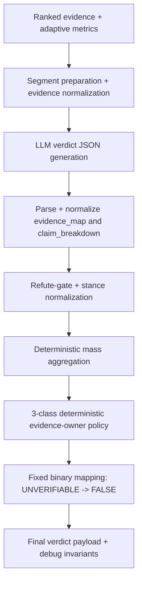

# 05. Verdict Synthesis

## Verdict Engine Composition

```mermaid
flowchart TD
    IN[Ranked evidence + adaptive metrics] --> PRE[Segment preparation + evidence normalization]
    PRE --> LLM[LLM verdict JSON generation]
    LLM --> PARSE[Parse + normalize evidence_map and claim_breakdown]
    PARSE --> NORM[Refute-gate + stance normalization]
    NORM --> MASS[Deterministic mass aggregation]
    MASS --> CORE[3-class deterministic evidence-owner policy]
    CORE --> MAP[Fixed binary mapping: UNVERIFIABLE -> FALSE]
    MAP --> OUT[Final verdict payload + debug invariants]
```

### Prose Equivalent

1. Verdict stage ingests ranked evidence, optionally recovers missing segment evidence, and formats LLM prompt inputs.
2. LLM response is parsed and normalized into `claim_breakdown` and `evidence_map`.
3. Evidence rows are normalized with contradiction/refute gate features and admission diagnostics.
4. Deterministic mass aggregation computes admitted `support_mass`, `contradict_mass`, and `neutral_mass`.
5. A single 3-class deterministic policy sets `verdict_internal` with explicit abstain reasons.
6. Binary output is a fixed projection of internal verdict (`UNVERIFIABLE -> FALSE`), not a second owner.
7. Final payload includes consistency invariants and policy/admission traces in debug fields.

## Component: Segment-Aware Preprocessing

1. Functional role
- Aligns verdict generation with claim segment structure and claim-specific evidence focus.

2. Technical mechanism
- Splits claim into logical segments.
- Retrieves segment-focused VDB evidence to mitigate full-claim embedding overshadow effects.
- Optional unknown-segment web recovery routines can fetch additional evidence before finalization.

3. Inputs and outputs
- Inputs: claim text and ranked evidence.
- Outputs: segment list, enriched evidence set for prompt and reconciliation.

4. Interaction with other components
- Uses VDB retrieval, trusted search, scraper, and fact extractor in targeted recovery paths.

5. Why necessary in this hybrid pipeline
- Multi-part claims frequently fail under monolithic prompt-only evaluation; segment recovery improves coverage.

6. Failure points and trade-offs
- Extra recovery steps improve resolution but increase latency and external dependency exposure.

## Component: LLM Verdict Inference

1. Functional role
- Produces initial structured verdict hypothesis from ranked evidence.

2. Technical mechanism
- Uses `VERDICT_GENERATION_PROMPT` requiring JSON output with verdict, confidence, truthfulness, claim breakdown, and evidence map.
- Parses response with schema normalization and fallback builders when fields are missing.

3. Inputs and outputs
- Inputs: claim and formatted evidence context.
- Outputs: provisional verdict JSON.

4. Interaction with other components
- Feeds deterministic post-processing pipeline (reconciliation, overrides, calibration).

5. Why necessary in this hybrid pipeline
- LLM synthesizes multi-evidence reasoning and natural-language rationale seed not directly encoded in ranking heuristics.

6. Failure points and trade-offs
- LLM may generate structurally valid but logically inconsistent segment assignments, requiring deterministic correction layers.

## Component: Deterministic Evidence-Owner Policy

1. Functional role
- Owns final verdict semantics from admitted evidence masses and sufficiency.

2. Technical mechanism
- `_compute_deterministic_masses` computes directional masses from admitted evidence only.
- `_apply_policy_v3_deterministic_projection` derives `verdict_internal`, truth score, and confidence.
- `_enforce_binary_verdict_payload_deterministic` enforces verdict-field invariants and fixed binary mapping.
- v2 logic remains shadow-only instrumentation; it does not own active verdict fields.

3. Inputs and outputs
- Inputs: normalized `evidence_map`, sufficiency signals, and evidence diagnostics.
- Outputs: `verdict_internal`, `verdict_binary`, masses, confidence, policy trace, and invariant flags.

4. Interaction with other components
- Receives normalized LLM outputs and evidence diagnostics, then feeds final payload assembly.

5. Why necessary in this hybrid pipeline
- Prevents binary fallback drift and ensures one deterministic decision owner for production output.

6. Failure points and trade-offs
- Over-strict admission gates can under-admit directional evidence; debug invariants are required to detect this.

## Component: Numeric and Comparative Overrides

1. Functional role
- Handles deterministic correctness for quantity/comparison claims where symbolic constraints are available.

2. Technical mechanism
- Detects numeric-comparison claim patterns.
- Parses evidence numeric mentions into bounded intervals and merges constraints.
- Applies direct support/refute checks to override ambiguous generative verdicts.

3. Inputs and outputs
- Inputs: claim text, evidence list, claim breakdown.
- Outputs: optional verdict/status/truthfulness overrides with explicit reason codes.

4. Interaction with other components
- Runs after reconciliation and before final confidence calibration.

5. Why necessary in this hybrid pipeline
- Reduces false neutrality for machine-checkable comparative statements.

6. Failure points and trade-offs
- Pattern-based numeric extraction can miss implicit comparative evidence.

## Component: Confidence Calibration

1. Functional role
- Converts raw LLM confidence into reliability-adjusted confidence.

2. Technical mechanism
- Uses `ConfidenceCalibrator` with optional external calibration file.
- Applies feature-aware reliability adjustment (`coverage`, `agreement`, `diversity`, contradiction signal, admissible ratio, evidence quality).

3. Inputs and outputs
- Inputs: raw confidence and evidence/trust features.
- Outputs: calibrated confidence in [0,1].

4. Interaction with other components
- Consumes deterministic verdict context and trust diagnostics.

5. Why necessary in this hybrid pipeline
- Raw LLM confidence is not calibrated to evidence sufficiency dynamics.

6. Failure points and trade-offs
- Over-aggressive penalties can understate confidence in genuinely strong but narrow evidence sets.

## Component: Legacy Logic and Shadow Diagnostics

1. Functional role
- Provides compatibility and observability signals while deterministic policy remains active owner.

2. Technical mechanism
- Legacy reconciliation and strictness-related computations can still run for diagnostics/shadow comparison.
- Active verdict fields are overwritten by deterministic evidence-owner projection in final normalization.

3. Inputs and outputs
- Inputs: claim/evidence intermediate outputs.
- Outputs: shadow and telemetry fields (not active decision ownership).

4. Interaction with other components
- Runs before final deterministic payload enforcement.

5. Why necessary in this hybrid pipeline
- Supports migration safety and forensic comparisons without taking ownership of final semantics.

6. Failure points and trade-offs
- If treated as owner, these layers can reintroduce patch-stacking conflicts; keep them shadow-only.

## Component: Binary Payload Enforcement and Rationale Fidelity

1. Functional role
- Final normalization layer ensuring deterministic contract consistency and evidence-grounded explanation quality.

2. Technical mechanism
- Normalizes/repairs `evidence_map` and `claim_breakdown` if incomplete.
- Computes internal 3-class decision first, then applies fixed binary projection (`UNVERIFIABLE -> FALSE`).
- Emits admission diagnostics (`support_labeled_count`, `support_admitted_count`, `refute_labeled_count`, `refute_admitted_count`) and invariant warnings when directional labels fail admission.
- Rewrites rationale if fidelity against evidence sentences is weak.

3. Inputs and outputs
- Inputs: post-override verdict payload and evidence context.
- Outputs: final payload with `verdict_internal`, `verdict_binary`, `binary_collapse_reason`, invariant flags, rationale, breakdown, and evidence map.

4. Interaction with other components
- Final step before pipeline return.

5. Why necessary in this hybrid pipeline
- Maintains API contract stability despite complex upstream branch logic.

6. Failure points and trade-offs
- Aggressive normalization may hide useful uncertainty details unless diagnostics are logged.

## Component: Verdict Failure Fallback

1. Functional role
- Preserves availability when verdict generation path fails unexpectedly.

2. Technical mechanism
- Returns deterministic fallback payload routed through final normalization path.
- Worker-level fallback also exists if entire pipeline throws.

3. Inputs and outputs
- Inputs: claim text and exception context.
- Outputs: conservative completed response with fallback metadata.

4. Interaction with other components
- Triggered by exception paths in verdict or worker orchestration.

5. Why necessary in this hybrid pipeline
- Long multi-stage systems need bounded failure semantics at API boundary.

6. Failure points and trade-offs
- Availability is protected, but epistemic fidelity is reduced in fallback mode.

Last verified against code: March 10, 2026

