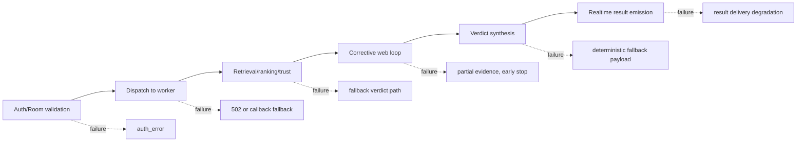

# 06. Failure Modes and Trade-Offs

## Failure Propagation Map

### Prose Equivalent

1. Ingress failures are mostly explicit (`auth_error`) and block costly downstream compute.
2. Dispatch failures are isolated and can use callback fallback when Kafka publish fails.
3. Worker subsystem failures generally degrade to fallback-completed responses rather than hard crashes.
4. Corrective loop failures often appear as low evidence yield, early stop, or reduced trust sufficiency.
5. Verdict-stage failures still return normalized payloads to preserve API continuity.

## Component: Ingress and Authorization Boundary

1. Functional role
- Protects compute path from invalid clients and unauthorized room actions.

2. Technical mechanism
- Room-secret hash verification and role-based action authorization via control-plane.

3. Inputs and outputs
- Inputs: join/post payloads, token scopes, room credentials.
- Outputs: join success or `auth_error`; no dispatch if unauthorized.

4. Interaction with other components
- Precondition for dispatcher/worker execution.

5. Why necessary in this hybrid pipeline
- Prevents abuse-driven expensive retrieval/search loops.

6. Failure points and design trade-offs
- Control-plane dependency increases ingress critical path; however security correctness outweighs additional latency.

## Component: Transport and Delivery Reliability

1. Functional role
- Ensures worker results and stage events reach clients under partial transport failures.

2. Technical mechanism
- Dual path: direct HTTP response/callback plus Kafka publish/consume loops.
- Signed callback token validation for internal endpoints.

3. Inputs and outputs
- Inputs: dispatch and callback payloads.
- Outputs: socket emissions or logged delivery failures.

4. Interaction with other components
- Bridges dispatcher, worker, socket-hub, and frontend.

5. Why necessary in this hybrid pipeline
- Long-running verification requires resilient asynchronous result handling.

6. Failure points and design trade-offs
- Multiple delivery channels improve resiliency but increase eventual consistency and observability complexity.

## Component: Retrieval Store Reliability (Pinecone, Neo4j, Lexical)

1. Functional role
- Provides multi-source evidence retrieval under varying store health conditions.

2. Technical mechanism
- Pinecone query fallback behavior and threshold/backfill logic.
- Neo4j timeout-guarded retrieval with connection-failure fast path.
- Local FTS5 lexical fallback for keyword precision.

3. Inputs and outputs
- Inputs: query embeddings/text, entities, anchors, topics.
- Outputs: candidate evidence sets with variable source composition.

4. Interaction with other components
- Feeds ranking and trust gates.

5. Why necessary in this hybrid pipeline
- Hybrid retrieval reduces single-store dependency risk and improves recall diversity.

6. Failure points and design trade-offs
- Store divergence can produce asymmetric evidence quality; fallback behavior may reduce structural coverage when KG is unavailable.

## Component: Extraction and Scraping Reliability

1. Functional role
- Converts web signals into usable structured evidence.

2. Technical mechanism
- Domain-aware scraper with cooldowns and Playwright fallback.
- Batched LLM extraction with JSON retries and conservative admissibility filters.

3. Inputs and outputs
- Inputs: URL sets and page content.
- Outputs: validated facts/entities/triples.

4. Interaction with other components
- Supplies ingestion and subsequent retrieval rounds.

5. Why necessary in this hybrid pipeline
- Corrective loop value depends on reliable conversion from web pages to fact units.

6. Failure points and design trade-offs
- Extraction precision guards reduce noise but can produce zero-fact rounds on sparse pages.

## Component: Ingestion Consistency Controls

1. Functional role
- Persists only trusted and structurally safe evidence.

2. Technical mechanism
- Domain trust filtering before VDB ingest.
- Negation/unsafe-triple suppression before KG ingest.
- Best-effort ingest semantics with failure logging.

3. Inputs and outputs
- Inputs: extracted facts/triples.
- Outputs: persisted subset and ingest status metrics.

4. Interaction with other components
- Affects future retrieval quality and corrective loop convergence.

5. Why necessary in this hybrid pipeline
- Prevents contamination of long-lived stores with weak or policy-disallowed evidence.

6. Failure points and design trade-offs
- Strict filtering protects quality but delays learning from newly observed domains.

## Component: Ranking and Trust Policy

1. Functional role
- Decides evidence sufficiency and loop continuation.

2. Technical mechanism
- Hybrid ranking + admissibility gate + adaptive trust policy with coverage/diversity/agreement thresholds.

3. Inputs and outputs
- Inputs: candidate evidence and claim decomposition.
- Outputs: top evidence set and sufficiency decision.

4. Interaction with other components
- Governs entry/exit of corrective search loop and influences verdict calibration.

5. Why necessary in this hybrid pipeline
- Controls both epistemic quality and cost envelope.

6. Failure points and design trade-offs
- Mis-tuned thresholds can cause over-search (latency cost) or under-search (evidence insufficiency).

## Component: Verdict and Override Layer

1. Functional role
- Produces final deterministic output despite noisy generative and retrieval inputs.

2. Technical mechanism
- Reconciliation engines, numeric overrides, strictness/evidence-strength overrides, confidence caps, rationale fidelity checks.

3. Inputs and outputs
- Inputs: claim breakdown, evidence map, trust diagnostics.
- Outputs: final verdict payload and override diagnostics.

4. Interaction with other components
- Consumes final ranked evidence and adaptive metrics from pipeline.

5. Why necessary in this hybrid pipeline
- Converts probabilistic outputs into contract-stable decisions with explicit policy safeguards.

6. Failure points and design trade-offs
- Policy override complexity improves safety but raises regression risk without dedicated tests.

## Component: Fallback Availability Strategy

1. Functional role
- Maintains service continuity during partial subsystem failure.

2. Technical mechanism
- Worker-level fallback-completed payloads.
- Verdict-level fallback payload generation.
- Stage callback error suppression (non-fatal).

3. Inputs and outputs
- Inputs: runtime exceptions, missing evidence paths.
- Outputs: degraded but valid response objects.

4. Interaction with other components
- Activated by worker pipeline and verdict generator exception handlers.

5. Why necessary in this hybrid pipeline
- End users still receive bounded outputs rather than timeouts during partial outages.

6. Failure points and design trade-offs
- Availability-first behavior can hide deeper quality regressions if observability is not monitored.

## Residual Risk Summary

1. Heuristic density
- Many gates are heuristic and require periodic calibration against regression suites.

2. Dependency volatility
- Search engines, third-party sites, and external APIs can alter behavior abruptly.

3. Multi-path transport complexity
- Kafka + callback + direct flows increase troubleshooting overhead.

4. Policy tuning pressure
- Strictness and confidence caps can over-correct in edge domains.

Last verified against code: February 28, 2026
