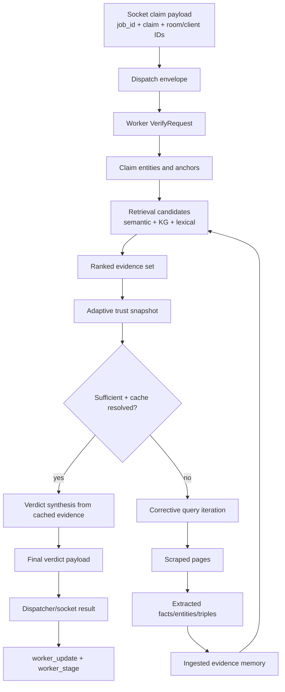

# 07. System Dataflow and Innovations

## End-to-End Evidence State Flow

### Prose Equivalent

1. Claim arrives with room/client correlation metadata and is wrapped as dispatch payload.
2. Worker converts request into claim anchors and retrieval query seeds.
3. Retrieval produces multi-source candidates which ranking condenses into top evidence.
4. Adaptive trust snapshot decides whether cached evidence is enough.
5. If not enough, corrective loop enriches evidence memory and re-enters retrieval/ranking.
6. Verdict synthesis reconciles structured statuses into final output payload.
7. Result and stage streams are emitted to clients via socket-hub.

## Component: Evidence State Transition Controller

1. Functional role
- Maintains deterministic progression of evidence state from raw claim to final verdict payload.

2. Technical mechanism
- Explicit state artifacts: `VerifyRequest`, candidate pools, ranked evidence, adaptive trust snapshot, verdict payload.
- Loop re-enters retrieval only after ingestion commits new evidence.

3. Inputs and outputs
- Inputs: claim request and external retrieval results.
- Outputs: stable final result schema consumed by frontend.

4. Interaction with other components
- Bridges ingress services, worker pipeline modules, and verdict engine.

5. Why necessary in this hybrid pipeline
- Hybrid correction requires explicit state transitions, not one-shot generation.

6. Failure points and design trade-offs
- Additional state layers improve traceability but increase payload/telemetry complexity.

## Component: Realtime Transparency Layer

1. Functional role
- Exposes internal progress and final outcomes without blocking UI on full completion.

2. Technical mechanism
- Stage callbacks from worker to socket-hub, then `worker_stage` fanout.
- Final normalized payload sent via `worker_update`.

3. Inputs and outputs
- Inputs: stage and result callback payloads.
- Outputs: per-post timeline states and final verdict rendering.

4. Interaction with other components
- Consumes pipeline stage emissions and dispatcher result delivery.

5. Why necessary in this hybrid pipeline
- Corrective loops are variable-length; stage stream keeps users and operators synchronized with backend state.

6. Failure points and design trade-offs
- Event loss does not stop verification, but frontend trace continuity can degrade.

## 1) System-Level Data Flow Summary (Step-by-Step)

1. Client sends `join_room` then `post_message` with claim and `client_claim_id` to `socket-hub`.
2. `socket-hub` validates room secret and action authorization through control-plane endpoints.
3. `socket-hub` emits immediate `processing` update and forwards job via dispatcher or Kafka.
4. `dispatcher` calls `POST /worker/verify` with normalized payload and timeout policy.
5. Worker pipeline emits `started`, extracts claim entities/anchors, infers topics, and builds retrieval queries.
6. Retrieval phase queries Pinecone, Neo4j, and lexical FTS branch; candidates are filtered and deduplicated.
7. Ranking phase computes hybrid scores, applies admissibility and contradiction logic, and produces top evidence.
8. Trust module computes adaptive sufficiency (`coverage`, `diversity`, `agreement`, `trust_post`).
9. If cache path passes, verdict is generated immediately and pipeline returns `completed_from_cache`.
10. If not sufficient, corrective loop runs per query: search -> scrape -> extract facts/entities/triples -> ingest -> re-retrieve -> re-rank -> re-check trust.
11. Loop exits on sufficiency, confidence/comparative stop rules, or budget limits.
12. Verdict generator performs LLM synthesis plus deterministic reconciliation, strictness overrides, and confidence calibration.
13. Worker returns normalized final payload including verdict, evidence map, trust/ranking diagnostics, and stage events.
14. Dispatcher/socket-hub deliver result to room as `worker_update`; stage stream remains available as `worker_stage`.

## 2) How This Differs from Standard Single-Stage RAG

1. Single-stage RAG usually performs one retrieve->generate pass; this system is iterative and trust-gated.
2. Single-stage RAG often relies on one retrieval modality; this system merges semantic vectors, KG structure, and lexical signals.
3. Single-stage RAG typically treats generation output as primary; this system adds deterministic reconciliation and policy override layers after generation.
4. Single-stage RAG often lacks realtime intermediate visibility; this system streams stage-level lifecycle events.
5. Single-stage RAG typically has static stop behavior; this system uses adaptive sufficiency, confidence-mode controls, and claim-type-specific early-stop logic.

## 3) Key Architectural Innovations

1. Retrieval-first, quota-optimized corrective loop with one-query-at-a-time expansion and immediate trust re-evaluation.
2. Claim-context hash and anchor-aware alignment used across VDB and KG retrieval scoring.
3. Adaptive trust policy combining subclaim coverage, diversity, agreement, and strong/contradicted segment counts.
4. Deterministic cache fast-path gate that validates segment resolution before allowing zero-search completion.
5. Domain-trust-gated ingestion pipeline that prevents untrusted evidence from contaminating persistent retrieval stores.
6. Multi-layer verdict governance: LLM synthesis, deterministic reconcile (v1/v2), numeric overrides, strictness/evidence-strength overrides, and binary enforcement.
7. Per-job LLM quota hardening with reserved critical slots and degradable non-critical calls.
8. Native stage-stream observability (`worker_stage`) integrated with final result transport (`worker_update`).

Last verified against code: February 28, 2026
