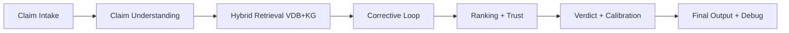
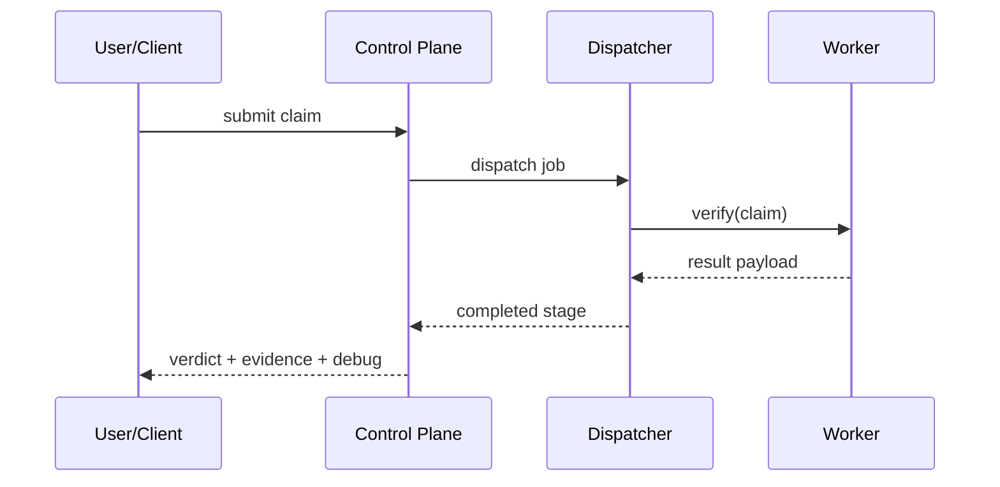
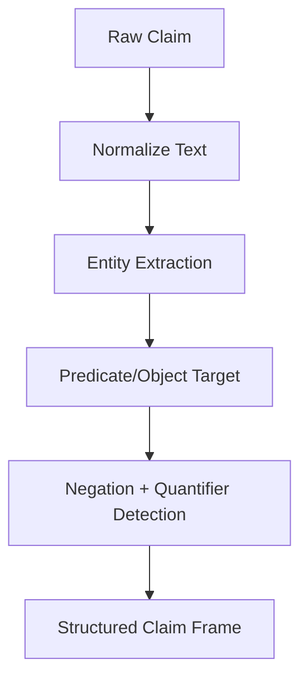
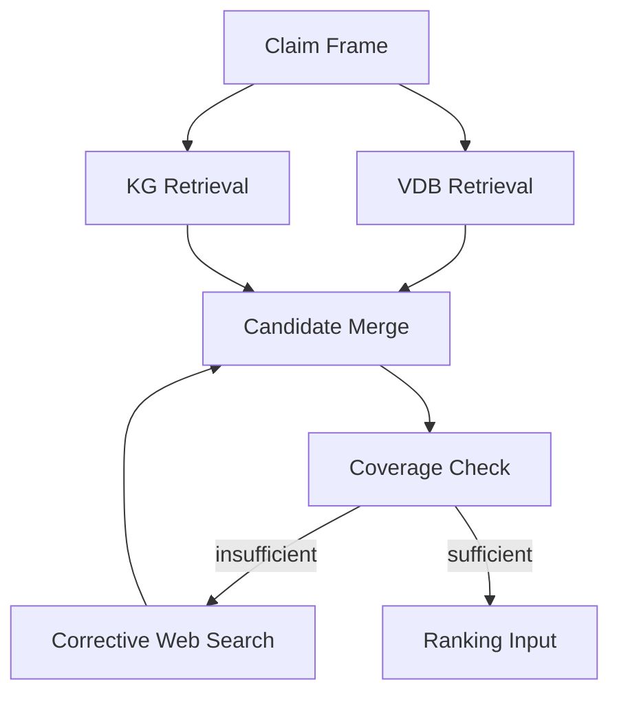
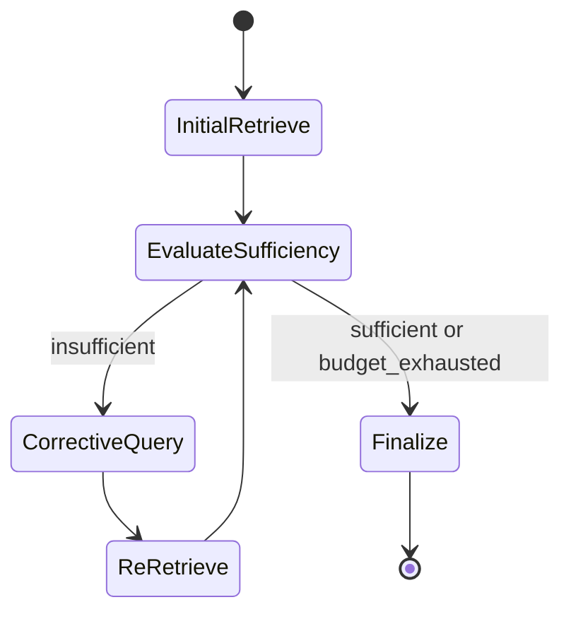
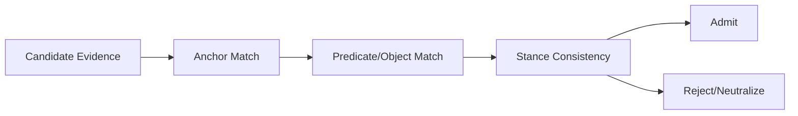
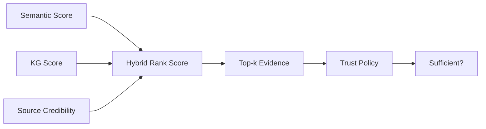
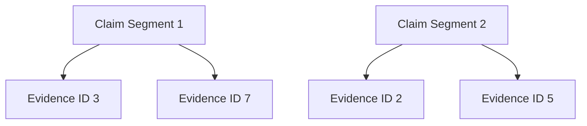

# Core Methodology Pack (H01-H08)

## H01 — System methodology overview (end-to-end architecture)
- **Figure ID**: H01
- **Paper Section**: Methods / System Overview
- **Type**: architecture
- **Research Question**: How does the system convert a health claim into a final verdict with diagnostics?
- **Key Variables**: claim_text, claim_entities, evidence_map, verdict_binary, confidence

### Mermaid Block

- **Caption (camera-ready)**: *H01.* End-to-end hybrid RAG methodology for health claim verification, from intake through calibrated verdict emission.
- **How to Read**: Follow left-to-right data flow; each block maps to one major subsystem.
- **Expected Insight**: Clarifies full methodology and handoff boundaries.
- **Failure Signal to Watch**: Stage output inconsistency across transitions.
- **Data Source / Log Fields**: `worker/app/main.py`, stage events, `final_payload`.
- **Export Notes**: SVG/PDF; `2-column`; grayscale-safe labels.

## H02 — Claim-to-verdict lifecycle (sequence)
- **Figure ID**: H02
- **Paper Section**: Methods / Runtime Flow
- **Type**: sequence
- **Research Question**: What runtime interactions occur from claim submission to result return?
- **Key Variables**: job_id, room_id, run_id, pipeline_status

### Mermaid Block

- **Caption (camera-ready)**: *H02.* Runtime sequence for claim verification across orchestration and inference services.
- **How to Read**: Read top-to-bottom with service lanes as participants.
- **Expected Insight**: Shows orchestration responsibilities vs worker responsibilities.
- **Failure Signal to Watch**: Missing completion handoff or stale stage state.
- **Data Source / Log Fields**: dispatcher logs, worker status fields, API response payload.
- **Export Notes**: SVG/PDF; `2-column`; lane labels >=8pt.

## H03 — Claim understanding (entities, predicates, quantifiers)
- **Figure ID**: H03
- **Paper Section**: Methods / Claim Understanding
- **Type**: flowchart
- **Research Question**: How are structured claim semantics extracted before retrieval?
- **Key Variables**: claim_entities, predicate_target, negation, quantifier_flags

### Mermaid Block

- **Caption (camera-ready)**: *H03.* Structured claim framing pipeline used to guide retrieval and verdict policy.
- **How to Read**: Top-down extraction stages; terminal node is the retrieval-ready frame.
- **Expected Insight**: Demonstrates deterministic claim conditioning before evidence search.
- **Failure Signal to Watch**: Missing predicate target or incorrect negation polarity.
- **Data Source / Log Fields**: corrective pipeline claim extraction logs, predicate target fields.
- **Export Notes**: SVG/PDF; `1-column`.

## H04 — Hybrid retrieval strategy (VDB+KG with corrective entry points)
- **Figure ID**: H04
- **Paper Section**: Methods / Retrieval
- **Type**: DAG
- **Research Question**: How are vector and graph retrieval combined with corrective search?
- **Key Variables**: semantic_candidates_count, kg_candidates_count, kg_fallback_triggered

### Mermaid Block

- **Caption (camera-ready)**: *H04.* Hybrid retrieval with corrective loop entry on insufficient evidence.
- **How to Read**: Follow DAG branches from shared claim frame to merged candidates and gating.
- **Expected Insight**: Makes fallback/iteration logic explicit.
- **Failure Signal to Watch**: Repeated low-gain corrective loops.
- **Data Source / Log Fields**: retrieval phase outputs, corrective loop decision logs.
- **Export Notes**: SVG/PDF; `2-column`.

## H05 — Corrective loop control logic (state machine)
- **Figure ID**: H05
- **Paper Section**: Methods / Corrective Retrieval
- **Type**: state
- **Research Question**: What control states drive iterative search and stopping?
- **Key Variables**: query_budget.total, query_budget.used, stop_reason, adaptive_sufficient

### Mermaid Block

- **Caption (camera-ready)**: *H05.* Corrective retrieval state machine with sufficiency and budget exits.
- **How to Read**: Trace transitions by condition labels.
- **Expected Insight**: Shows why latency can grow and where exits are enforced.
- **Failure Signal to Watch**: budget exhaustion with no directional gain.
- **Data Source / Log Fields**: `debug.query_budget`, `debug.stop_reason`.
- **Export Notes**: SVG/PDF; `1-column`.

## H06 — Evidence admissibility and alignment gate
- **Figure ID**: H06
- **Paper Section**: Methods / Evidence Validation
- **Type**: flowchart
- **Research Question**: Which evidence is admissible for verdict computation?
- **Key Variables**: anchor_match, predicate_match_score, object_match_ok, stance

### Mermaid Block

- **Caption (camera-ready)**: *H06.* Evidence gating based on semantic alignment and stance consistency.
- **How to Read**: Left-to-right decision path ending in admit/reject outcomes.
- **Expected Insight**: Explains reduction of hallucinated or weakly linked evidence.
- **Failure Signal to Watch**: high neutral-only evidence despite high candidate count.
- **Data Source / Log Fields**: `evidence_map`, alignment debug fields.
- **Export Notes**: SVG/PDF; `1-column`.

## H07 — Ranking and trust composition
- **Figure ID**: H07
- **Paper Section**: Methods / Ranking and Trust
- **Type**: DAG
- **Research Question**: How are ranking and trust fused into final evidence selection?
- **Key Variables**: final_score, support_score, contradict_score, trust_post, diversity, agreement

### Mermaid Block

- **Caption (camera-ready)**: *H07.* Hybrid ranking pipeline followed by trust sufficiency assessment.
- **How to Read**: Inputs converge into rank score, then pass through trust gating.
- **Expected Insight**: Distinguishes ranking quality from trust sufficiency.
- **Failure Signal to Watch**: high rank with low trust sufficiency.
- **Data Source / Log Fields**: ranking phase outputs, trust snapshots.
- **Export Notes**: SVG/PDF; `2-column`.

## H08 — Evidence attribution structure (claim segments ↔ evidence IDs)
- **Figure ID**: H08
- **Paper Section**: Methods / Explainability
- **Type**: table-graphic
- **Research Question**: How is segment-level evidence attribution represented?
- **Key Variables**: claim_breakdown.segment, status, evidence_used_ids

### Mermaid Block

- **Caption (camera-ready)**: *H08.* Segment-to-evidence attribution graph supporting interpretable verdicts.
- **How to Read**: Segment nodes connect to supporting/refuting evidence IDs.
- **Expected Insight**: Makes rationale traceable and auditable.
- **Failure Signal to Watch**: non-unknown segments without evidence links.
- **Data Source / Log Fields**: `claim_breakdown`, `evidence_attribution`, `evidence_map`.
- **Export Notes**: SVG/PDF; `1-column`.
