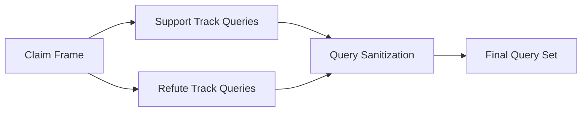
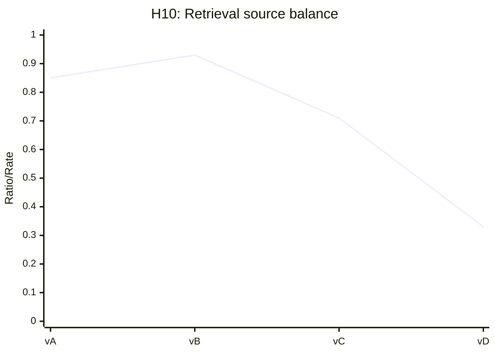
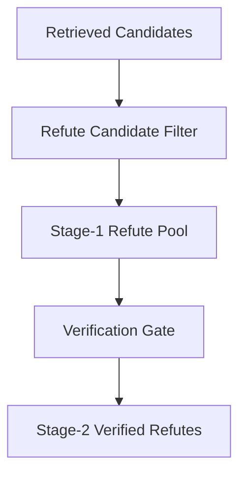
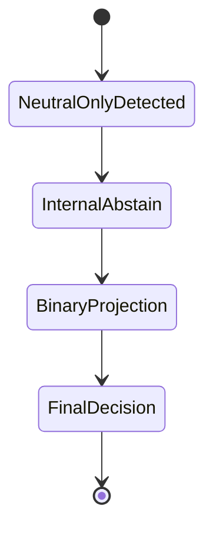
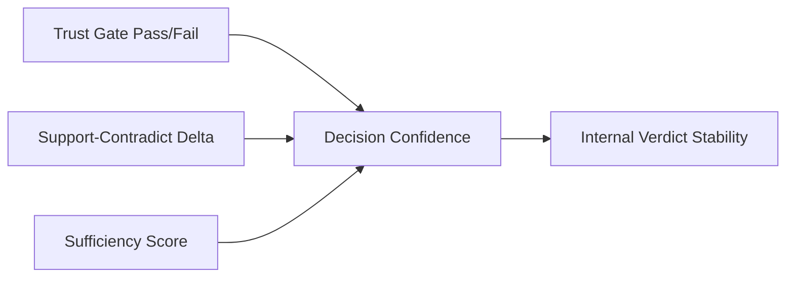
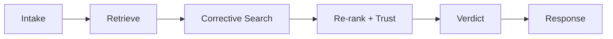

# Retrieval, Ranking, and Trust Pack (H09-H14)

## H09 — Query strategy design (support/refute tracks)
- **Figure ID**: H09
- **Paper Section**: Methods / Query Generation
- **Type**: flowchart
- **Research Question**: How are support and contradiction query tracks generated?
- **Key Variables**: generated_queries, query_track, query_quality

### Mermaid Block

- **Caption (camera-ready)**: *H09.* Dual-track query generation for balanced evidence retrieval.
- **How to Read**: Observe branch generation then merge/sanitize before retrieval.
- **Expected Insight**: Prevents one-sided retrieval bias.
- **Failure Signal to Watch**: repetitive or low-yield query variants.
- **Data Source / Log Fields**: `debug.generated_queries`, query reformulation logs.
- **Export Notes**: SVG/PDF; `1-column`.

## H10 — Retrieval source balance and fusion behavior
- **Figure ID**: H10
- **Paper Section**: Methods / Hybrid Retrieval
- **Type**: curve
- **Research Question**: How does VDB/KG contribution balance affect outcomes?
- **Key Variables**: kg_utilization_ratio, kg_zero_signal_rate, vector_hits, kg_hits

### Mermaid Block

- **Caption (camera-ready)**: *H10.* Retrieval-source balance profile across versions and runs.
- **How to Read**: Relative shifts indicate KG/VDB dominance changes.
- **Expected Insight**: Detects source imbalance linked to instability.
- **Failure Signal to Watch**: high KG zero-signal with low KG utilization.
- **Data Source / Log Fields**: `metrics.json` (`kg_utilization_ratio`, `kg_zero_signal_rate`), debug hit counts.
- **Export Notes**: SVG/PDF; `1-column`.

## H11 — Contradiction admission and verification path
- **Figure ID**: H11
- **Paper Section**: Methods / Ranking
- **Type**: flowchart
- **Research Question**: How does contradiction evidence move from candidate to verified refute?
- **Key Variables**: refute_candidate_count_stage1, refute_verified_count_stage2, contradiction_strength

### Mermaid Block

- **Caption (camera-ready)**: *H11.* Contradiction admission pipeline and verification bottlenecks.
- **How to Read**: Top-down stages from broad candidate set to verified refutations.
- **Expected Insight**: Highlights under-admission risk for false-claim detection.
- **Failure Signal to Watch**: large stage1-stage2 drop with persistent errors.
- **Data Source / Log Fields**: `refute_pipeline_stats`, ranking diagnostics.
- **Export Notes**: SVG/PDF; `1-column`.

## H12 — Neutral-only evidence handling path
- **Figure ID**: H12
- **Paper Section**: Methods / Evidence Policy
- **Type**: state
- **Research Question**: How are neutral-only evidence cases handled before final binary output?
- **Key Variables**: supports, refutes, neutral, abstain_reason, verdict_internal, verdict_binary

### Mermaid Block

- **Caption (camera-ready)**: *H12.* Policy path for neutral-only evidence regimes.
- **How to Read**: State transitions show abstain-first then projection behavior.
- **Expected Insight**: Makes uncertainty handling explicit.
- **Failure Signal to Watch**: frequent projection under low alignment.
- **Data Source / Log Fields**: `debug.evidence_stance_distribution`, `abstain_reason`, `verdict_internal`, `verdict_binary`.
- **Export Notes**: SVG/PDF; `1-column`.

## H13 — Trust gate vs directional evidence interaction
- **Figure ID**: H13
- **Paper Section**: Methods / Trust Policy
- **Type**: causal
- **Research Question**: How do trust gate outcomes interact with directional mass signals?
- **Key Variables**: trust_threshold_met, support_mass, contradict_mass, sufficiency_score

### Mermaid Block

- **Caption (camera-ready)**: *H13.* Coupling between trust gating, directional evidence, and verdict stability.
- **How to Read**: Three upstream determinants influence confidence/stability.
- **Expected Insight**: Separates soft trust effects from directional evidence effects.
- **Failure Signal to Watch**: high directional delta with unstable internal verdict.
- **Data Source / Log Fields**: trust snapshot fields, mass fields, policy trace.
- **Export Notes**: SVG/PDF; `1-column`.

## H14 — Latency-critical path across stages
- **Figure ID**: H14
- **Paper Section**: Methods / Efficiency
- **Type**: flowchart
- **Research Question**: Which stage sequence dominates end-to-end latency?
- **Key Variables**: stage_events timestamps, elapsed_seconds, queries_used

### Mermaid Block

- **Caption (camera-ready)**: *H14.* Latency-critical execution path emphasizing corrective-search amplification.
- **How to Read**: Left-to-right path approximates latency contribution order.
- **Expected Insight**: Identifies optimization priorities without changing methodology semantics.
- **Failure Signal to Watch**: excessive query rounds without quality gain.
- **Data Source / Log Fields**: stage events, run elapsed times, query budget fields.
- **Export Notes**: SVG/PDF; `1-column`.
