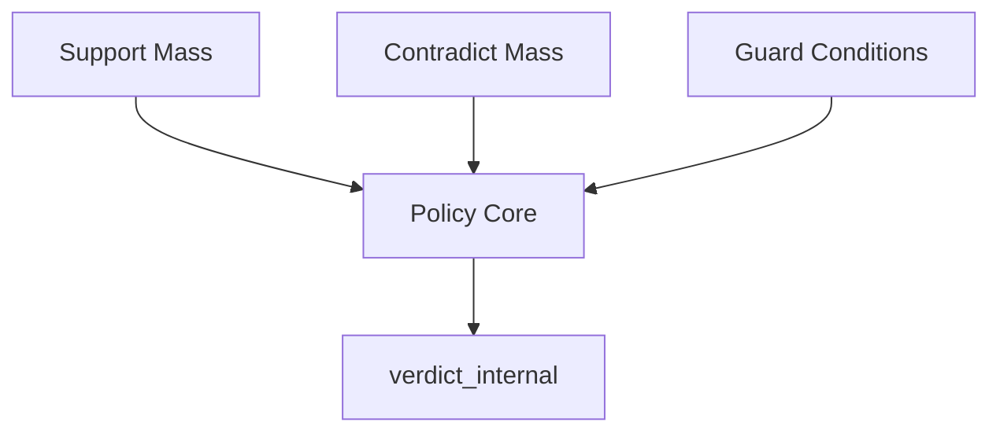
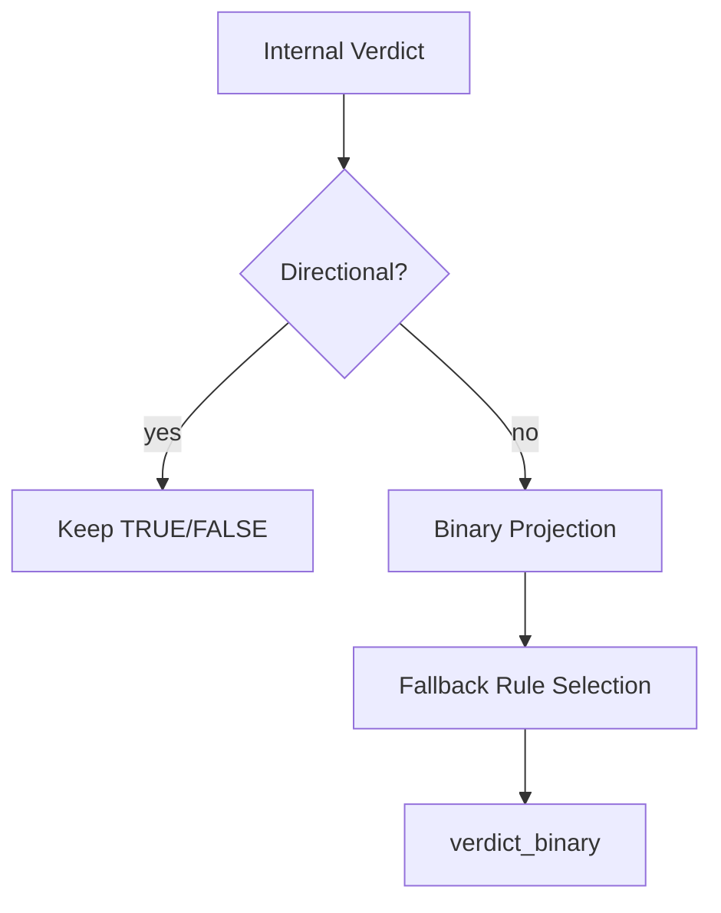
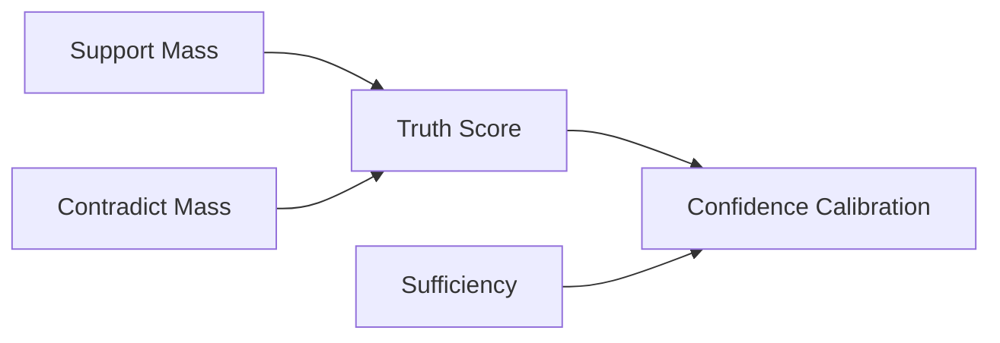
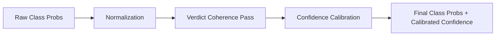
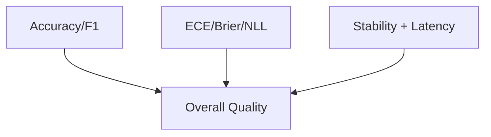
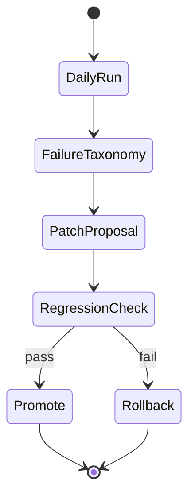

# Verdict, Calibration, and Evaluation Pack (H15-H20)

## H15 — Internal verdict policy graph
- **Figure ID**: H15
- **Paper Section**: Methods / Verdict Synthesis
- **Type**: DAG
- **Research Question**: How is internal verdict formed from evidence masses and guards?
- **Key Variables**: support_mass, contradict_mass, neutral_mass, verdict_guard_reasons, verdict_internal

### Mermaid Block

- **Caption (camera-ready)**: *H15.* Internal verdict derivation graph using directional masses and guard constraints.
- **How to Read**: Inputs converge on a deterministic internal policy node.
- **Expected Insight**: Clarifies abstain vs directional internal outcomes.
- **Failure Signal to Watch**: guard over-triggering with adequate directional evidence.
- **Data Source / Log Fields**: policy trace, guard reasons, mass fields.
- **Export Notes**: SVG/PDF; `2-column`.

## H16 — Binary projection policy and fallback logic
- **Figure ID**: H16
- **Paper Section**: Methods / Output Policy
- **Type**: flowchart
- **Research Question**: How is final binary output projected from internal state and fallback rules?
- **Key Variables**: verdict_internal, truth_score_binary, binary_fallback_reason, verdict_binary

### Mermaid Block

- **Caption (camera-ready)**: *H16.* Binary projection pathway with explicit fallback reasons.
- **How to Read**: Decision diamond separates direct directional outputs from projection branch.
- **Expected Insight**: Exposes where binary coercion occurs.
- **Failure Signal to Watch**: high fallback frequency in low-alignment cohorts.
- **Data Source / Log Fields**: `policy_trace`, `binary_fallback_reason`, `verdict_binary`.
- **Export Notes**: SVG/PDF; `1-column`.

## H17 — Truth/confidence mass flow (support vs contradiction)
- **Figure ID**: H17
- **Paper Section**: Methods / Confidence Modeling
- **Type**: causal
- **Research Question**: How do support and contradiction masses determine truth score and confidence?
- **Key Variables**: support_mass, contradict_mass, truth_score_binary, confidence, sufficiency_score

### Mermaid Block

- **Caption (camera-ready)**: *H17.* Mass-based truth and confidence flow.
- **How to Read**: Support and contradiction masses drive truth, then confidence is calibrated with sufficiency.
- **Expected Insight**: Separates directional evidence from confidence scaling.
- **Failure Signal to Watch**: high confidence under low sufficiency.
- **Data Source / Log Fields**: mass fields, `truth_score_binary`, `confidence`, `sufficiency_score`.
- **Export Notes**: SVG/PDF; `1-column`.

## H18 — Calibration and probability coherence pipeline
- **Figure ID**: H18
- **Paper Section**: Methods / Calibration
- **Type**: flowchart
- **Research Question**: How are class probabilities and confidence made coherent with final outputs?
- **Key Variables**: class_probs, calibrated_confidence, calibration_meta, class_probs_resync_reason

### Mermaid Block

- **Caption (camera-ready)**: *H18.* Calibration pipeline ensuring probability-label consistency.
- **How to Read**: Left-to-right calibration transforms before output emission.
- **Expected Insight**: Shows why ECE/Brier can improve or regress.
- **Failure Signal to Watch**: repeated resync with persistent miscalibration.
- **Data Source / Log Fields**: `class_probs`, `calibrated_confidence`, `calibration_meta`.
- **Export Notes**: SVG/PDF; `1-column`.

## H19 — Evaluation framework (accuracy + calibration + stability)
- **Figure ID**: H19
- **Paper Section**: Evaluation
- **Type**: table-graphic
- **Research Question**: How is performance jointly measured beyond accuracy?
- **Key Variables**: accuracy_3class, macro_ece_3class, brier_3class, nll_3class, repeat_flip_rate

### Mermaid Block

- **Caption (camera-ready)**: *H19.* Multi-axis evaluation stack combining correctness, calibration, and stability.
- **How to Read**: Three metric families aggregate into one quality view.
- **Expected Insight**: Prevents over-optimizing for accuracy alone.
- **Failure Signal to Watch**: accuracy gains paired with ECE degradation.
- **Data Source / Log Fields**: `evaluation/artifacts/metrics.json`.
- **Export Notes**: SVG/PDF; `1-column`.

## H20 — Failure taxonomy and governance loop (daily/weekly regression)
- **Figure ID**: H20
- **Paper Section**: Reproducibility / Governance
- **Type**: state
- **Research Question**: How are failures categorized, tracked, and fed into controlled iteration?
- **Key Variables**: failure_category, regression_flag, anchor_metrics_delta, canary_status

### Mermaid Block

- **Caption (camera-ready)**: *H20.* Governance loop connecting failure taxonomy to regression-controlled iteration.
- **How to Read**: State loop enforces controlled promotion after checks.
- **Expected Insight**: Encodes reproducible research protocol and risk control.
- **Failure Signal to Watch**: repeated rollback cycles in same failure category.
- **Data Source / Log Fields**: daily protocol artifacts, version comparison metrics, regression reports.
- **Export Notes**: SVG/PDF; `2-column`.
