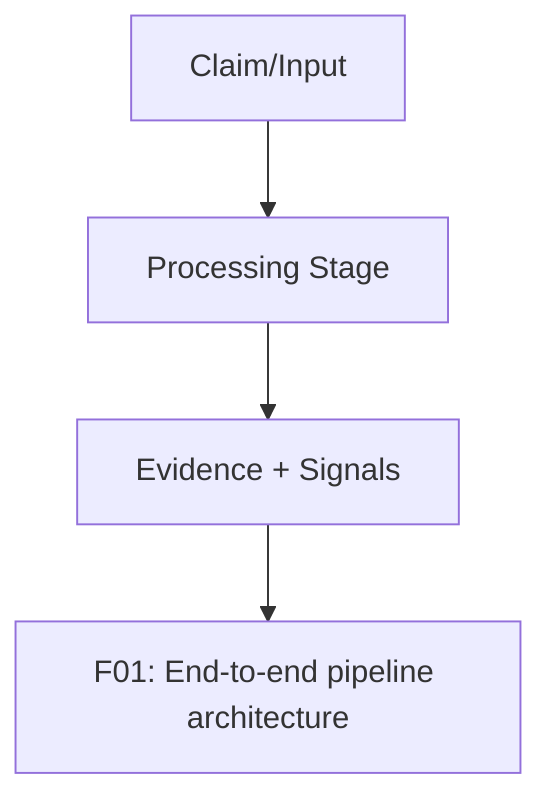
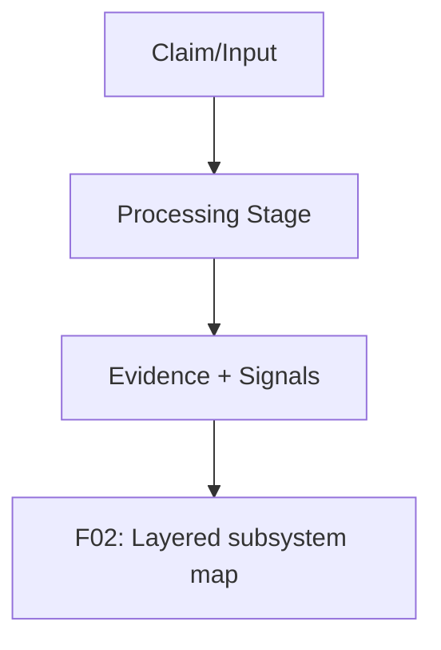
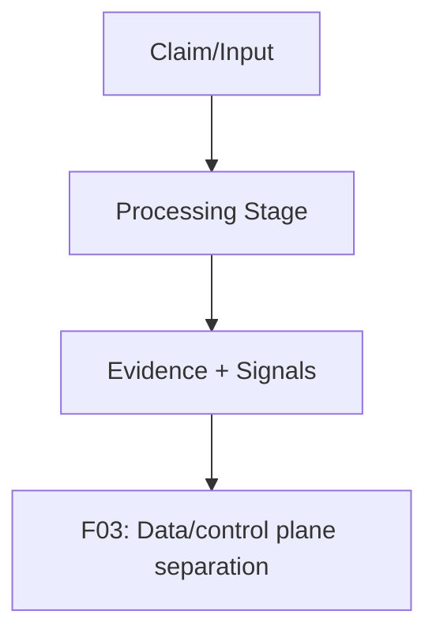
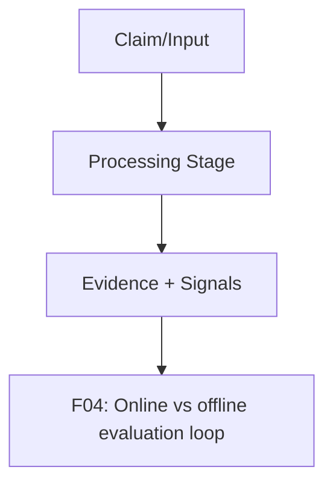
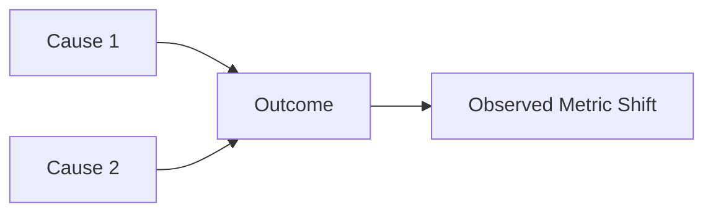

# method overview pack

This pack defines publication-ready figure specs and Mermaid drafts.

### F01 — End-to-end pipeline architecture

- **Figure ID**: F01
- **Paper Section**: Methodology: System Architecture
- **Type**: architecture
- **Placement**: Main
- **Column Fit**: 2-column
- **Research Question**: How does the full verification stack transform a claim into verdict + diagnostics?
- **Key Variables**: claim_text, claim_entities, evidence_map, verdict_binary, confidence

#### Mermaid Block

#### Figure Spec (Camera-Ready)
- **Caption (IEEE/ACM style)**: *F01.* End-to-end pipeline architecture. This figure operationalizes how does the full verification stack transform a claim into verdict + diagnostics? using deterministic system signals and stage-linked diagnostics.
- **How to Read**: Start from the leftmost/topmost stage, follow directed transitions, then interpret terminal nodes against the metrics listed in the data-source field.
- **Expected Insight**: Reveals causal or procedural structure needed to reproduce and audit methodological behavior.
- **Failure Signal to Watch**: Disagreement between directional outputs and supporting upstream evidence signals; review `alignment_score`, `neutral_only_stance_rate`, and policy path branches.
- **Data Source / Log Fields**: worker/app/main.py debug block; worker pipeline stage events
- **Export Notes**: SVG/PDF export preferred; grayscale-safe palette required; annotate as 2-column in final manuscript; keep text >= 8pt at print scale.

---
### F02 — Layered subsystem map

- **Figure ID**: F02
- **Paper Section**: Methodology: System Architecture
- **Type**: architecture
- **Placement**: Main
- **Column Fit**: 2-column
- **Research Question**: How are services layered across control-plane, retrieval, ranking, and verdict?
- **Key Variables**: service_layer, dependency_edges, interface_contracts

#### Mermaid Block

#### Figure Spec (Camera-Ready)
- **Caption (IEEE/ACM style)**: *F02.* Layered subsystem map. This figure operationalizes how are services layered across control-plane, retrieval, ranking, and verdict? using deterministic system signals and stage-linked diagnostics.
- **How to Read**: Start from the leftmost/topmost stage, follow directed transitions, then interpret terminal nodes against the metrics listed in the data-source field.
- **Expected Insight**: Reveals causal or procedural structure needed to reproduce and audit methodological behavior.
- **Failure Signal to Watch**: Disagreement between directional outputs and supporting upstream evidence signals; review `alignment_score`, `neutral_only_stance_rate`, and policy path branches.
- **Data Source / Log Fields**: docs/system-overview.md; docs/interfaces-and-contracts.md
- **Export Notes**: SVG/PDF export preferred; grayscale-safe palette required; annotate as 2-column in final manuscript; keep text >= 8pt at print scale.

---
### F03 — Data/control plane separation

- **Figure ID**: F03
- **Paper Section**: Methodology: System Architecture
- **Type**: flowchart
- **Placement**: Main
- **Column Fit**: 1-column
- **Research Question**: Where are data-plane vs control-plane boundaries and failure isolation points?
- **Key Variables**: dispatch_events, room_id, pipeline_status, storage_version

#### Mermaid Block

#### Figure Spec (Camera-Ready)
- **Caption (IEEE/ACM style)**: *F03.* Data/control plane separation. This figure operationalizes where are data-plane vs control-plane boundaries and failure isolation points? using deterministic system signals and stage-linked diagnostics.
- **How to Read**: Start from the leftmost/topmost stage, follow directed transitions, then interpret terminal nodes against the metrics listed in the data-source field.
- **Expected Insight**: Reveals causal or procedural structure needed to reproduce and audit methodological behavior.
- **Failure Signal to Watch**: Disagreement between directional outputs and supporting upstream evidence signals; review `alignment_score`, `neutral_only_stance_rate`, and policy path branches.
- **Data Source / Log Fields**: dispatcher/socket-hub logs; control-plane API contracts
- **Export Notes**: SVG/PDF export preferred; grayscale-safe palette required; annotate as 1-column in final manuscript; keep text >= 8pt at print scale.

---
### F04 — Online vs offline evaluation loop

- **Figure ID**: F04
- **Paper Section**: Methodology: Evaluation Protocol
- **Type**: flowchart
- **Placement**: Main
- **Column Fit**: 1-column
- **Research Question**: How does online inference feed offline evaluation and iterative patching?
- **Key Variables**: run_id, version, metrics, failure_categories

#### Mermaid Block

#### Figure Spec (Camera-Ready)
- **Caption (IEEE/ACM style)**: *F04.* Online vs offline evaluation loop. This figure operationalizes how does online inference feed offline evaluation and iterative patching? using deterministic system signals and stage-linked diagnostics.
- **How to Read**: Start from the leftmost/topmost stage, follow directed transitions, then interpret terminal nodes against the metrics listed in the data-source field.
- **Expected Insight**: Reveals causal or procedural structure needed to reproduce and audit methodological behavior.
- **Failure Signal to Watch**: Disagreement between directional outputs and supporting upstream evidence signals; review `alignment_score`, `neutral_only_stance_rate`, and policy path branches.
- **Data Source / Log Fields**: evaluation/runs/*; evaluation/artifacts/metrics.json
- **Export Notes**: SVG/PDF export preferred; grayscale-safe palette required; annotate as 1-column in final manuscript; keep text >= 8pt at print scale.

---
### F05 — Research contribution map

- **Figure ID**: F05
- **Paper Section**: Introduction / Contributions
- **Type**: causal
- **Placement**: Main
- **Column Fit**: 1-column
- **Research Question**: What innovations contribute to calibration and robustness?
- **Key Variables**: hybrid_retrieval, trust_policy, corrective_loop, calibration

#### Mermaid Block

#### Figure Spec (Camera-Ready)
- **Caption (IEEE/ACM style)**: *F05.* Research contribution map. This figure operationalizes what innovations contribute to calibration and robustness? using deterministic system signals and stage-linked diagnostics.
- **How to Read**: Start from the leftmost/topmost stage, follow directed transitions, then interpret terminal nodes against the metrics listed in the data-source field.
- **Expected Insight**: Reveals causal or procedural structure needed to reproduce and audit methodological behavior.
- **Failure Signal to Watch**: Disagreement between directional outputs and supporting upstream evidence signals; review `alignment_score`, `neutral_only_stance_rate`, and policy path branches.
- **Data Source / Log Fields**: docs/methodology/*.md synthesis
- **Export Notes**: SVG/PDF export preferred; grayscale-safe palette required; annotate as 1-column in final manuscript; keep text >= 8pt at print scale.

---

