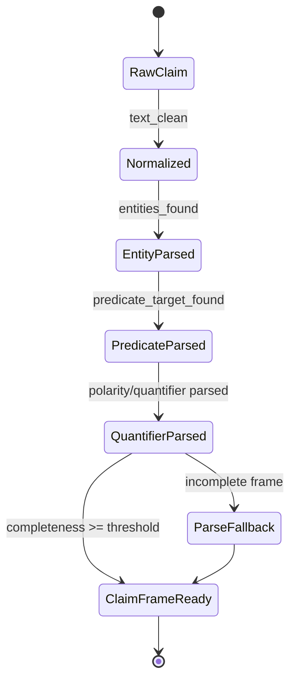
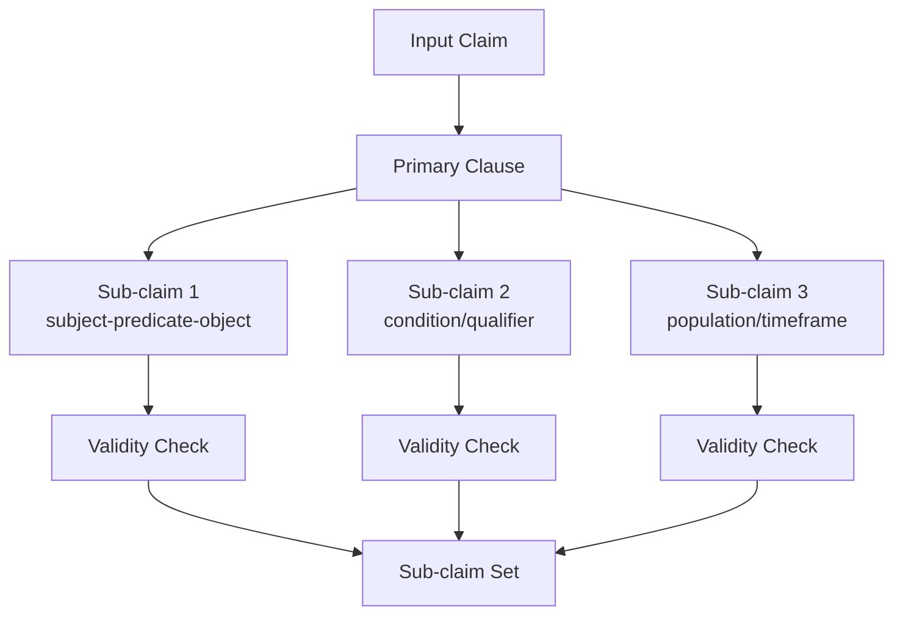
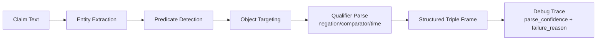
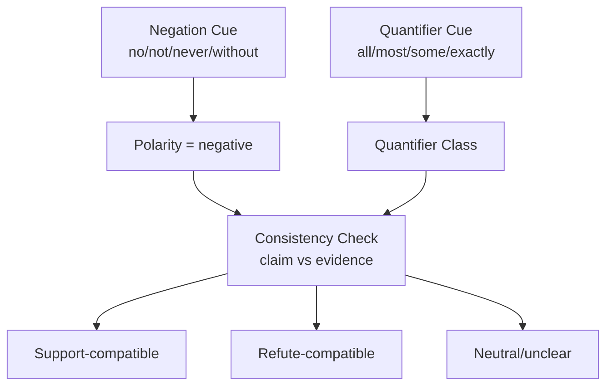
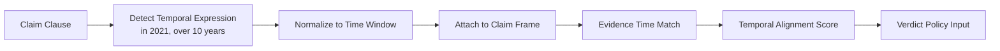

# intake and claim understanding pack

This pack defines publication-ready figure specs and Mermaid drafts.

### F06 — Claim parsing finite-state view

- **Figure ID**: F06
- **Paper Section**: Methodology: Claim Understanding
- **Type**: state
- **Placement**: Main
- **Column Fit**: 1-column
- **Research Question**: What deterministic stages parse and normalize claims?
- **Key Variables**: raw_claim, normalized_claim, parse_state

#### Mermaid Block

#### Figure Spec (Camera-Ready)
- **Caption (IEEE/ACM style)**: *F06.* Claim parsing finite-state view. This figure operationalizes what deterministic stages parse and normalize claims? using deterministic system signals and stage-linked diagnostics.
- **How to Read**: Start from the leftmost/topmost stage, follow directed transitions, then interpret terminal nodes against the metrics listed in the data-source field.
- **Expected Insight**: Reveals causal or procedural structure needed to reproduce and audit methodological behavior.
- **Failure Signal to Watch**: Disagreement between directional outputs and supporting upstream evidence signals; review `alignment_score`, `neutral_only_stance_rate`, and policy path branches.
- **Data Source / Log Fields**: worker corrective pipeline claim preprocessing logs
- **Export Notes**: SVG/PDF export preferred; grayscale-safe palette required; annotate as 1-column in final manuscript; keep text >= 8pt at print scale.

---
### F07 — Sub-claim decomposition tree

- **Figure ID**: F07
- **Paper Section**: Methodology: Claim Understanding
- **Type**: DAG
- **Placement**: Main
- **Column Fit**: 2-column
- **Research Question**: How are composite claims decomposed for evidence attribution?
- **Key Variables**: subclaims, segment_status, evidence_used_ids

#### Mermaid Block

#### Figure Spec (Camera-Ready)
- **Caption (IEEE/ACM style)**: *F07.* Sub-claim decomposition tree. This figure operationalizes how are composite claims decomposed for evidence attribution? using deterministic system signals and stage-linked diagnostics.
- **How to Read**: Start from the leftmost/topmost stage, follow directed transitions, then interpret terminal nodes against the metrics listed in the data-source field.
- **Expected Insight**: Reveals causal or procedural structure needed to reproduce and audit methodological behavior.
- **Failure Signal to Watch**: Disagreement between directional outputs and supporting upstream evidence signals; review `alignment_score`, `neutral_only_stance_rate`, and policy path branches.
- **Data Source / Log Fields**: final_payload.claim_breakdown
- **Export Notes**: SVG/PDF export preferred; grayscale-safe palette required; annotate as 2-column in final manuscript; keep text >= 8pt at print scale.

---
### F08 — Entity-predicate-object extraction flow

- **Figure ID**: F08
- **Paper Section**: Methodology: Claim Understanding
- **Type**: flowchart
- **Placement**: Main
- **Column Fit**: 1-column
- **Research Question**: How are claim entities and predicate targets extracted?
- **Key Variables**: claim_entities, predicate_target, must_have_entities

#### Mermaid Block

#### Figure Spec (Camera-Ready)
- **Caption (IEEE/ACM style)**: *F08.* Entity-predicate-object extraction flow. This figure operationalizes how are claim entities and predicate targets extracted? using deterministic system signals and stage-linked diagnostics.
- **How to Read**: Start from the leftmost/topmost stage, follow directed transitions, then interpret terminal nodes against the metrics listed in the data-source field.
- **Expected Insight**: Reveals causal or procedural structure needed to reproduce and audit methodological behavior.
- **Failure Signal to Watch**: Disagreement between directional outputs and supporting upstream evidence signals; review `alignment_score`, `neutral_only_stance_rate`, and policy path branches.
- **Data Source / Log Fields**: corrective pipeline phase outputs
- **Export Notes**: SVG/PDF export preferred; grayscale-safe palette required; annotate as 1-column in final manuscript; keep text >= 8pt at print scale.

---
### F09 — Negation/quantifier polarity map

- **Figure ID**: F09
- **Paper Section**: Methodology: Claim Understanding
- **Type**: table-graphic
- **Placement**: Main
- **Column Fit**: 1-column
- **Research Question**: How are negation and absolute quantifiers represented and used?
- **Key Variables**: negation_tokens, quantifier_flags, polarity

#### Mermaid Block

#### Figure Spec (Camera-Ready)
- **Caption (IEEE/ACM style)**: *F09.* Negation/quantifier polarity map. This figure operationalizes how are negation and absolute quantifiers represented and used? using deterministic system signals and stage-linked diagnostics.
- **How to Read**: Start from the leftmost/topmost stage, follow directed transitions, then interpret terminal nodes against the metrics listed in the data-source field.
- **Expected Insight**: Reveals causal or procedural structure needed to reproduce and audit methodological behavior.
- **Failure Signal to Watch**: Disagreement between directional outputs and supporting upstream evidence signals; review `alignment_score`, `neutral_only_stance_rate`, and policy path branches.
- **Data Source / Log Fields**: verdict_generator quantifier signals
- **Export Notes**: SVG/PDF export preferred; grayscale-safe palette required; annotate as 1-column in final manuscript; keep text >= 8pt at print scale.

---
### F10 — Temporal qualifier handling logic

- **Figure ID**: F10
- **Paper Section**: Methodology: Claim Understanding
- **Type**: flowchart
- **Placement**: Appendix
- **Column Fit**: 1-column
- **Research Question**: How are temporal terms treated to avoid stale-evidence mismatch?
- **Key Variables**: temporal_terms, publication_time, temporal_risk

#### Mermaid Block

#### Figure Spec (Camera-Ready)
- **Caption (IEEE/ACM style)**: *F10.* Temporal qualifier handling logic. This figure operationalizes how are temporal terms treated to avoid stale-evidence mismatch? using deterministic system signals and stage-linked diagnostics.
- **How to Read**: Start from the leftmost/topmost stage, follow directed transitions, then interpret terminal nodes against the metrics listed in the data-source field.
- **Expected Insight**: Reveals causal or procedural structure needed to reproduce and audit methodological behavior.
- **Failure Signal to Watch**: Disagreement between directional outputs and supporting upstream evidence signals; review `alignment_score`, `neutral_only_stance_rate`, and policy path branches.
- **Data Source / Log Fields**: evidence metadata + claim temporal tokens
- **Export Notes**: SVG/PDF export preferred; grayscale-safe palette required; annotate as 1-column in final manuscript; keep text >= 8pt at print scale.

---

