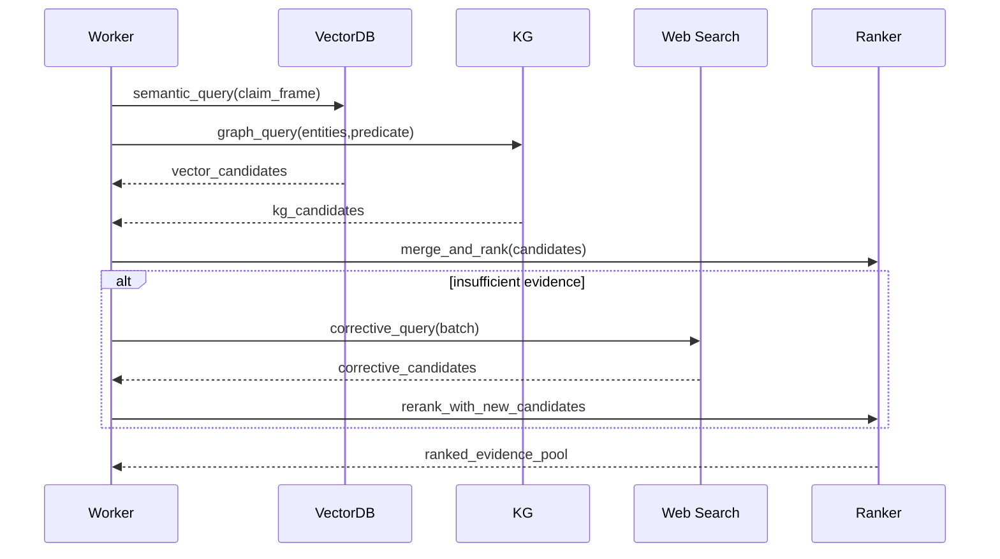
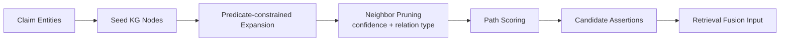
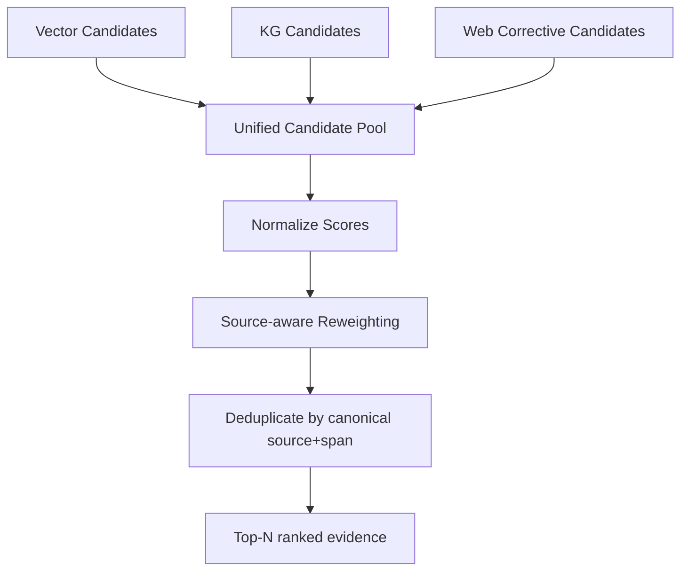
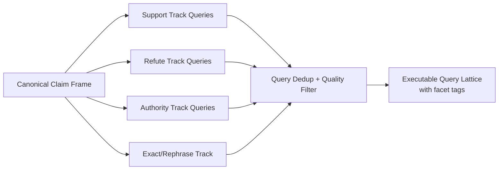
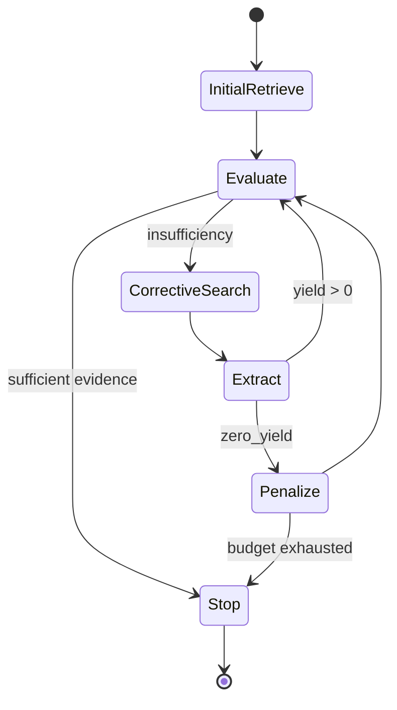
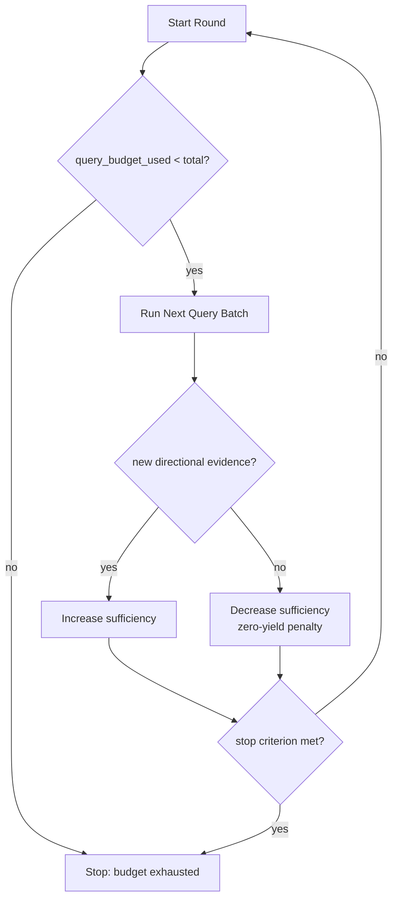
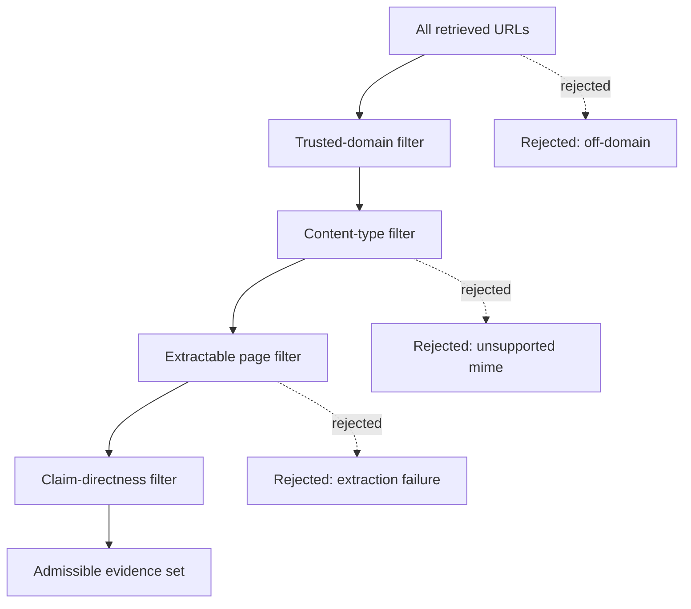

# retrieval and corrective pack

This pack defines publication-ready figure specs and Mermaid drafts.

### F11 — Hybrid retrieval orchestration sequence

- **Figure ID**: F11
- **Paper Section**: Methodology: Retrieval
- **Type**: sequence
- **Placement**: Main
- **Column Fit**: 2-column
- **Research Question**: How do VDB and KG retrieval interact with corrective stages?
- **Key Variables**: queries, semantic_candidates_count, kg_candidates_count

#### Mermaid Block


#### Figure Spec (Camera-Ready)
- **Caption (IEEE/ACM style)**: *F11.* Hybrid retrieval orchestration sequence. This figure operationalizes how do vdb and kg retrieval interact with corrective stages? using deterministic system signals and stage-linked diagnostics.
- **How to Read**: Start from the leftmost/topmost stage, follow directed transitions, then interpret terminal nodes against the metrics listed in the data-source field.
- **Expected Insight**: Reveals causal or procedural structure needed to reproduce and audit methodological behavior.
- **Failure Signal to Watch**: Disagreement between directional outputs and supporting upstream evidence signals; review `alignment_score`, `neutral_only_stance_rate`, and policy path branches.
- **Data Source / Log Fields**: retrieval phase outputs; debug.generated_queries
- **Export Notes**: SVG/PDF export preferred; grayscale-safe palette required; annotate as 2-column in final manuscript; keep text >= 8pt at print scale.

---
### F12 — VDB retrieval decision surface

- **Figure ID**: F12
- **Paper Section**: Methodology: Retrieval
- **Type**: curve
- **Placement**: Appendix
- **Column Fit**: 1-column
- **Research Question**: How does semantic thresholding influence recall/noise?
- **Key Variables**: vdb_score, min_threshold, dropped_claim_mismatch

#### Mermaid Block
```mermaid
flowchart TB
  Q[Query Embedding] --> S1[Similarity Score]
  S1 --> F1[Filter by semantic_floor]
  F1 --> K1[Top-k selection]
  K1 --> D1[Directness scoring]
  D1 --> O1[Pass to fusion]
  subgraph Decision Surface
    A1[high similarity + high directness -> admit]
    A2[high similarity + low directness -> neutral risk]
    A3[low similarity + high directness -> keep for review]
    A4[low similarity + low directness -> drop]
  end
  O1 -. classify .-> Decision Surface
```

#### Figure Spec (Camera-Ready)
- **Caption (IEEE/ACM style)**: *F12.* VDB retrieval decision surface. This figure operationalizes how does semantic thresholding influence recall/noise? using deterministic system signals and stage-linked diagnostics.
- **How to Read**: Start from the leftmost/topmost stage, follow directed transitions, then interpret terminal nodes against the metrics listed in the data-source field.
- **Expected Insight**: Reveals causal or procedural structure needed to reproduce and audit methodological behavior.
- **Failure Signal to Watch**: Disagreement between directional outputs and supporting upstream evidence signals; review `alignment_score`, `neutral_only_stance_rate`, and policy path branches.
- **Data Source / Log Fields**: VDB retrieval filter logs
- **Export Notes**: SVG/PDF export preferred; grayscale-safe palette required; annotate as 1-column in final manuscript; keep text >= 8pt at print scale.

---
### F13 — KG traversal and expansion graph

- **Figure ID**: F13
- **Paper Section**: Methodology: Retrieval
- **Type**: DAG
- **Placement**: Main
- **Column Fit**: 1-column
- **Research Question**: How are entities expanded into KG relations?
- **Key Variables**: seed_entities, hop, kg_score, kg_fallback_triggered

#### Mermaid Block


#### Figure Spec (Camera-Ready)
- **Caption (IEEE/ACM style)**: *F13.* KG traversal and expansion graph. This figure operationalizes how are entities expanded into kg relations? using deterministic system signals and stage-linked diagnostics.
- **How to Read**: Start from the leftmost/topmost stage, follow directed transitions, then interpret terminal nodes against the metrics listed in the data-source field.
- **Expected Insight**: Reveals causal or procedural structure needed to reproduce and audit methodological behavior.
- **Failure Signal to Watch**: Disagreement between directional outputs and supporting upstream evidence signals; review `alignment_score`, `neutral_only_stance_rate`, and policy path branches.
- **Data Source / Log Fields**: KG retrieval outputs
- **Export Notes**: SVG/PDF export preferred; grayscale-safe palette required; annotate as 1-column in final manuscript; keep text >= 8pt at print scale.

---
### F14 — Retrieval fusion DAG

- **Figure ID**: F14
- **Paper Section**: Methodology: Retrieval
- **Type**: DAG
- **Placement**: Main
- **Column Fit**: 1-column
- **Research Question**: How are VDB and KG candidates merged before ranking?
- **Key Variables**: semantic_score, kg_score, dedup_count

#### Mermaid Block


#### Figure Spec (Camera-Ready)
- **Caption (IEEE/ACM style)**: *F14.* Retrieval fusion DAG. This figure operationalizes how are vdb and kg candidates merged before ranking? using deterministic system signals and stage-linked diagnostics.
- **How to Read**: Start from the leftmost/topmost stage, follow directed transitions, then interpret terminal nodes against the metrics listed in the data-source field.
- **Expected Insight**: Reveals causal or procedural structure needed to reproduce and audit methodological behavior.
- **Failure Signal to Watch**: Disagreement between directional outputs and supporting upstream evidence signals; review `alignment_score`, `neutral_only_stance_rate`, and policy path branches.
- **Data Source / Log Fields**: retrieval_phase semantic_dedup_count + kg_with_score
- **Export Notes**: SVG/PDF export preferred; grayscale-safe palette required; annotate as 1-column in final manuscript; keep text >= 8pt at print scale.

---
### F15 — Query generation lattice (support/refute tracks)

- **Figure ID**: F15
- **Paper Section**: Methodology: Corrective Retrieval
- **Type**: flowchart
- **Placement**: Main
- **Column Fit**: 2-column
- **Research Question**: How are support-track and refute-track queries generated?
- **Key Variables**: queries_planned, query_track, query_quality

#### Mermaid Block


#### Figure Spec (Camera-Ready)
- **Caption (IEEE/ACM style)**: *F15.* Query generation lattice (support/refute tracks). This figure operationalizes how are support-track and refute-track queries generated? using deterministic system signals and stage-linked diagnostics.
- **How to Read**: Start from the leftmost/topmost stage, follow directed transitions, then interpret terminal nodes against the metrics listed in the data-source field.
- **Expected Insight**: Reveals causal or procedural structure needed to reproduce and audit methodological behavior.
- **Failure Signal to Watch**: Disagreement between directional outputs and supporting upstream evidence signals; review `alignment_score`, `neutral_only_stance_rate`, and policy path branches.
- **Data Source / Log Fields**: debug.generated_queries + corrective loop logs
- **Export Notes**: SVG/PDF export preferred; grayscale-safe palette required; annotate as 2-column in final manuscript; keep text >= 8pt at print scale.

---
### F16 — Corrective loop state machine

- **Figure ID**: F16
- **Paper Section**: Methodology: Corrective Retrieval
- **Type**: state
- **Placement**: Main
- **Column Fit**: 1-column
- **Research Question**: What states and exits govern iterative corrective retrieval?
- **Key Variables**: query_budget_total, query_budget_used, stop_reason

#### Mermaid Block


#### Figure Spec (Camera-Ready)
- **Caption (IEEE/ACM style)**: *F16.* Corrective loop state machine. This figure operationalizes what states and exits govern iterative corrective retrieval? using deterministic system signals and stage-linked diagnostics.
- **How to Read**: Start from the leftmost/topmost stage, follow directed transitions, then interpret terminal nodes against the metrics listed in the data-source field.
- **Expected Insight**: Reveals causal or procedural structure needed to reproduce and audit methodological behavior.
- **Failure Signal to Watch**: Disagreement between directional outputs and supporting upstream evidence signals; review `alignment_score`, `neutral_only_stance_rate`, and policy path branches.
- **Data Source / Log Fields**: debug.query_budget + debug.stop_reason
- **Export Notes**: SVG/PDF export preferred; grayscale-safe palette required; annotate as 1-column in final manuscript; keep text >= 8pt at print scale.

---
### F17 — Query budget and stop-criterion flow

- **Figure ID**: F17
- **Paper Section**: Methodology: Corrective Retrieval
- **Type**: flowchart
- **Placement**: Appendix
- **Column Fit**: 1-column
- **Research Question**: When does the loop continue vs stop under confidence mode?
- **Key Variables**: coverage, diversity, adaptive_sufficient, gain

#### Mermaid Block


#### Figure Spec (Camera-Ready)
- **Caption (IEEE/ACM style)**: *F17.* Query budget and stop-criterion flow. This figure operationalizes when does the loop continue vs stop under confidence mode? using deterministic system signals and stage-linked diagnostics.
- **How to Read**: Start from the leftmost/topmost stage, follow directed transitions, then interpret terminal nodes against the metrics listed in the data-source field.
- **Expected Insight**: Reveals causal or procedural structure needed to reproduce and audit methodological behavior.
- **Failure Signal to Watch**: Disagreement between directional outputs and supporting upstream evidence signals; review `alignment_score`, `neutral_only_stance_rate`, and policy path branches.
- **Data Source / Log Fields**: pipeline stop decision logs
- **Export Notes**: SVG/PDF export preferred; grayscale-safe palette required; annotate as 1-column in final manuscript; keep text >= 8pt at print scale.

---
### F18 — Source acquisition funnel

- **Figure ID**: F18
- **Paper Section**: Methodology: Retrieval
- **Type**: table-graphic
- **Placement**: Main
- **Column Fit**: 1-column
- **Research Question**: How do fetched URLs progress to usable evidence?
- **Key Variables**: urls_requested, pages_scraped, facts_count, admitted_evidence

#### Mermaid Block


#### Figure Spec (Camera-Ready)
- **Caption (IEEE/ACM style)**: *F18.* Source acquisition funnel. This figure operationalizes how do fetched urls progress to usable evidence? using deterministic system signals and stage-linked diagnostics.
- **How to Read**: Start from the leftmost/topmost stage, follow directed transitions, then interpret terminal nodes against the metrics listed in the data-source field.
- **Expected Insight**: Reveals causal or procedural structure needed to reproduce and audit methodological behavior.
- **Failure Signal to Watch**: Disagreement between directional outputs and supporting upstream evidence signals; review `alignment_score`, `neutral_only_stance_rate`, and policy path branches.
- **Data Source / Log Fields**: scraper/fact_extractor phase outputs
- **Export Notes**: SVG/PDF export preferred; grayscale-safe palette required; annotate as 1-column in final manuscript; keep text >= 8pt at print scale.

---


