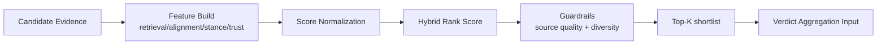
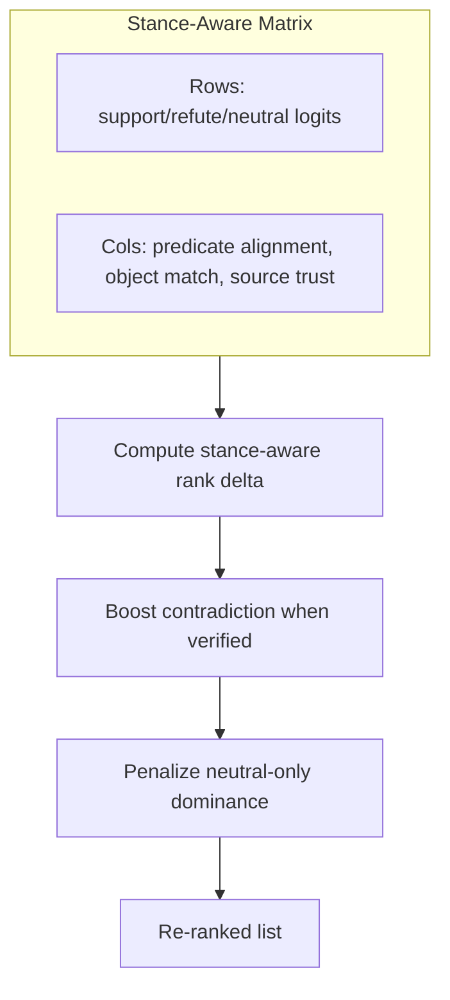
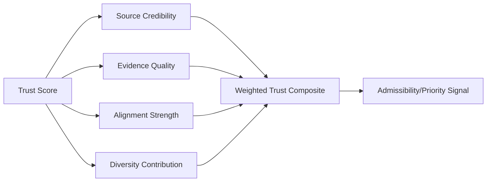
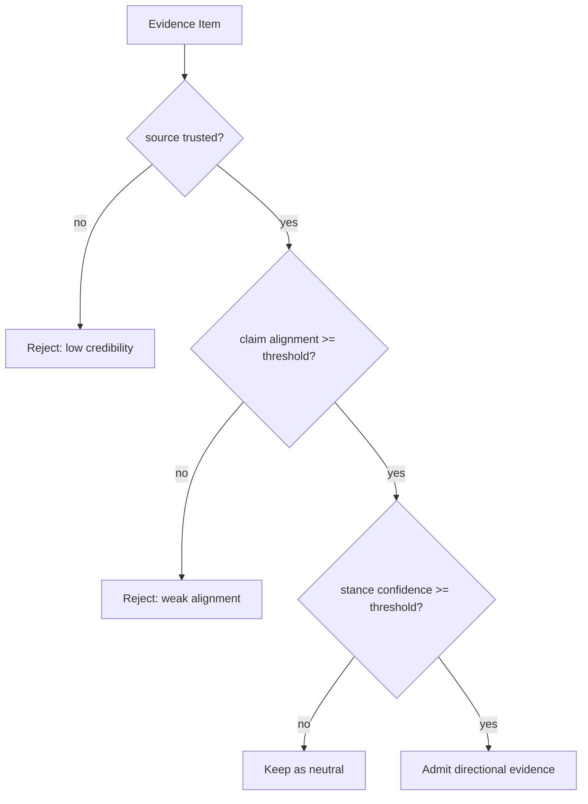
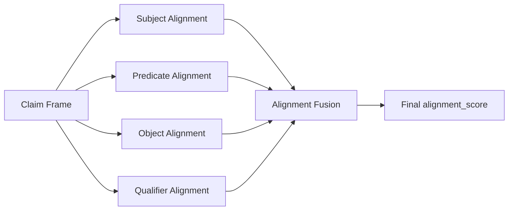
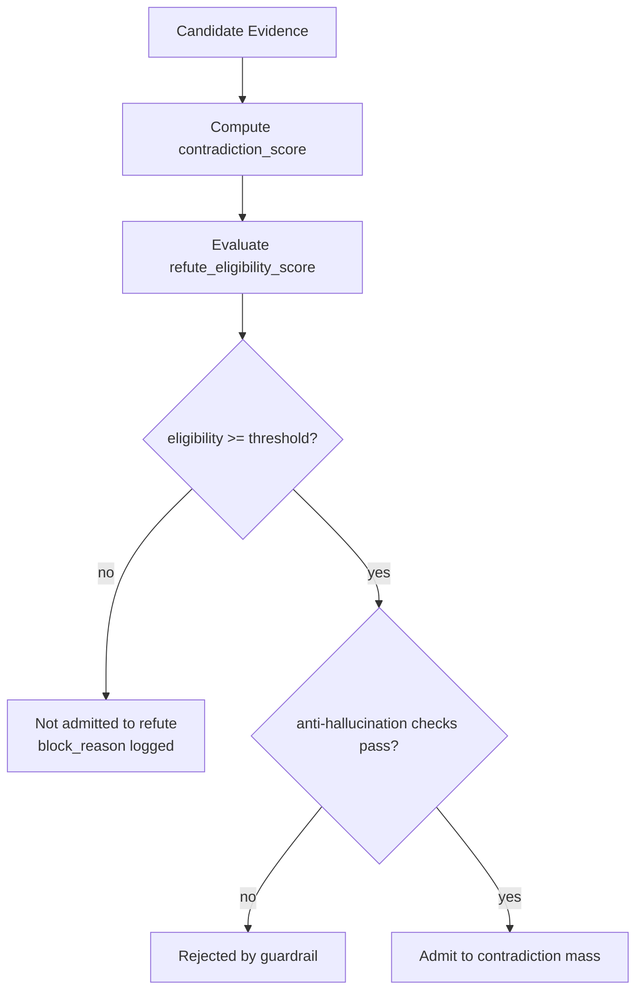
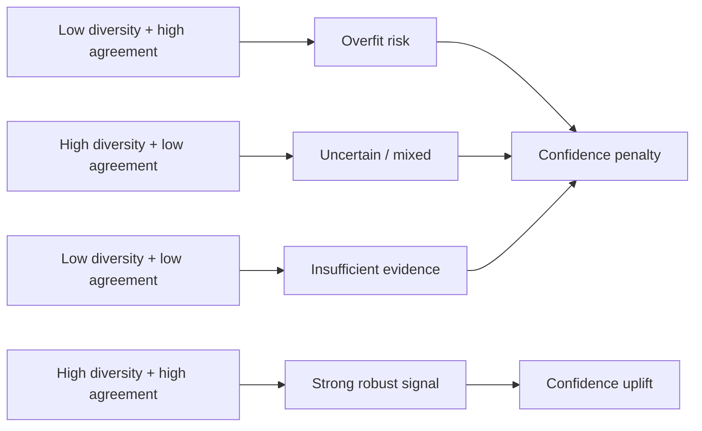
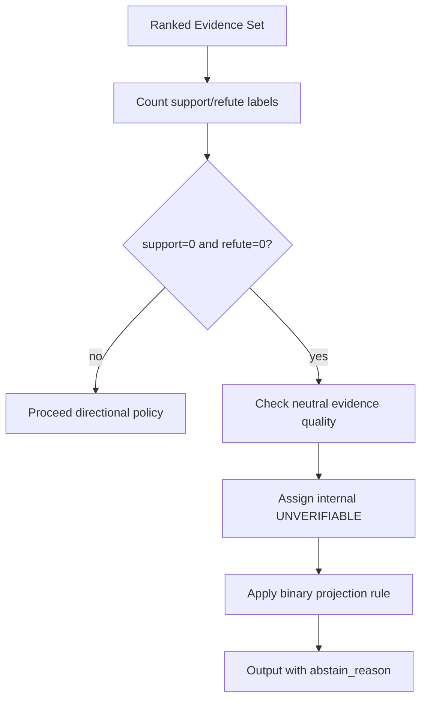

# ranking trust and evidence quality pack

This pack defines publication-ready figure specs and Mermaid drafts.

### F19 — Candidate ranking pipeline

- **Figure ID**: F19
- **Paper Section**: Methodology: Ranking
- **Type**: flowchart
- **Placement**: Main
- **Column Fit**: 2-column
- **Research Question**: How are candidates transformed into top-k evidence?
- **Key Variables**: final_score, sem_score, kg_score, credibility

#### Mermaid Block

#### Figure Spec (Camera-Ready)
- **Caption (IEEE/ACM style)**: *F19.* Candidate ranking pipeline. This figure operationalizes how are candidates transformed into top-k evidence? using deterministic system signals and stage-linked diagnostics.
- **How to Read**: Start from the leftmost/topmost stage, follow directed transitions, then interpret terminal nodes against the metrics listed in the data-source field.
- **Expected Insight**: Reveals causal or procedural structure needed to reproduce and audit methodological behavior.
- **Failure Signal to Watch**: Disagreement between directional outputs and supporting upstream evidence signals; review `alignment_score`, `neutral_only_stance_rate`, and policy path branches.
- **Data Source / Log Fields**: ranking_phase top_k_selected
- **Export Notes**: SVG/PDF export preferred; grayscale-safe palette required; annotate as 2-column in final manuscript; keep text >= 8pt at print scale.

---
### F20 — Stance-aware reranking matrix

- **Figure ID**: F20
- **Paper Section**: Methodology: Ranking
- **Type**: table-graphic
- **Placement**: Main
- **Column Fit**: 1-column
- **Research Question**: How do support/refute/neutral stances interact with rank?
- **Key Variables**: support_score, contradict_score, stance

#### Mermaid Block

#### Figure Spec (Camera-Ready)
- **Caption (IEEE/ACM style)**: *F20.* Stance-aware reranking matrix. This figure operationalizes how do support/refute/neutral stances interact with rank? using deterministic system signals and stage-linked diagnostics.
- **How to Read**: Start from the leftmost/topmost stage, follow directed transitions, then interpret terminal nodes against the metrics listed in the data-source field.
- **Expected Insight**: Reveals causal or procedural structure needed to reproduce and audit methodological behavior.
- **Failure Signal to Watch**: Disagreement between directional outputs and supporting upstream evidence signals; review `alignment_score`, `neutral_only_stance_rate`, and policy path branches.
- **Data Source / Log Fields**: ranking scores + evidence_map relevance
- **Export Notes**: SVG/PDF export preferred; grayscale-safe palette required; annotate as 1-column in final manuscript; keep text >= 8pt at print scale.

---
### F21 — Trust score decomposition

- **Figure ID**: F21
- **Paper Section**: Methodology: Trust Policy
- **Type**: DAG
- **Placement**: Main
- **Column Fit**: 1-column
- **Research Question**: How is trust_post composed from coverage/diversity/agreement?
- **Key Variables**: coverage, diversity, agreement, trust_post

#### Mermaid Block

#### Figure Spec (Camera-Ready)
- **Caption (IEEE/ACM style)**: *F21.* Trust score decomposition. This figure operationalizes how is trust_post composed from coverage/diversity/agreement? using deterministic system signals and stage-linked diagnostics.
- **How to Read**: Start from the leftmost/topmost stage, follow directed transitions, then interpret terminal nodes against the metrics listed in the data-source field.
- **Expected Insight**: Reveals causal or procedural structure needed to reproduce and audit methodological behavior.
- **Failure Signal to Watch**: Disagreement between directional outputs and supporting upstream evidence signals; review `alignment_score`, `neutral_only_stance_rate`, and policy path branches.
- **Data Source / Log Fields**: adaptive_trust_policy logs + payload.trust_post
- **Export Notes**: SVG/PDF export preferred; grayscale-safe palette required; annotate as 1-column in final manuscript; keep text >= 8pt at print scale.

---
### F22 — Evidence admissibility gate

- **Figure ID**: F22
- **Paper Section**: Methodology: Evidence Validation
- **Type**: flowchart
- **Placement**: Main
- **Column Fit**: 1-column
- **Research Question**: Which gates decide admissible vs rejected evidence?
- **Key Variables**: anchor_match, predicate_match, object_match_ok, domain_credibility

#### Mermaid Block

#### Figure Spec (Camera-Ready)
- **Caption (IEEE/ACM style)**: *F22.* Evidence admissibility gate. This figure operationalizes which gates decide admissible vs rejected evidence? using deterministic system signals and stage-linked diagnostics.
- **How to Read**: Start from the leftmost/topmost stage, follow directed transitions, then interpret terminal nodes against the metrics listed in the data-source field.
- **Expected Insight**: Reveals causal or procedural structure needed to reproduce and audit methodological behavior.
- **Failure Signal to Watch**: Disagreement between directional outputs and supporting upstream evidence signals; review `alignment_score`, `neutral_only_stance_rate`, and policy path branches.
- **Data Source / Log Fields**: evidence_map alignment/validation fields
- **Export Notes**: SVG/PDF export preferred; grayscale-safe palette required; annotate as 1-column in final manuscript; keep text >= 8pt at print scale.

---
### F23 — Alignment scoring anatomy

- **Figure ID**: F23
- **Paper Section**: Methodology: Evidence Validation
- **Type**: causal
- **Placement**: Main
- **Column Fit**: 1-column
- **Research Question**: Which factors drive alignment score behavior?
- **Key Variables**: alignment_score, anchor_overlap, predicate_match_score

#### Mermaid Block

#### Figure Spec (Camera-Ready)
- **Caption (IEEE/ACM style)**: *F23.* Alignment scoring anatomy. This figure operationalizes which factors drive alignment score behavior? using deterministic system signals and stage-linked diagnostics.
- **How to Read**: Start from the leftmost/topmost stage, follow directed transitions, then interpret terminal nodes against the metrics listed in the data-source field.
- **Expected Insight**: Reveals causal or procedural structure needed to reproduce and audit methodological behavior.
- **Failure Signal to Watch**: Disagreement between directional outputs and supporting upstream evidence signals; review `alignment_score`, `neutral_only_stance_rate`, and policy path branches.
- **Data Source / Log Fields**: debug.alignment_score + evidence-level features
- **Export Notes**: SVG/PDF export preferred; grayscale-safe palette required; annotate as 1-column in final manuscript; keep text >= 8pt at print scale.

---
### F24 — Contradiction admission path

- **Figure ID**: F24
- **Paper Section**: Methodology: Ranking
- **Type**: flowchart
- **Placement**: Main
- **Column Fit**: 1-column
- **Research Question**: How are contradiction candidates admitted and verified?
- **Key Variables**: refute_candidate_count_stage1, refute_verified_count_stage2

#### Mermaid Block

#### Figure Spec (Camera-Ready)
- **Caption (IEEE/ACM style)**: *F24.* Contradiction admission path. This figure operationalizes how are contradiction candidates admitted and verified? using deterministic system signals and stage-linked diagnostics.
- **How to Read**: Start from the leftmost/topmost stage, follow directed transitions, then interpret terminal nodes against the metrics listed in the data-source field.
- **Expected Insight**: Reveals causal or procedural structure needed to reproduce and audit methodological behavior.
- **Failure Signal to Watch**: Disagreement between directional outputs and supporting upstream evidence signals; review `alignment_score`, `neutral_only_stance_rate`, and policy path branches.
- **Data Source / Log Fields**: refute_pipeline_stats
- **Export Notes**: SVG/PDF export preferred; grayscale-safe palette required; annotate as 1-column in final manuscript; keep text >= 8pt at print scale.

---
### F25 — Evidence diversity vs agreement map

- **Figure ID**: F25
- **Paper Section**: Methodology: Trust Policy
- **Type**: curve
- **Placement**: Appendix
- **Column Fit**: 1-column
- **Research Question**: What trade-off exists between diversity and agreement?
- **Key Variables**: diversity, agreement, trust_threshold_met

#### Mermaid Block

#### Figure Spec (Camera-Ready)
- **Caption (IEEE/ACM style)**: *F25.* Evidence diversity vs agreement map. This figure operationalizes what trade-off exists between diversity and agreement? using deterministic system signals and stage-linked diagnostics.
- **How to Read**: Start from the leftmost/topmost stage, follow directed transitions, then interpret terminal nodes against the metrics listed in the data-source field.
- **Expected Insight**: Reveals causal or procedural structure needed to reproduce and audit methodological behavior.
- **Failure Signal to Watch**: Disagreement between directional outputs and supporting upstream evidence signals; review `alignment_score`, `neutral_only_stance_rate`, and policy path branches.
- **Data Source / Log Fields**: trust_snapshot/debug.trust_gate
- **Export Notes**: SVG/PDF export preferred; grayscale-safe palette required; annotate as 1-column in final manuscript; keep text >= 8pt at print scale.

---
### F26 — Neutral-only evidence detection flow

- **Figure ID**: F26
- **Paper Section**: Methodology: Evidence Validation
- **Type**: flowchart
- **Placement**: Main
- **Column Fit**: 1-column
- **Research Question**: How are neutral-only evidence regimes flagged?
- **Key Variables**: supports_count, refutes_count, neutral_count

#### Mermaid Block

#### Figure Spec (Camera-Ready)
- **Caption (IEEE/ACM style)**: *F26.* Neutral-only evidence detection flow. This figure operationalizes how are neutral-only evidence regimes flagged? using deterministic system signals and stage-linked diagnostics.
- **How to Read**: Start from the leftmost/topmost stage, follow directed transitions, then interpret terminal nodes against the metrics listed in the data-source field.
- **Expected Insight**: Reveals causal or procedural structure needed to reproduce and audit methodological behavior.
- **Failure Signal to Watch**: Disagreement between directional outputs and supporting upstream evidence signals; review `alignment_score`, `neutral_only_stance_rate`, and policy path branches.
- **Data Source / Log Fields**: debug.evidence_stance_distribution
- **Export Notes**: SVG/PDF export preferred; grayscale-safe palette required; annotate as 1-column in final manuscript; keep text >= 8pt at print scale.

---

