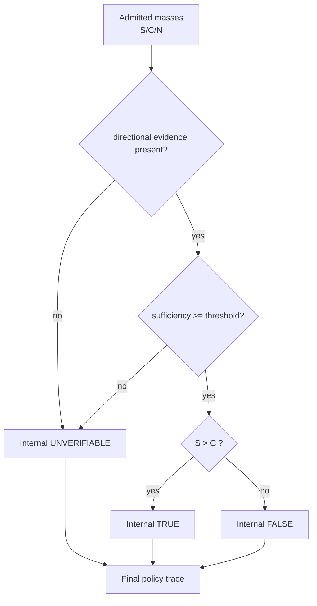
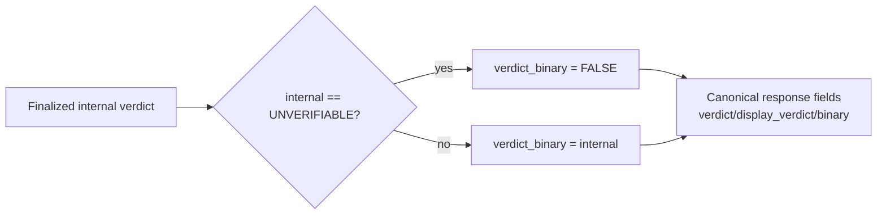
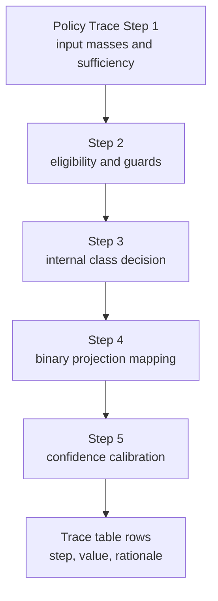
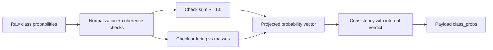
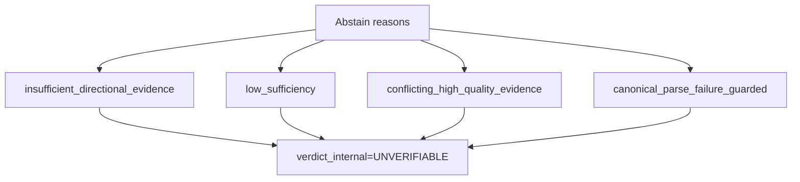
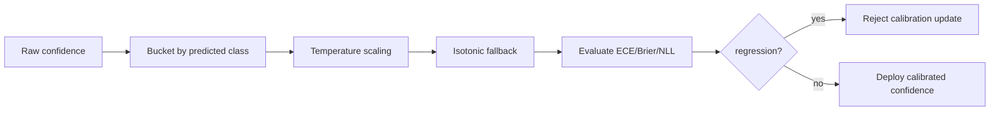

# verdict policy and calibration pack

This pack defines publication-ready figure specs and Mermaid drafts.

### F27 — Internal verdict policy graph

- **Figure ID**: F27
- **Paper Section**: Methodology: Verdict Synthesis
- **Type**: DAG
- **Placement**: Main
- **Column Fit**: 2-column
- **Research Question**: How is internal verdict derived from masses and guards?
- **Key Variables**: support_mass, contradict_mass, guard_reasons, verdict_internal

#### Mermaid Block


#### Figure Spec (Camera-Ready)
- **Caption (IEEE/ACM style)**: *F27.* Internal verdict policy graph. This figure operationalizes how is internal verdict derived from masses and guards? using deterministic system signals and stage-linked diagnostics.
- **How to Read**: Start from the leftmost/topmost stage, follow directed transitions, then interpret terminal nodes against the metrics listed in the data-source field.
- **Expected Insight**: Reveals causal or procedural structure needed to reproduce and audit methodological behavior.
- **Failure Signal to Watch**: Disagreement between directional outputs and supporting upstream evidence signals; review `alignment_score`, `neutral_only_stance_rate`, and policy path branches.
- **Data Source / Log Fields**: final_payload policy fields
- **Export Notes**: SVG/PDF export preferred; grayscale-safe palette required; annotate as 2-column in final manuscript; keep text >= 8pt at print scale.

---
### F28 — Binary projection logic graph

- **Figure ID**: F28
- **Paper Section**: Methodology: Verdict Synthesis
- **Type**: flowchart
- **Placement**: Main
- **Column Fit**: 1-column
- **Research Question**: How is verdict_binary produced from internal state?
- **Key Variables**: truth_score_binary, verdict_internal, verdict_binary

#### Mermaid Block


#### Figure Spec (Camera-Ready)
- **Caption (IEEE/ACM style)**: *F28.* Binary projection logic graph. This figure operationalizes how is verdict_binary produced from internal state? using deterministic system signals and stage-linked diagnostics.
- **How to Read**: Start from the leftmost/topmost stage, follow directed transitions, then interpret terminal nodes against the metrics listed in the data-source field.
- **Expected Insight**: Reveals causal or procedural structure needed to reproduce and audit methodological behavior.
- **Failure Signal to Watch**: Disagreement between directional outputs and supporting upstream evidence signals; review `alignment_score`, `neutral_only_stance_rate`, and policy path branches.
- **Data Source / Log Fields**: policy_trace step=`deterministic_evidence_owner`, `binary_collapse_reason`
- **Export Notes**: SVG/PDF export preferred; grayscale-safe palette required; annotate as 1-column in final manuscript; keep text >= 8pt at print scale.

---
### F29 — Policy trace decision table graphic

- **Figure ID**: F29
- **Paper Section**: Methodology: Verdict Synthesis
- **Type**: table-graphic
- **Placement**: Main
- **Column Fit**: 1-column
- **Research Question**: Which policy path branches dominate outcomes?
- **Key Variables**: policy_trace.step, binary_collapse_reason, abstain_reason

#### Mermaid Block


#### Figure Spec (Camera-Ready)
- **Caption (IEEE/ACM style)**: *F29.* Policy trace decision table graphic. This figure operationalizes which policy path branches dominate outcomes? using deterministic system signals and stage-linked diagnostics.
- **How to Read**: Start from the leftmost/topmost stage, follow directed transitions, then interpret terminal nodes against the metrics listed in the data-source field.
- **Expected Insight**: Reveals causal or procedural structure needed to reproduce and audit methodological behavior.
- **Failure Signal to Watch**: Disagreement between directional outputs and supporting upstream evidence signals; review `alignment_score`, `neutral_only_stance_rate`, and policy path branches.
- **Data Source / Log Fields**: debug.verdict_policy_path + policy_trace
- **Export Notes**: SVG/PDF export preferred; grayscale-safe palette required; annotate as 1-column in final manuscript; keep text >= 8pt at print scale.

---
### F30 — Truth score mass-balance equation diagram

- **Figure ID**: F30
- **Paper Section**: Methodology: Verdict Synthesis
- **Type**: causal
- **Placement**: Main
- **Column Fit**: 1-column
- **Research Question**: How do support/contradict masses map to truth score?
- **Key Variables**: support_mass, contradict_mass, sigmoid_k, truth_score_binary

#### Mermaid Block
```mermaid
flowchart LR
  S[Support Mass S] --> D1[Directional Delta
S - C]
  C[Contradict Mass C] --> D1
  N[Neutral Mass N] --> D2[Normalization Term
S + C + N]
  D1 --> TS[truth_score = sigmoid(k*(S-C))]
  D2 --> DG[direction_gap = |S-C|/(S+C+N)]
  TS --> V[Internal Verdict]
  DG --> CF[Confidence Composition]
```

#### Figure Spec (Camera-Ready)
- **Caption (IEEE/ACM style)**: *F30.* Truth score mass-balance equation diagram. This figure operationalizes how do support/contradict masses map to truth score? using deterministic system signals and stage-linked diagnostics.
- **How to Read**: Start from the leftmost/topmost stage, follow directed transitions, then interpret terminal nodes against the metrics listed in the data-source field.
- **Expected Insight**: Reveals causal or procedural structure needed to reproduce and audit methodological behavior.
- **Failure Signal to Watch**: Disagreement between directional outputs and supporting upstream evidence signals; review `alignment_score`, `neutral_only_stance_rate`, and policy path branches.
- **Data Source / Log Fields**: final_payload mass fields
- **Export Notes**: SVG/PDF export preferred; grayscale-safe palette required; annotate as 1-column in final manuscript; keep text >= 8pt at print scale.

---
### F31 — Confidence composition chart

- **Figure ID**: F31
- **Paper Section**: Methodology: Calibration
- **Type**: curve
- **Placement**: Main
- **Column Fit**: 1-column
- **Research Question**: How does confidence respond to sufficiency and directional strength?
- **Key Variables**: confidence, sufficiency_score, |S-C|

#### Mermaid Block
```mermaid
flowchart TD
  S1[Sufficiency Score] --> C[confidence_raw]
  S2[Direction Gap] --> C
  S3[Evidence Quality] --> C
  C --> P1[Conflict Penalty]
  P1 --> P2[Rejection-rate Penalty]
  P2 --> CL[Clamp to [0.05, 0.95]]
  CL --> OUT[Final confidence]
```

#### Figure Spec (Camera-Ready)
- **Caption (IEEE/ACM style)**: *F31.* Confidence composition chart. This figure operationalizes how does confidence respond to sufficiency and directional strength? using deterministic system signals and stage-linked diagnostics.
- **How to Read**: Start from the leftmost/topmost stage, follow directed transitions, then interpret terminal nodes against the metrics listed in the data-source field.
- **Expected Insight**: Reveals causal or procedural structure needed to reproduce and audit methodological behavior.
- **Failure Signal to Watch**: Disagreement between directional outputs and supporting upstream evidence signals; review `alignment_score`, `neutral_only_stance_rate`, and policy path branches.
- **Data Source / Log Fields**: final_payload confidence + sufficiency_score
- **Export Notes**: SVG/PDF export preferred; grayscale-safe palette required; annotate as 1-column in final manuscript; keep text >= 8pt at print scale.

---
### F32 — Class-probability coherence projection

- **Figure ID**: F32
- **Paper Section**: Methodology: Calibration
- **Type**: flowchart
- **Placement**: Appendix
- **Column Fit**: 1-column
- **Research Question**: How are class probabilities resynced with final outputs?
- **Key Variables**: class_probs, verdict_binary, calibration_meta

#### Mermaid Block


#### Figure Spec (Camera-Ready)
- **Caption (IEEE/ACM style)**: *F32.* Class-probability coherence projection. This figure operationalizes how are class probabilities resynced with final outputs? using deterministic system signals and stage-linked diagnostics.
- **How to Read**: Start from the leftmost/topmost stage, follow directed transitions, then interpret terminal nodes against the metrics listed in the data-source field.
- **Expected Insight**: Reveals causal or procedural structure needed to reproduce and audit methodological behavior.
- **Failure Signal to Watch**: Disagreement between directional outputs and supporting upstream evidence signals; review `alignment_score`, `neutral_only_stance_rate`, and policy path branches.
- **Data Source / Log Fields**: class_probs_resync_reason
- **Export Notes**: SVG/PDF export preferred; grayscale-safe palette required; annotate as 1-column in final manuscript; keep text >= 8pt at print scale.

---
### F33 — Abstain reason taxonomy map

- **Figure ID**: F33
- **Paper Section**: Methodology: Verdict Synthesis
- **Type**: table-graphic
- **Placement**: Main
- **Column Fit**: 1-column
- **Research Question**: What abstain reasons occur and what do they imply?
- **Key Variables**: abstain_reason, verdict_guard_reasons

#### Mermaid Block


#### Figure Spec (Camera-Ready)
- **Caption (IEEE/ACM style)**: *F33.* Abstain reason taxonomy map. This figure operationalizes what abstain reasons occur and what do they imply? using deterministic system signals and stage-linked diagnostics.
- **How to Read**: Start from the leftmost/topmost stage, follow directed transitions, then interpret terminal nodes against the metrics listed in the data-source field.
- **Expected Insight**: Reveals causal or procedural structure needed to reproduce and audit methodological behavior.
- **Failure Signal to Watch**: Disagreement between directional outputs and supporting upstream evidence signals; review `alignment_score`, `neutral_only_stance_rate`, and policy path branches.
- **Data Source / Log Fields**: final_payload abstain_reason + guard reasons
- **Export Notes**: SVG/PDF export preferred; grayscale-safe palette required; annotate as 1-column in final manuscript; keep text >= 8pt at print scale.

---
### F34 — Confidence calibration pipeline

- **Figure ID**: F34
- **Paper Section**: Methodology: Calibration
- **Type**: flowchart
- **Placement**: Main
- **Column Fit**: 1-column
- **Research Question**: How are raw outputs converted into calibrated confidences?
- **Key Variables**: raw_confidence, calibrated_confidence, class_probs

#### Mermaid Block


#### Figure Spec (Camera-Ready)
- **Caption (IEEE/ACM style)**: *F34.* Confidence calibration pipeline. This figure operationalizes how are raw outputs converted into calibrated confidences? using deterministic system signals and stage-linked diagnostics.
- **How to Read**: Start from the leftmost/topmost stage, follow directed transitions, then interpret terminal nodes against the metrics listed in the data-source field.
- **Expected Insight**: Reveals causal or procedural structure needed to reproduce and audit methodological behavior.
- **Failure Signal to Watch**: Disagreement between directional outputs and supporting upstream evidence signals; review `alignment_score`, `neutral_only_stance_rate`, and policy path branches.
- **Data Source / Log Fields**: calibration_meta + confidence outputs
- **Export Notes**: SVG/PDF export preferred; grayscale-safe palette required; annotate as 1-column in final manuscript; keep text >= 8pt at print scale.

---


