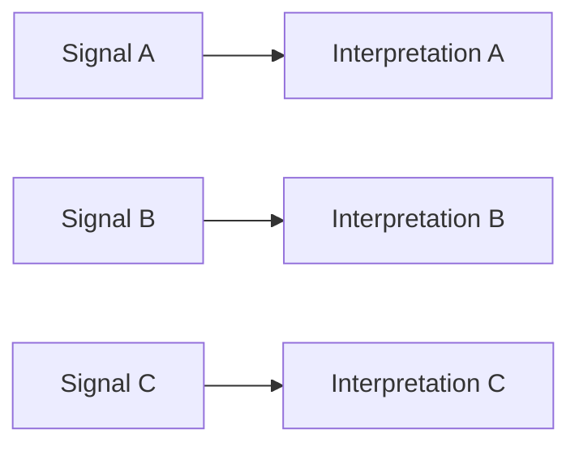
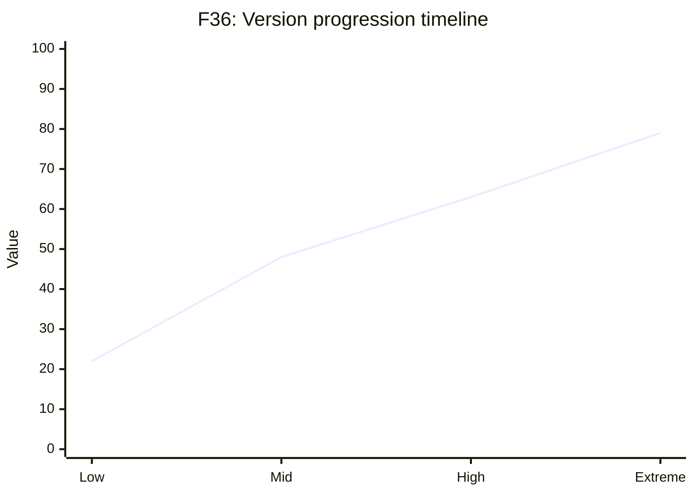
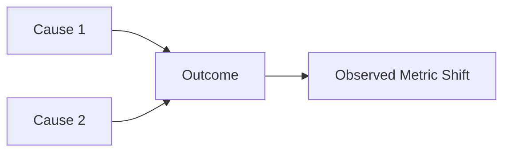
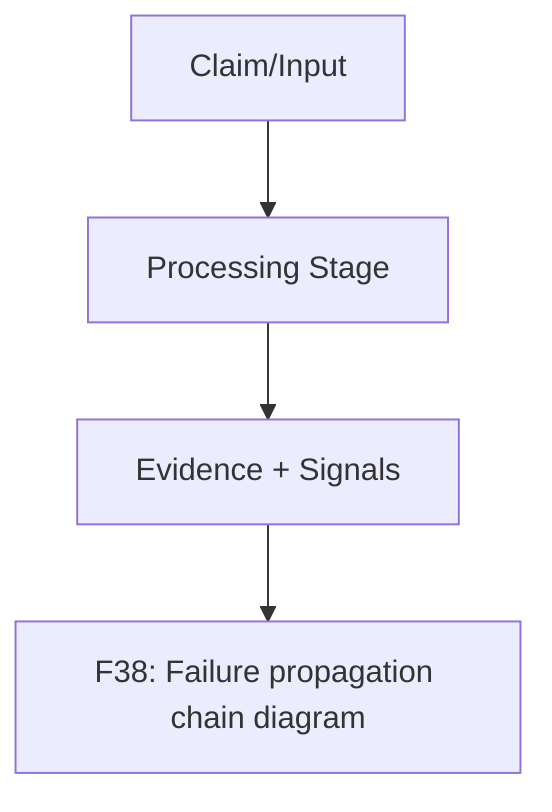
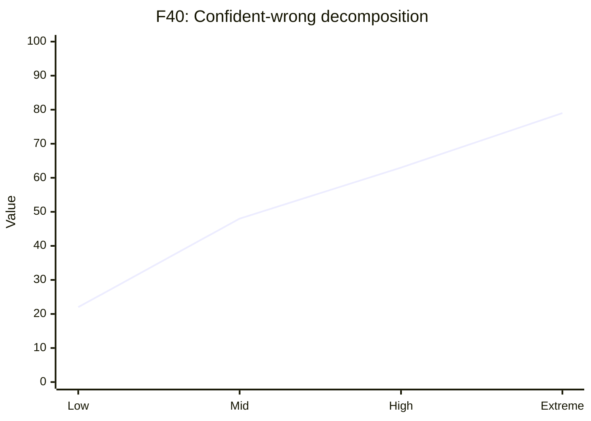

# evaluation and failure analysis pack

This pack defines publication-ready figure specs and Mermaid drafts.

### F35 — Metrics stack map (Acc/F1/ECE/Brier/NLL)

- **Figure ID**: F35
- **Paper Section**: Evaluation
- **Type**: table-graphic
- **Placement**: Main
- **Column Fit**: 1-column
- **Research Question**: How do performance and calibration metrics relate?
- **Key Variables**: accuracy_3class, macro_ece, brier, nll, class_f1

#### Mermaid Block

#### Figure Spec (Camera-Ready)
- **Caption (IEEE/ACM style)**: *F35.* Metrics stack map (Acc/F1/ECE/Brier/NLL). This figure operationalizes how do performance and calibration metrics relate? using deterministic system signals and stage-linked diagnostics.
- **How to Read**: Start from the leftmost/topmost stage, follow directed transitions, then interpret terminal nodes against the metrics listed in the data-source field.
- **Expected Insight**: Reveals causal or procedural structure needed to reproduce and audit methodological behavior.
- **Failure Signal to Watch**: Disagreement between directional outputs and supporting upstream evidence signals; review `alignment_score`, `neutral_only_stance_rate`, and policy path branches.
- **Data Source / Log Fields**: evaluation/artifacts/metrics.json
- **Export Notes**: SVG/PDF export preferred; grayscale-safe palette required; annotate as 1-column in final manuscript; keep text >= 8pt at print scale.

---
### F36 — Version progression timeline

- **Figure ID**: F36
- **Paper Section**: Evaluation
- **Type**: curve
- **Placement**: Main
- **Column Fit**: 2-column
- **Research Question**: How do metrics evolve by version?
- **Key Variables**: version, accuracy, ece, p95

#### Mermaid Block

#### Figure Spec (Camera-Ready)
- **Caption (IEEE/ACM style)**: *F36.* Version progression timeline. This figure operationalizes how do metrics evolve by version? using deterministic system signals and stage-linked diagnostics.
- **How to Read**: Start from the leftmost/topmost stage, follow directed transitions, then interpret terminal nodes against the metrics listed in the data-source field.
- **Expected Insight**: Reveals causal or procedural structure needed to reproduce and audit methodological behavior.
- **Failure Signal to Watch**: Disagreement between directional outputs and supporting upstream evidence signals; review `alignment_score`, `neutral_only_stance_rate`, and policy path branches.
- **Data Source / Log Fields**: analyze_runs by_version outputs
- **Export Notes**: SVG/PDF export preferred; grayscale-safe palette required; annotate as 2-column in final manuscript; keep text >= 8pt at print scale.

---
### F37 — Error taxonomy Sankey

- **Figure ID**: F37
- **Paper Section**: Failure Analysis
- **Type**: causal
- **Placement**: Main
- **Column Fit**: 2-column
- **Research Question**: How do upstream failures propagate into final errors?
- **Key Variables**: failure_category, downstream_outcome

#### Mermaid Block

#### Figure Spec (Camera-Ready)
- **Caption (IEEE/ACM style)**: *F37.* Error taxonomy Sankey. This figure operationalizes how do upstream failures propagate into final errors? using deterministic system signals and stage-linked diagnostics.
- **How to Read**: Start from the leftmost/topmost stage, follow directed transitions, then interpret terminal nodes against the metrics listed in the data-source field.
- **Expected Insight**: Reveals causal or procedural structure needed to reproduce and audit methodological behavior.
- **Failure Signal to Watch**: Disagreement between directional outputs and supporting upstream evidence signals; review `alignment_score`, `neutral_only_stance_rate`, and policy path branches.
- **Data Source / Log Fields**: failure diagnostics + debug fields
- **Export Notes**: SVG/PDF export preferred; grayscale-safe palette required; annotate as 2-column in final manuscript; keep text >= 8pt at print scale.

---
### F38 — Failure propagation chain diagram

- **Figure ID**: F38
- **Paper Section**: Failure Analysis
- **Type**: flowchart
- **Placement**: Main
- **Column Fit**: 1-column
- **Research Question**: What stage interactions amplify errors?
- **Key Variables**: stage_failure_flags, policy_path

#### Mermaid Block

#### Figure Spec (Camera-Ready)
- **Caption (IEEE/ACM style)**: *F38.* Failure propagation chain diagram. This figure operationalizes what stage interactions amplify errors? using deterministic system signals and stage-linked diagnostics.
- **How to Read**: Start from the leftmost/topmost stage, follow directed transitions, then interpret terminal nodes against the metrics listed in the data-source field.
- **Expected Insight**: Reveals causal or procedural structure needed to reproduce and audit methodological behavior.
- **Failure Signal to Watch**: Disagreement between directional outputs and supporting upstream evidence signals; review `alignment_score`, `neutral_only_stance_rate`, and policy path branches.
- **Data Source / Log Fields**: stage_events + policy trace
- **Export Notes**: SVG/PDF export preferred; grayscale-safe palette required; annotate as 1-column in final manuscript; keep text >= 8pt at print scale.

---
### F39 — Alignment-zero cohort analysis

- **Figure ID**: F39
- **Paper Section**: Failure Analysis
- **Type**: table-graphic
- **Placement**: Main
- **Column Fit**: 1-column
- **Research Question**: How do low-alignment cases differ from aligned cases?
- **Key Variables**: alignment_zero_rate, accuracy_in_cohort

#### Mermaid Block

#### Figure Spec (Camera-Ready)
- **Caption (IEEE/ACM style)**: *F39.* Alignment-zero cohort analysis. This figure operationalizes how do low-alignment cases differ from aligned cases? using deterministic system signals and stage-linked diagnostics.
- **How to Read**: Start from the leftmost/topmost stage, follow directed transitions, then interpret terminal nodes against the metrics listed in the data-source field.
- **Expected Insight**: Reveals causal or procedural structure needed to reproduce and audit methodological behavior.
- **Failure Signal to Watch**: Disagreement between directional outputs and supporting upstream evidence signals; review `alignment_score`, `neutral_only_stance_rate`, and policy path branches.
- **Data Source / Log Fields**: new diagnostics in analyze_runs
- **Export Notes**: SVG/PDF export preferred; grayscale-safe palette required; annotate as 1-column in final manuscript; keep text >= 8pt at print scale.

---
### F40 — Confident-wrong decomposition

- **Figure ID**: F40
- **Paper Section**: Failure Analysis
- **Type**: curve
- **Placement**: Appendix
- **Column Fit**: 1-column
- **Research Question**: Which conditions produce confident wrong predictions?
- **Key Variables**: confident_wrong_count, confidence, target/pred mismatch

#### Mermaid Block

#### Figure Spec (Camera-Ready)
- **Caption (IEEE/ACM style)**: *F40.* Confident-wrong decomposition. This figure operationalizes which conditions produce confident wrong predictions? using deterministic system signals and stage-linked diagnostics.
- **How to Read**: Start from the leftmost/topmost stage, follow directed transitions, then interpret terminal nodes against the metrics listed in the data-source field.
- **Expected Insight**: Reveals causal or procedural structure needed to reproduce and audit methodological behavior.
- **Failure Signal to Watch**: Disagreement between directional outputs and supporting upstream evidence signals; review `alignment_score`, `neutral_only_stance_rate`, and policy path branches.
- **Data Source / Log Fields**: evaluation samples + confidence fields
- **Export Notes**: SVG/PDF export preferred; grayscale-safe palette required; annotate as 1-column in final manuscript; keep text >= 8pt at print scale.

---
### F41 — KG/VDB imbalance dashboard layout

- **Figure ID**: F41
- **Paper Section**: Failure Analysis
- **Type**: table-graphic
- **Placement**: Main
- **Column Fit**: 1-column
- **Research Question**: How does retrieval-source imbalance track quality?
- **Key Variables**: kg_utilization_ratio, kg_zero_signal_rate, semantic_hits

#### Mermaid Block

#### Figure Spec (Camera-Ready)
- **Caption (IEEE/ACM style)**: *F41.* KG/VDB imbalance dashboard layout. This figure operationalizes how does retrieval-source imbalance track quality? using deterministic system signals and stage-linked diagnostics.
- **How to Read**: Start from the leftmost/topmost stage, follow directed transitions, then interpret terminal nodes against the metrics listed in the data-source field.
- **Expected Insight**: Reveals causal or procedural structure needed to reproduce and audit methodological behavior.
- **Failure Signal to Watch**: Disagreement between directional outputs and supporting upstream evidence signals; review `alignment_score`, `neutral_only_stance_rate`, and policy path branches.
- **Data Source / Log Fields**: metrics + debug vector_hits/kg_hits
- **Export Notes**: SVG/PDF export preferred; grayscale-safe palette required; annotate as 1-column in final manuscript; keep text >= 8pt at print scale.

---

