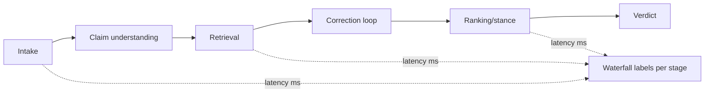
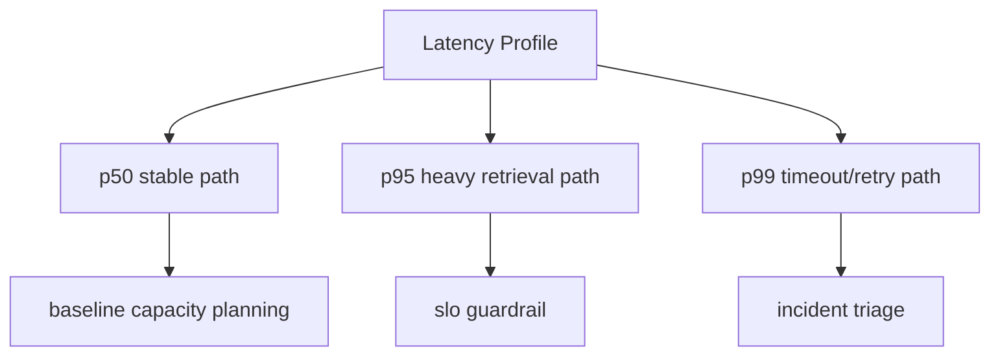
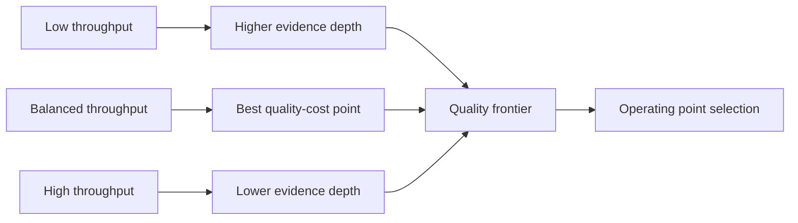
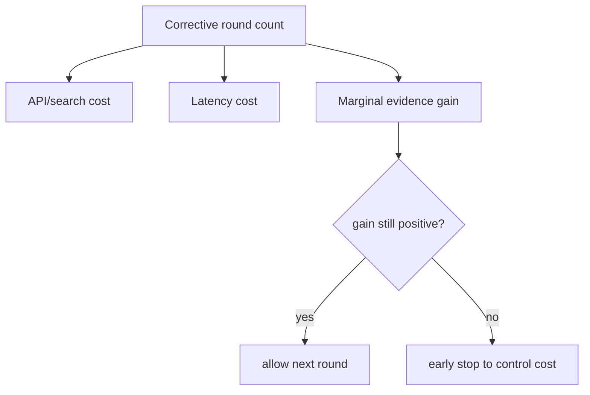

# latency throughput and cost pack

This pack defines publication-ready figure specs and Mermaid drafts.

### F42 — Stage-wise latency waterfall

- **Figure ID**: F42
- **Paper Section**: System Performance
- **Type**: curve
- **Placement**: Main
- **Column Fit**: 1-column
- **Research Question**: Which stages dominate latency budget?
- **Key Variables**: stage_latency, total_latency, p95

#### Mermaid Block

#### Figure Spec (Camera-Ready)
- **Caption (IEEE/ACM style)**: *F42.* Stage-wise latency waterfall. This figure operationalizes which stages dominate latency budget? using deterministic system signals and stage-linked diagnostics.
- **How to Read**: Start from the leftmost/topmost stage, follow directed transitions, then interpret terminal nodes against the metrics listed in the data-source field.
- **Expected Insight**: Reveals causal or procedural structure needed to reproduce and audit methodological behavior.
- **Failure Signal to Watch**: Disagreement between directional outputs and supporting upstream evidence signals; review `alignment_score`, `neutral_only_stance_rate`, and policy path branches.
- **Data Source / Log Fields**: stage_events timestamps + elapsed_seconds
- **Export Notes**: SVG/PDF export preferred; grayscale-safe palette required; annotate as 1-column in final manuscript; keep text >= 8pt at print scale.

---
### F43 — p50/p95/p99 profile curves

- **Figure ID**: F43
- **Paper Section**: System Performance
- **Type**: curve
- **Placement**: Main
- **Column Fit**: 1-column
- **Research Question**: How does tail behavior evolve by version?
- **Key Variables**: p50,p95,p99 latency

#### Mermaid Block

#### Figure Spec (Camera-Ready)
- **Caption (IEEE/ACM style)**: *F43.* p50/p95/p99 profile curves. This figure operationalizes how does tail behavior evolve by version? using deterministic system signals and stage-linked diagnostics.
- **How to Read**: Start from the leftmost/topmost stage, follow directed transitions, then interpret terminal nodes against the metrics listed in the data-source field.
- **Expected Insight**: Reveals causal or procedural structure needed to reproduce and audit methodological behavior.
- **Failure Signal to Watch**: Disagreement between directional outputs and supporting upstream evidence signals; review `alignment_score`, `neutral_only_stance_rate`, and policy path branches.
- **Data Source / Log Fields**: evaluation run latencies
- **Export Notes**: SVG/PDF export preferred; grayscale-safe palette required; annotate as 1-column in final manuscript; keep text >= 8pt at print scale.

---
### F44 — Throughput vs quality frontier

- **Figure ID**: F44
- **Paper Section**: System Performance
- **Type**: curve
- **Placement**: Main
- **Column Fit**: 2-column
- **Research Question**: What throughput-quality trade-off is achievable?
- **Key Variables**: throughput, accuracy, ece

#### Mermaid Block

#### Figure Spec (Camera-Ready)
- **Caption (IEEE/ACM style)**: *F44.* Throughput vs quality frontier. This figure operationalizes what throughput-quality trade-off is achievable? using deterministic system signals and stage-linked diagnostics.
- **How to Read**: Start from the leftmost/topmost stage, follow directed transitions, then interpret terminal nodes against the metrics listed in the data-source field.
- **Expected Insight**: Reveals causal or procedural structure needed to reproduce and audit methodological behavior.
- **Failure Signal to Watch**: Disagreement between directional outputs and supporting upstream evidence signals; review `alignment_score`, `neutral_only_stance_rate`, and policy path branches.
- **Data Source / Log Fields**: evaluation + deployment metrics
- **Export Notes**: SVG/PDF export preferred; grayscale-safe palette required; annotate as 2-column in final manuscript; keep text >= 8pt at print scale.

---
### F45 — Corrective-loop cost curve

- **Figure ID**: F45
- **Paper Section**: System Performance
- **Type**: curve
- **Placement**: Appendix
- **Column Fit**: 1-column
- **Research Question**: How query rounds affect quality gain vs cost?
- **Key Variables**: queries_used, quality_gain, latency

#### Mermaid Block

#### Figure Spec (Camera-Ready)
- **Caption (IEEE/ACM style)**: *F45.* Corrective-loop cost curve. This figure operationalizes how query rounds affect quality gain vs cost? using deterministic system signals and stage-linked diagnostics.
- **How to Read**: Start from the leftmost/topmost stage, follow directed transitions, then interpret terminal nodes against the metrics listed in the data-source field.
- **Expected Insight**: Reveals causal or procedural structure needed to reproduce and audit methodological behavior.
- **Failure Signal to Watch**: Disagreement between directional outputs and supporting upstream evidence signals; review `alignment_score`, `neutral_only_stance_rate`, and policy path branches.
- **Data Source / Log Fields**: debug.query_budget + stop_reason + metrics deltas
- **Export Notes**: SVG/PDF export preferred; grayscale-safe palette required; annotate as 1-column in final manuscript; keep text >= 8pt at print scale.

---

