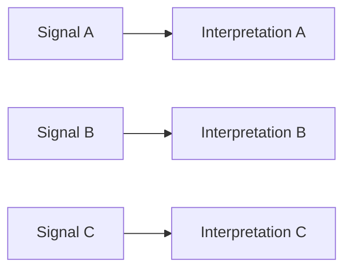
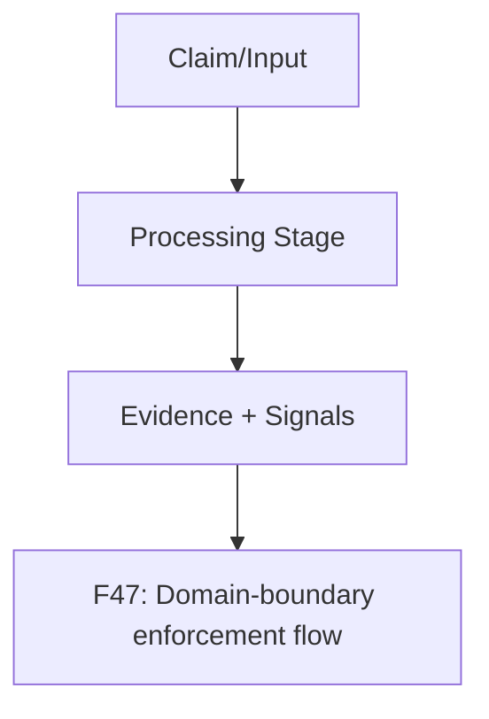
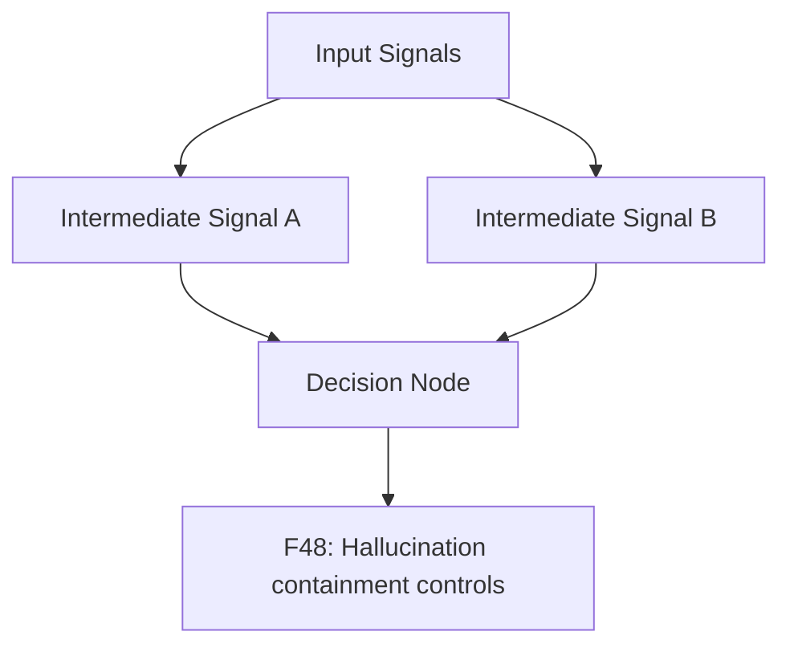
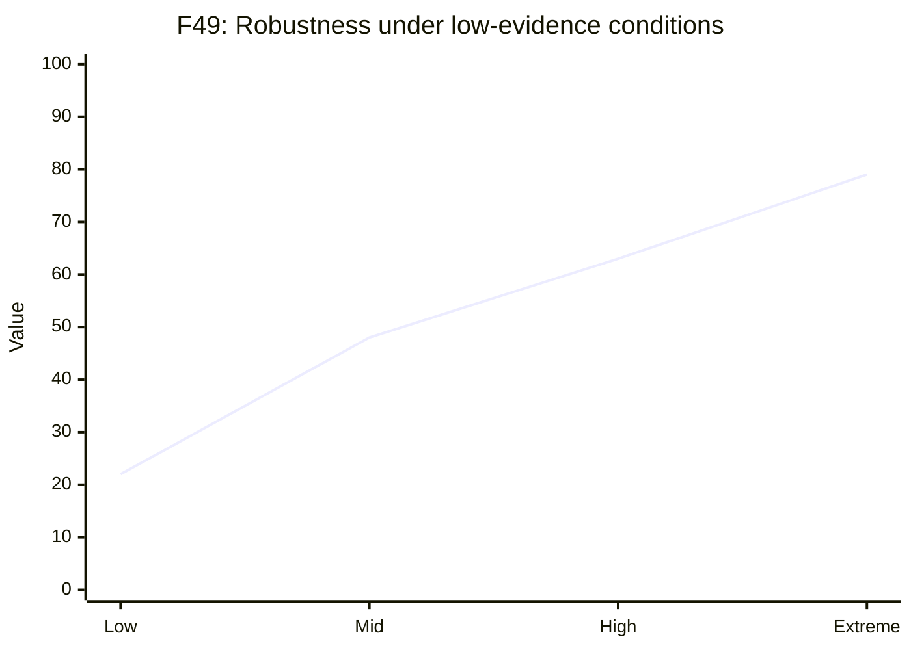

# generalization and safety pack

This pack defines publication-ready figure specs and Mermaid drafts.

### F46 — No-hardcoding compliance checklist graphic

- **Figure ID**: F46
- **Paper Section**: Generalization/Safety
- **Type**: table-graphic
- **Placement**: Main
- **Column Fit**: 1-column
- **Research Question**: How does implementation satisfy anti-hardcoding constraints?
- **Key Variables**: rule_id, status, evidence

#### Mermaid Block

#### Figure Spec (Camera-Ready)
- **Caption (IEEE/ACM style)**: *F46.* No-hardcoding compliance checklist graphic. This figure operationalizes how does implementation satisfy anti-hardcoding constraints? using deterministic system signals and stage-linked diagnostics.
- **How to Read**: Start from the leftmost/topmost stage, follow directed transitions, then interpret terminal nodes against the metrics listed in the data-source field.
- **Expected Insight**: Reveals causal or procedural structure needed to reproduce and audit methodological behavior.
- **Failure Signal to Watch**: Disagreement between directional outputs and supporting upstream evidence signals; review `alignment_score`, `neutral_only_stance_rate`, and policy path branches.
- **Data Source / Log Fields**: code audit checklist + module scan
- **Export Notes**: SVG/PDF export preferred; grayscale-safe palette required; annotate as 1-column in final manuscript; keep text >= 8pt at print scale.

---
### F47 — Domain-boundary enforcement flow

- **Figure ID**: F47
- **Paper Section**: Generalization/Safety
- **Type**: flowchart
- **Placement**: Main
- **Column Fit**: 1-column
- **Research Question**: How is health-domain scope enforced?
- **Key Variables**: domain_classifier, source_policy, rejection_path

#### Mermaid Block

#### Figure Spec (Camera-Ready)
- **Caption (IEEE/ACM style)**: *F47.* Domain-boundary enforcement flow. This figure operationalizes how is health-domain scope enforced? using deterministic system signals and stage-linked diagnostics.
- **How to Read**: Start from the leftmost/topmost stage, follow directed transitions, then interpret terminal nodes against the metrics listed in the data-source field.
- **Expected Insight**: Reveals causal or procedural structure needed to reproduce and audit methodological behavior.
- **Failure Signal to Watch**: Disagreement between directional outputs and supporting upstream evidence signals; review `alignment_score`, `neutral_only_stance_rate`, and policy path branches.
- **Data Source / Log Fields**: pipeline scope checks + source policy
- **Export Notes**: SVG/PDF export preferred; grayscale-safe palette required; annotate as 1-column in final manuscript; keep text >= 8pt at print scale.

---
### F48 — Hallucination containment controls

- **Figure ID**: F48
- **Paper Section**: Generalization/Safety
- **Type**: DAG
- **Placement**: Main
- **Column Fit**: 1-column
- **Research Question**: How are hallucination risks constrained before verdict?
- **Key Variables**: admissibility_gate, evidence_attribution, rationale_fidelity

#### Mermaid Block

#### Figure Spec (Camera-Ready)
- **Caption (IEEE/ACM style)**: *F48.* Hallucination containment controls. This figure operationalizes how are hallucination risks constrained before verdict? using deterministic system signals and stage-linked diagnostics.
- **How to Read**: Start from the leftmost/topmost stage, follow directed transitions, then interpret terminal nodes against the metrics listed in the data-source field.
- **Expected Insight**: Reveals causal or procedural structure needed to reproduce and audit methodological behavior.
- **Failure Signal to Watch**: Disagreement between directional outputs and supporting upstream evidence signals; review `alignment_score`, `neutral_only_stance_rate`, and policy path branches.
- **Data Source / Log Fields**: verdict/evidence attribution outputs
- **Export Notes**: SVG/PDF export preferred; grayscale-safe palette required; annotate as 1-column in final manuscript; keep text >= 8pt at print scale.

---
### F49 — Robustness under low-evidence conditions

- **Figure ID**: F49
- **Paper Section**: Generalization/Safety
- **Type**: curve
- **Placement**: Main
- **Column Fit**: 1-column
- **Research Question**: How does the system behave when evidence is sparse?
- **Key Variables**: evidence_count, confidence, abstain_reason

#### Mermaid Block

#### Figure Spec (Camera-Ready)
- **Caption (IEEE/ACM style)**: *F49.* Robustness under low-evidence conditions. This figure operationalizes how does the system behave when evidence is sparse? using deterministic system signals and stage-linked diagnostics.
- **How to Read**: Start from the leftmost/topmost stage, follow directed transitions, then interpret terminal nodes against the metrics listed in the data-source field.
- **Expected Insight**: Reveals causal or procedural structure needed to reproduce and audit methodological behavior.
- **Failure Signal to Watch**: Disagreement between directional outputs and supporting upstream evidence signals; review `alignment_score`, `neutral_only_stance_rate`, and policy path branches.
- **Data Source / Log Fields**: final payload evidence_count + confidence + abstain
- **Export Notes**: SVG/PDF export preferred; grayscale-safe palette required; annotate as 1-column in final manuscript; keep text >= 8pt at print scale.

---

