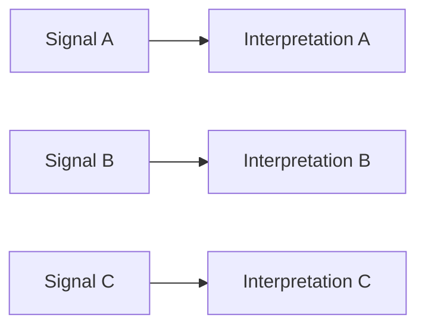
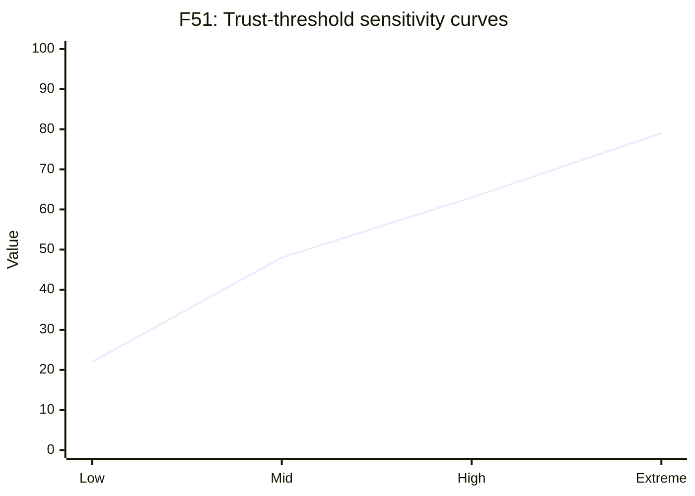
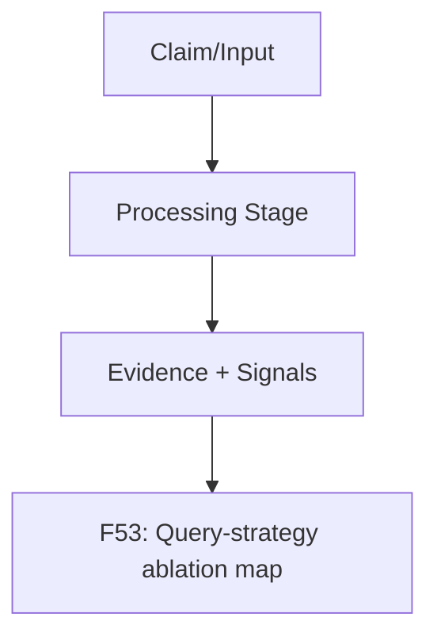

# ablation and sensitivity pack

This pack defines publication-ready figure specs and Mermaid drafts.

### F50 — Retrieval weight ablation matrix

- **Figure ID**: F50
- **Paper Section**: Ablations
- **Type**: table-graphic
- **Placement**: Main
- **Column Fit**: 1-column
- **Research Question**: How do retrieval weights alter accuracy and calibration?
- **Key Variables**: w_vdb,w_kg,accuracy,ece

#### Mermaid Block

#### Figure Spec (Camera-Ready)
- **Caption (IEEE/ACM style)**: *F50.* Retrieval weight ablation matrix. This figure operationalizes how do retrieval weights alter accuracy and calibration? using deterministic system signals and stage-linked diagnostics.
- **How to Read**: Start from the leftmost/topmost stage, follow directed transitions, then interpret terminal nodes against the metrics listed in the data-source field.
- **Expected Insight**: Reveals causal or procedural structure needed to reproduce and audit methodological behavior.
- **Failure Signal to Watch**: Disagreement between directional outputs and supporting upstream evidence signals; review `alignment_score`, `neutral_only_stance_rate`, and policy path branches.
- **Data Source / Log Fields**: ablation experiments
- **Export Notes**: SVG/PDF export preferred; grayscale-safe palette required; annotate as 1-column in final manuscript; keep text >= 8pt at print scale.

---
### F51 — Trust-threshold sensitivity curves

- **Figure ID**: F51
- **Paper Section**: Ablations
- **Type**: curve
- **Placement**: Main
- **Column Fit**: 1-column
- **Research Question**: How sensitive are outcomes to trust threshold choices?
- **Key Variables**: trust_threshold, accuracy,ece,abstain_rate

#### Mermaid Block

#### Figure Spec (Camera-Ready)
- **Caption (IEEE/ACM style)**: *F51.* Trust-threshold sensitivity curves. This figure operationalizes how sensitive are outcomes to trust threshold choices? using deterministic system signals and stage-linked diagnostics.
- **How to Read**: Start from the leftmost/topmost stage, follow directed transitions, then interpret terminal nodes against the metrics listed in the data-source field.
- **Expected Insight**: Reveals causal or procedural structure needed to reproduce and audit methodological behavior.
- **Failure Signal to Watch**: Disagreement between directional outputs and supporting upstream evidence signals; review `alignment_score`, `neutral_only_stance_rate`, and policy path branches.
- **Data Source / Log Fields**: threshold sweep runs
- **Export Notes**: SVG/PDF export preferred; grayscale-safe palette required; annotate as 1-column in final manuscript; keep text >= 8pt at print scale.

---
### F52 — Calibration method comparison panel

- **Figure ID**: F52
- **Paper Section**: Ablations
- **Type**: table-graphic
- **Placement**: Main
- **Column Fit**: 1-column
- **Research Question**: Which calibration method best improves ECE without hurting accuracy?
- **Key Variables**: method,ece,brier,nll,acc

#### Mermaid Block

#### Figure Spec (Camera-Ready)
- **Caption (IEEE/ACM style)**: *F52.* Calibration method comparison panel. This figure operationalizes which calibration method best improves ece without hurting accuracy? using deterministic system signals and stage-linked diagnostics.
- **How to Read**: Start from the leftmost/topmost stage, follow directed transitions, then interpret terminal nodes against the metrics listed in the data-source field.
- **Expected Insight**: Reveals causal or procedural structure needed to reproduce and audit methodological behavior.
- **Failure Signal to Watch**: Disagreement between directional outputs and supporting upstream evidence signals; review `alignment_score`, `neutral_only_stance_rate`, and policy path branches.
- **Data Source / Log Fields**: calibration experiment logs
- **Export Notes**: SVG/PDF export preferred; grayscale-safe palette required; annotate as 1-column in final manuscript; keep text >= 8pt at print scale.

---
### F53 — Query-strategy ablation map

- **Figure ID**: F53
- **Paper Section**: Ablations
- **Type**: flowchart
- **Placement**: Appendix
- **Column Fit**: 1-column
- **Research Question**: How do query strategy variants impact corrective effectiveness?
- **Key Variables**: strategy,queries_used,alignment_zero_rate,acc

#### Mermaid Block

#### Figure Spec (Camera-Ready)
- **Caption (IEEE/ACM style)**: *F53.* Query-strategy ablation map. This figure operationalizes how do query strategy variants impact corrective effectiveness? using deterministic system signals and stage-linked diagnostics.
- **How to Read**: Start from the leftmost/topmost stage, follow directed transitions, then interpret terminal nodes against the metrics listed in the data-source field.
- **Expected Insight**: Reveals causal or procedural structure needed to reproduce and audit methodological behavior.
- **Failure Signal to Watch**: Disagreement between directional outputs and supporting upstream evidence signals; review `alignment_score`, `neutral_only_stance_rate`, and policy path branches.
- **Data Source / Log Fields**: query strategy experiment runs
- **Export Notes**: SVG/PDF export preferred; grayscale-safe palette required; annotate as 1-column in final manuscript; keep text >= 8pt at print scale.

---

