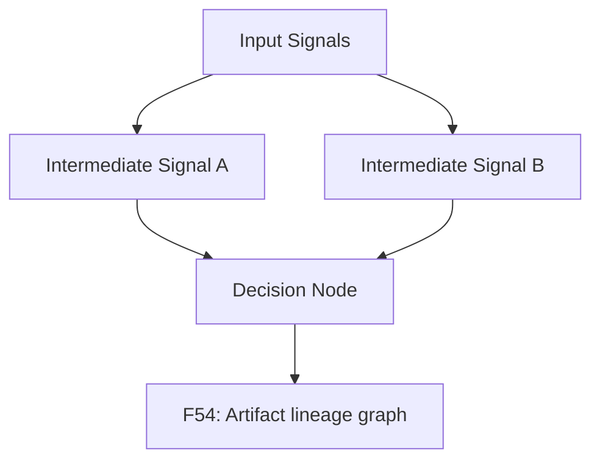
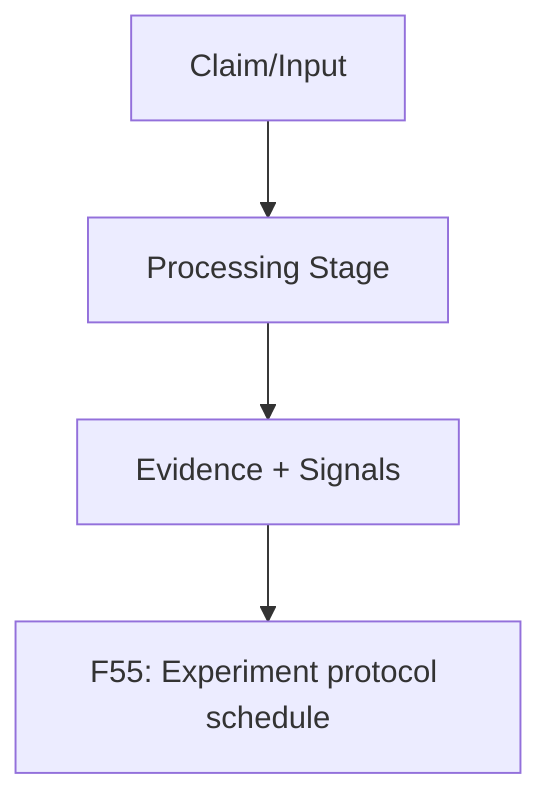
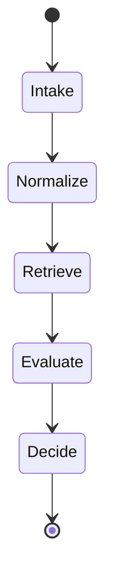

# reproducibility and governance pack

This pack defines publication-ready figure specs and Mermaid drafts.

### F54 — Artifact lineage graph

- **Figure ID**: F54
- **Paper Section**: Reproducibility
- **Type**: DAG
- **Placement**: Main
- **Column Fit**: 1-column
- **Research Question**: How are artifacts linked from run to publication figure?
- **Key Variables**: run_id,claim_result,metrics_json,figure_id

#### Mermaid Block

#### Figure Spec (Camera-Ready)
- **Caption (IEEE/ACM style)**: *F54.* Artifact lineage graph. This figure operationalizes how are artifacts linked from run to publication figure? using deterministic system signals and stage-linked diagnostics.
- **How to Read**: Start from the leftmost/topmost stage, follow directed transitions, then interpret terminal nodes against the metrics listed in the data-source field.
- **Expected Insight**: Reveals causal or procedural structure needed to reproduce and audit methodological behavior.
- **Failure Signal to Watch**: Disagreement between directional outputs and supporting upstream evidence signals; review `alignment_score`, `neutral_only_stance_rate`, and policy path branches.
- **Data Source / Log Fields**: evaluation/runs + artifacts lineage
- **Export Notes**: SVG/PDF export preferred; grayscale-safe palette required; annotate as 1-column in final manuscript; keep text >= 8pt at print scale.

---
### F55 — Experiment protocol schedule

- **Figure ID**: F55
- **Paper Section**: Reproducibility
- **Type**: flowchart
- **Placement**: Main
- **Column Fit**: 1-column
- **Research Question**: What daily/weekly protocol governs stable experimentation?
- **Key Variables**: anchor_set,tuning_set,canary_set,thresholds

#### Mermaid Block

#### Figure Spec (Camera-Ready)
- **Caption (IEEE/ACM style)**: *F55.* Experiment protocol schedule. This figure operationalizes what daily/weekly protocol governs stable experimentation? using deterministic system signals and stage-linked diagnostics.
- **How to Read**: Start from the leftmost/topmost stage, follow directed transitions, then interpret terminal nodes against the metrics listed in the data-source field.
- **Expected Insight**: Reveals causal or procedural structure needed to reproduce and audit methodological behavior.
- **Failure Signal to Watch**: Disagreement between directional outputs and supporting upstream evidence signals; review `alignment_score`, `neutral_only_stance_rate`, and policy path branches.
- **Data Source / Log Fields**: protocol docs + evaluation workflow
- **Export Notes**: SVG/PDF export preferred; grayscale-safe palette required; annotate as 1-column in final manuscript; keep text >= 8pt at print scale.

---
### F56 — Daily/weekly regression governance chart

- **Figure ID**: F56
- **Paper Section**: Governance
- **Type**: state
- **Placement**: Main
- **Column Fit**: 1-column
- **Research Question**: How are regressions detected and patch decisions escalated?
- **Key Variables**: regression_flags,acceptance_criteria,rollback

#### Mermaid Block

#### Figure Spec (Camera-Ready)
- **Caption (IEEE/ACM style)**: *F56.* Daily/weekly regression governance chart. This figure operationalizes how are regressions detected and patch decisions escalated? using deterministic system signals and stage-linked diagnostics.
- **How to Read**: Start from the leftmost/topmost stage, follow directed transitions, then interpret terminal nodes against the metrics listed in the data-source field.
- **Expected Insight**: Reveals causal or procedural structure needed to reproduce and audit methodological behavior.
- **Failure Signal to Watch**: Disagreement between directional outputs and supporting upstream evidence signals; review `alignment_score`, `neutral_only_stance_rate`, and policy path branches.
- **Data Source / Log Fields**: daily reports + regression checks
- **Export Notes**: SVG/PDF export preferred; grayscale-safe palette required; annotate as 1-column in final manuscript; keep text >= 8pt at print scale.

---

