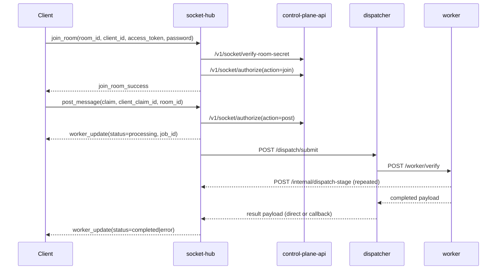

# Request Lifecycle

This document describes the implemented realtime claim lifecycle for the current backend.

## Primary Lifecycle (Socket -> Dispatch -> Worker -> Socket)

### Prose Equivalent

1. Client joins room through `socket-hub`; room secret and join authorization are validated against control-plane.
2. Client posts claim; `socket-hub` validates post authorization.
3. `socket-hub` emits immediate `processing` update with generated `job_id`.
4. Dispatcher forwards request to worker verify endpoint.
5. Worker streams stage updates to `socket-hub` callback endpoint while pipeline executes.
6. Dispatcher returns worker result; socket-hub emits final `worker_update` to room subscribers.

## Stage Streaming Contract

Worker stage callbacks become `worker_stage` events with:

- `job_id`
- `room_id`
- `client_id`
- `client_claim_id`
- `claim`
- `stage`
- `stage_payload`
- `timestamp`
- `source`

Observed stage keys in pipeline:

- `started`
- `retrieval_done`
- `ranking_done`
- `search_done`
- `extraction_done`
- `ingestion_done`
- `completed`
- `error` (exception path)

## Worker Result Contract Highlights

Final payload is normalized by worker API layer and includes:

- lifecycle: `status`, `pipeline_status`, `result_status`, `timestamp`
- identifiers: `job_id`, `room_id`, `client_id`, `client_claim_id`
- verdict: `verdict`, `verdict_confidence`, `truthfulness_percent`, `verdict_rationale`
- evidence: `claim_breakdown`, `evidence_map`, summarized top evidence list
- ranking/trust: `top_ranking_score`, `avg_ranking_score`, `trust_policy_mode`, `coverage`, `diversity`
- diagnostics: `vdb_signal_count`, `kg_signal_count`, signal sums, `stage_events`

## Kafka-Enabled Variant

When enabled:

1. `socket-hub` publishes claims to `posts.inbound`.
2. `dispatcher` consumes from `posts.inbound`, calls worker, publishes to `jobs.results`.
3. `socket-hub` may consume `jobs.results` and emit `worker_update`.
4. Dispatcher can still fallback to `socket-hub /internal/dispatch-result` callback when publish fails.

## Failure Semantics

- Authorization failures emit `auth_error` to socket client.
- Dispatch failure returns `502` upstream and socket-hub emits error update.
- Worker exceptions return fallback-completed payload instead of hard endpoint failure.
- Stage callback failures are logged and non-fatal to verification completion.

For detailed internals, see [methodology/02-pipeline-stage-decomposition.md](./methodology/02-pipeline-stage-decomposition.md).

Last verified against code: February 28, 2026
