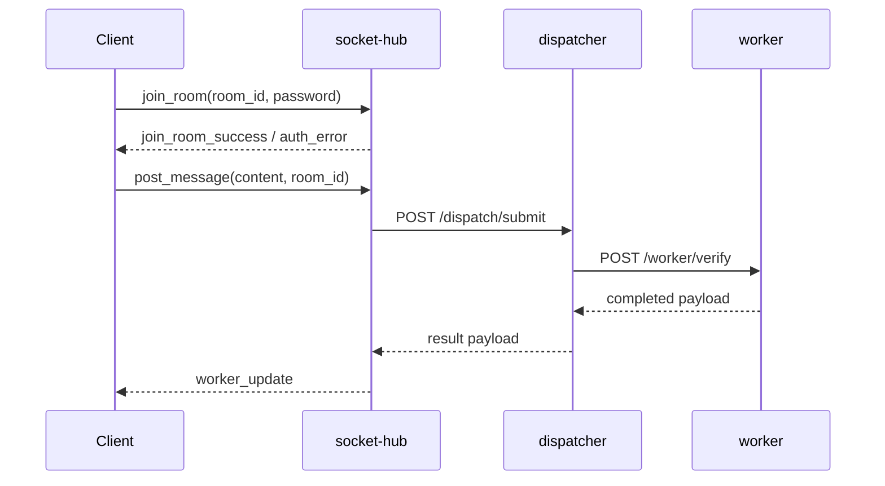

# Request Lifecycle

This document describes the implemented end-to-end claim flow.

## Primary Flow (Socket -> Dispatch -> Worker -> Socket)

## Kafka-Enabled Variant

- `socket-hub` can publish inbound posts to Kafka (`POSTS_TOPIC`)
- `dispatcher` can consume inbound posts and publish results (`RESULTS_TOPIC`)
- `socket-hub` can consume `RESULTS_TOPIC` and emit to room

## Worker Result States

Observed payload status patterns:

- `completed`
- `completed_from_cache`
- fallback-completed response shape when pipeline execution errors

Worker responses include:

- verdict fields: `verdict`, `verdict_confidence`, `truthfulness_percent`, `verdict_rationale`
- trust/ranking fields: `trust_policy_mode`, `trust_metric_name`, `trust_metric_value`, `trust_threshold_met`, `coverage`, `diversity`
- evidence fields: top evidence list, evidence map, counts and signal summaries

## Error Propagation

- Socket auth failures emit `auth_error`
- Dispatch/worker failures emit error payloads to `worker_update`
- Dispatcher publish failure can trigger socket-hub callback fallback endpoint (`/internal/dispatch-result`) when configured

## Relevant Files

- `socket-hub/app/main.py`
- `socket-hub/app/sockets/manager.py`
- `dispatcher/app/main.py`
- `worker/app/main.py`

Last verified against code: February 13, 2026
