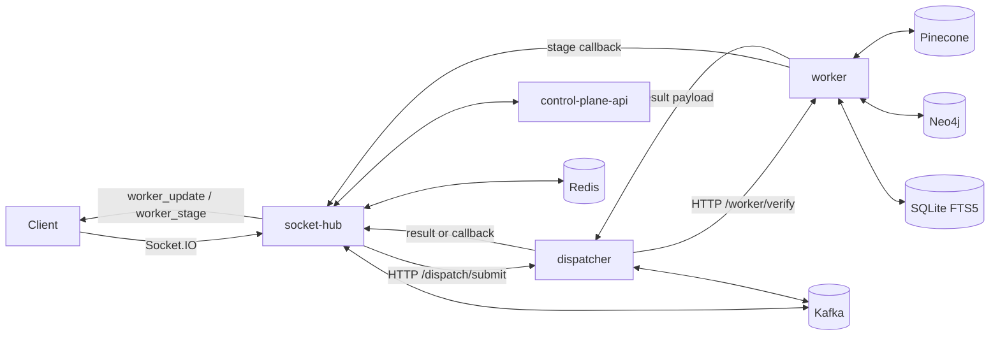

# System Overview

Luxia is a multi-service hybrid corrective RAG fact verification system.

## Service Roles

- `socket-hub`
  - Socket.IO ingress (`join_room`, `post_message`)
  - room authentication and token-scoped authorization checks
  - stage/result fanout (`worker_stage`, `worker_update`)
- `control-plane-api`
  - room ownership, role-based action authorization, room-secret verification
- `dispatcher`
  - request orchestration (`POST /dispatch/submit`)
  - worker timeout control, Kafka consume/publish path, callback fallback
- `worker`
  - retrieval/ranking/trust/verdict pipeline (`POST /worker/verify`)
  - stage callback emission to socket-hub
- `frontend`
  - realtime contract consumer for stage progression and final verdict output

## Topology

### Prose Equivalent

1. Client connects to socket-hub and joins a room after control-plane authorization.
2. Posted claims are dispatched to worker through dispatcher (or Kafka path).
3. Worker runs corrective pipeline and emits stage callbacks during execution.
4. Dispatcher/socket-hub return final payload and socket-hub broadcasts stage/result events.

## Verification Pipeline Characteristics

- Retrieval-first cache gate before web expansion.
- Hybrid evidence retrieval: vector + graph + lexical.
- Adaptive trust sufficiency controls loop continuation.
- Incremental one-query-at-a-time corrective search.
- Deterministic verdict reconciliation and policy override layers.

## Key Contracts

- Socket ingress events: `join_room`, `post_message`
- Socket egress events: `worker_stage`, `worker_update`
- Dispatcher API: `POST /dispatch/submit`
- Worker API: `POST /worker/verify`
- Internal callbacks: `/internal/dispatch-stage`, `/internal/dispatch-result`

For full implementation detail, see [methodology/README.md](./methodology/README.md).

Last verified against code: February 28, 2026
