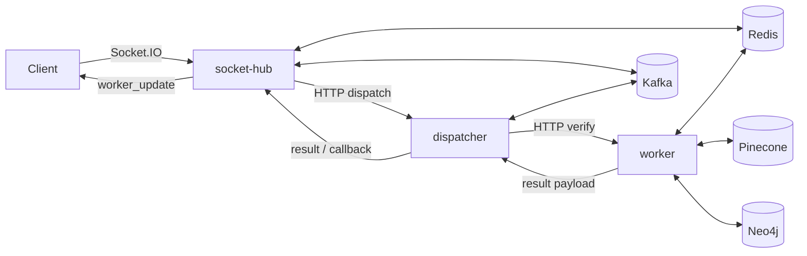

# System Overview

Luxia is a multi-service claim verification system with realtime client interaction and evidence-driven verdict generation.

## Services

- `socket-hub`:
  - Accepts client Socket.IO events
  - Authenticates room access
  - Forwards claims for processing
  - Emits final worker results back to room subscribers
- `dispatcher`:
  - Accepts dispatch requests (`/dispatch/submit`)
  - Calls worker verify endpoint
  - Supports Kafka consume/publish flow when enabled
  - Uses callback fallback for delivery failure scenarios
- `worker`:
  - Runs corrective retrieval pipeline
  - Combines semantic and KG signals
  - Applies trust gating and adaptive policy
  - Generates verdict + rationale + evidence map
- `shared`:
  - Provides shared HTTP metrics middleware (`shared/metrics.py`)
- `infra`:
  - Local multi-container dev topology (`docker-compose.yml`)
  - Azure unified container runtime (`infra/azure`)
  - Observability stack configs (`infra/observability`)
- `frontend`:
  - Next.js user interface layer

## High-Level Topology

## Runtime Characteristics

- FastAPI-based service APIs
- Socket.IO ASGI app in `socket-hub`
- Optional Kafka-based asynchronous fanout
- Redis-backed room/auth state
- Worker pipeline supports cache-first behavior and fallback response mode
- Prometheus metrics exposed by each backend service

## Key Entry Points

- `socket-hub/app/main.py`
- `dispatcher/app/main.py`
- `worker/app/main.py`
- `shared/metrics.py`
- `docker-compose.yml`

Last verified against code: February 13, 2026
