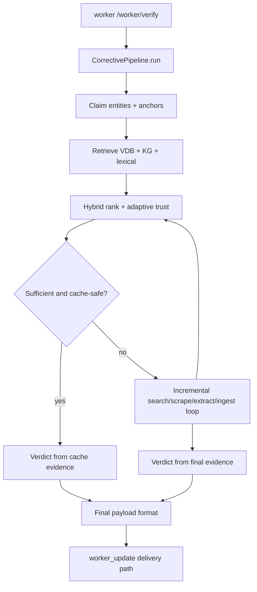

# Worker Pipeline

`worker` exposes `POST /worker/verify` and wraps the hybrid corrective RAG verification pipeline.

## API Contract

Request (`VerifyRequest`):

- `job_id: str`
- `claim: str`
- `room_id: str | null`
- `client_id: str | null`
- `client_claim_id: str | null`
- `source: str | null`
- `domain: str` (default `general`)
- `top_k: int` (default `5`, range `1..20`)

Response: normalized completion payload with verdict, trust/ranking signals, evidence summaries, and optional `stage_events`.

## Execution Flow

### Prose Equivalent

1. Worker loads pipeline singleton and starts stage callback capture.
2. Pipeline runs retrieval-first trust gate.
3. If cache evidence is sufficient and passes deterministic checks, worker completes without web expansion.
4. Otherwise the pipeline enters one-query corrective loop with immediate ingest and rerank after each query.
5. Final verdict synthesis runs with deterministic reconciliation and override layers.
6. Worker returns normalized payload and stage history.

## Stage Events Emitted by Worker

- `started`
- `retrieval_done`
- `ranking_done`
- `search_done`
- `extraction_done`
- `ingestion_done`
- `completed`
- `error`

Stage callbacks are posted to `socket-hub /internal/dispatch-stage` when configured.

## Worker Resilience Behavior

- Pipeline initialization is lazy and optionally preloaded on startup.
- If pipeline execution raises, worker returns a fallback-completed payload to keep API availability.
- Fallback payload still includes claim/job metadata and conservative verdict fields.

## Key Runtime Signals in Response

- Ranking: `top_ranking_score`, `avg_ranking_score`
- Retrieval composition: `vdb_signal_count`, `kg_signal_count`, top5 signal sums
- Trust: `trust_policy_mode`, `trust_metric_name`, `trust_metric_value`, `trust_threshold_met`
- Adaptive metrics: `coverage`, `diversity`, `num_subclaims`
- Provenance: `used_web_search`, `data_source`, `llm` metadata

## Where to Go Deeper

- Architecture: [methodology/01-system-architecture.md](./methodology/01-system-architecture.md)
- Stage internals: [methodology/02-pipeline-stage-decomposition.md](./methodology/02-pipeline-stage-decomposition.md)
- Retrieval/ingestion: [methodology/03-retrieval-and-ingestion.md](./methodology/03-retrieval-and-ingestion.md)
- Ranking/trust loop: [methodology/04-ranking-trust-and-corrective-loop.md](./methodology/04-ranking-trust-and-corrective-loop.md)
- Verdict synthesis: [methodology/05-verdict-synthesis.md](./methodology/05-verdict-synthesis.md)

Last verified against code: February 28, 2026
